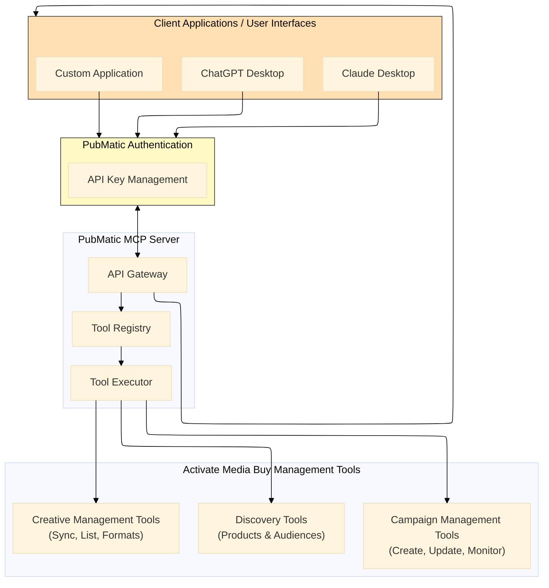
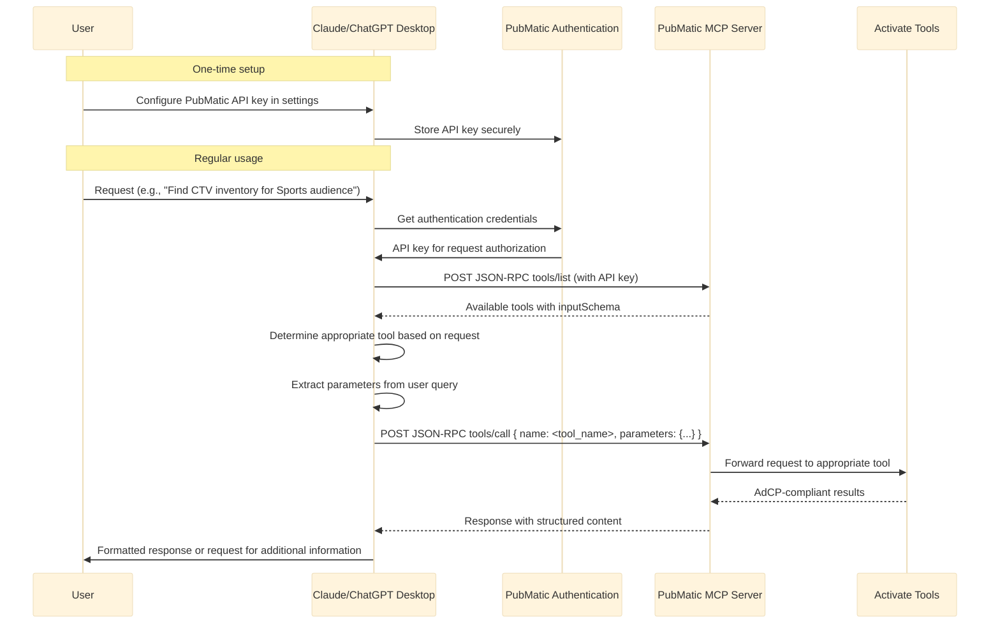
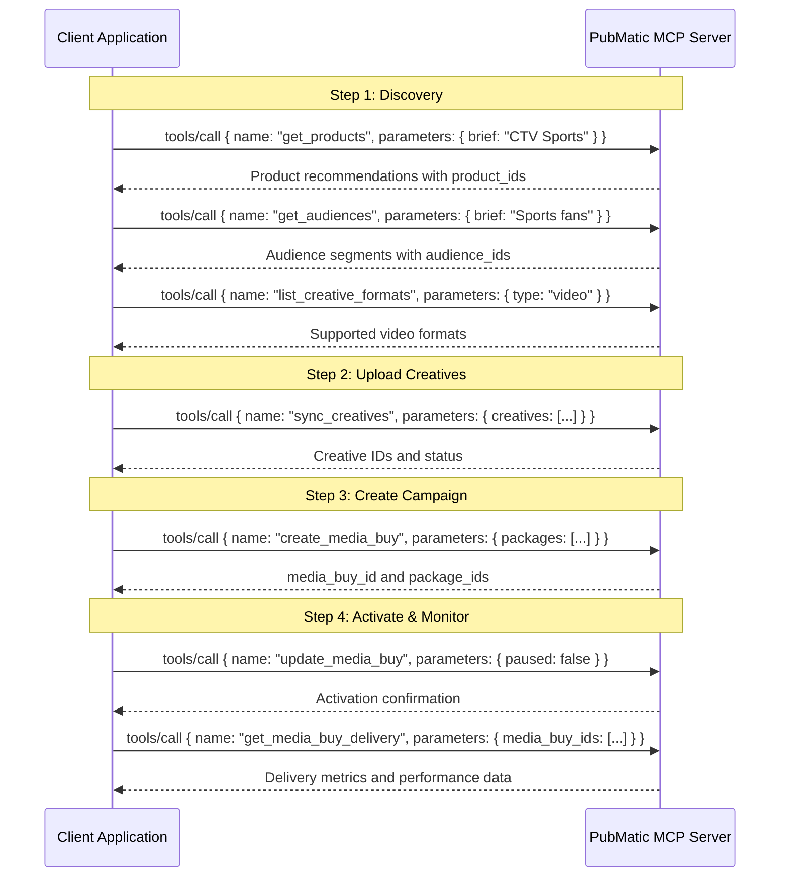

# Activate Media Buy Management Specifications

## Overview

The Activate Media Buy Management specification represents PubMatic's comprehensive suite of AdCP-compliant tools for programmatic campaign activation and management. This specification enables **Activate Advertiser** clients to discover inventory, create and manage media buys, handle creative assets, and monitor campaign performance—all through the Model Context Protocol (MCP).

## Key Capabilities

- **Product & Audience Discovery**: Search and discover advertising products and audience segments using natural language
- **Campaign Management**: Create, update, and monitor programmatic media buy campaigns
- **Creative Management**: Synchronize, manage, and assign creative assets to campaigns
- **Performance Monitoring**: Track delivery metrics and campaign performance in real-time
- **Structured Responses**: Receive AdCP-compliant, machine-readable data for seamless integration

## Available Tools

Activate Media Buy Management provides three categories of tools:

### 1. Discovery Tools

The [Activate Discovery Integration Guide](./activate_discovery_integration_guide.md) covers tools for discovering and evaluating supply opportunities:

- **get_products**: Search and discover advertising products/deal templates based on campaign requirements
- **get_audiences**: Discover and evaluate audience segments using natural language queries

### 2. Campaign Management Tools

The [Activate Campaign Management Integration Guide](./activate_campaign_management_integration_guide.md) provides documentation for managing the complete campaign lifecycle:

- **create_media_buy**: Create new programmatic media buy campaigns with packages, targeting, and creative assignments
- **update_media_buy**: Update existing campaigns with partial update support (budgets, targeting, creatives, status)
- **list_media_buys**: Retrieve complete campaign configurations including packages and targeting details
- **get_media_buy_delivery**: Access comprehensive delivery metrics and performance data

### 3. Creative Management Tools

The [Activate Creative Management Integration Guide](./activate_creative_management_integration_guide.md) documents tools for managing creative assets:

- **sync_creatives**: Synchronize creative assets with centralized library (upload, update, assign)
- **list_creatives**: Query and search creative library with advanced filtering and sorting
- **list_creative_formats**: Discover supported creative formats with complete specifications

## Benefits

Media buy activation and management involves multiple complex workflows—from discovering the right inventory and audiences, to creating campaigns with proper targeting and creatives, to monitoring and optimizing performance. By streamlining these processes with agentic AI using protocols such as MCP and AdCP, we transform fragmented workflows into intelligent, conversational experiences that save time and reduce errors.

### Key Workflows

#### 1. Complete Campaign Setup
Discover products and audiences → Create campaign with targeting → Upload and assign creatives → Activate campaign

#### 2. Campaign Optimization
Monitor performance → Update budgets and bids → Refine targeting → Refresh creatives

#### 3. Campaign Monitoring
Track delivery metrics → Analyze pacing → Review performance by package → Generate reports

#### 4. Media Buy Activation
Retrieve campaign configuration → Verify creative assignments → Activate packages → Monitor initial delivery

## Integration Architecture

The Activate Media Buy Management tools run on PubMatic's MCP Server using the standardized Model Context Protocol with AdCP-compliant structured responses. This architecture enables seamless integration with client applications, including AI assistants such as Claude Desktop and ChatGPT Desktop.

### Integration Flow Diagram



### Claude/ChatGPT Desktop as MCP Client



## Integration Approaches

The specification supports multiple integration approaches:

1. **AI Assistant Integration**: Connect through popular AI tools like ChatGPT
2. **Direct API Integration**: Build custom applications that directly call the MCP Server endpoints
3. **Agent-to-Agent Communication**: Enable your AI agents to communicate directly with PubMatic's tools using AdCP protocol

### API Key Configuration

Claude Desktop support API key configuration for external services:

**For Claude Desktop**:

1. Open the Claude Desktop application settings.
2. Navigate to the "Integrations" or "API Keys" section.
3. Add a new integration for "PubMatic MCP Server".
4. Enter your PubMatic-provided API key.
5. Save the configuration.

**For ChatGPT Desktop**:

1. Open ChatGPT Desktop settings.
2. Select "Plugins" or "Integrations".
3. Add a new custom plugin for "PubMatic MCP Server".
4. Enter the MCP Server base URL and your API key.
5. Configure the authentication method as "API Key".
6. Save the configuration.

### MCP Client Configuration Example

For MCP clients that support HTTP transport (such as Claude Desktop with MCP HTTP support), you can configure the PubMatic MCP Server using the following JSON configuration:

```json
{
  "mcp.prod.pubmatic": {
    "url": "https://mcp.pubmatic.com/mcp",
    "transport": "http",
    "headers": {
      "x-client-name": "external_client",
      "Authorization": "Bearer YOUR_API_TOKEN",
      "resource-id": "YOUR_ACTIVATE_ADVERTISER_ID",
      "resource-type": "ACTIVATE ADVERTISER",
      "Accept": "application/json, text/event-stream",
      "Content-Type": "application/json"
    }
  }
}
```

**Configuration Parameters:**

- `url`: The PubMatic MCP Server endpoint
- `transport`: Use "http" for HTTP-based MCP communication
- `headers`:
  - `x-client-name`: Must be set to `external_client` (required value)
  - `Authorization`: Bearer token for authentication (replace `YOUR_API_TOKEN` with your actual token)
  - `resource-id`: Your advertiser/resource ID (provided by PubMatic)
  - `resource-type`: Set to "ACTIVATE ADVERTISER" for Activate Media Buy Management tools
  - `Accept`: Required for MCP protocol support (JSON and SSE)
  - `Content-Type`: JSON content type for requests

**Note:** Contact your PubMatic representative to obtain your API token, resource ID, and client name for configuration.

## Getting Started

- **Request API access:** Contact your PubMatic representative to request access to the MCP Server and Activate Media Buy Management tools.
- **Explore available tools:** Use the JSON-RPC method tools/list to discover available tools and their capabilities.
- **Plan your integration:** Decide whether you need an AI assistant integration, direct API integration, or both.
- **Implement authentication:** Set up secure storage and handling of your API key.
- **Build a prototype:** Start with a simple integration to test the API and understand the response formats.
- **Test thoroughly:** Ensure your integration handles various scenarios, including errors and edge cases.
- **Deploy and monitor:** After testing, deploy your integration and monitor its performance.

## API Endpoints

### MCP Specification Compliance

The PubMatic MCP Server implements the [Model Context Protocol (MCP) specification](https://modelcontextprotocol.io/specification/2025-06-18/server/tools#structured-content), ensuring standardized interactions with AI assistants and client applications. All requests and responses follow the JSONRPC 2.0 format with structured content support.

### AdCP Compliance

All Activate Media Buy Management tools follow the [Ad Context Protocol (AdCP)](https://adcontextprotocol.org) specifications for programmatic advertising workflows. This ensures:

- Standardized request/response formats across the industry
- Interoperability between different platforms and agents
- Consistent field naming and data structures
- Support for complex advertising workflows

### Authentication

All requests to the MCP Server require API key authentication:

```
X-API-Key: your-api-key
```

Contact your PubMatic representative to obtain an API key for your organization.

### Base URL

```
https://mcp.pubmatic.com/mcp
```

### Common Endpoints (MCP Tools)

#### 1. Tool Discovery (JSON-RPC)

- Method: tools/list
- Transport: POST JSON-RPC 2.0 to your MCP server endpoint (e.g., /v1/tools)

Request:
```json
{
  "jsonrpc": "2.0",
  "id": 1,
  "method": "tools/list",
  "params": {}
}
```

Response:
```json
{
  "jsonrpc": "2.0",
  "id": 1,
  "result": {
    "tools": [
      {
        "name": "get_products",
        "description": "Search and discover deal templates using natural language queries",
        "inputSchema": { "type": "object", "properties": { /* ... */ } }
      },
      {
        "name": "get_audiences",
        "description": "Discovers available audience segments using natural language queries",
        "inputSchema": { "type": "object", "properties": { /* ... */ } }
      },
      {
        "name": "create_media_buy",
        "description": "Creates media buy campaigns from selected packages following AdCP protocol",
        "inputSchema": { "type": "object", "properties": { /* ... */ }, "required": ["buyer_ref", "packages", "brand_manifest", "start_time", "end_time"] }
      },
      {
        "name": "update_media_buy",
        "description": "Update campaign and package settings with partial update support",
        "inputSchema": { "type": "object", "properties": { /* ... */ } }
      },
      {
        "name": "list_media_buys",
        "description": "List all media buys with complete configuration",
        "inputSchema": { "type": "object", "properties": { /* ... */ } }
      },
      {
        "name": "get_media_buy_delivery",
        "description": "Retrieve comprehensive delivery metrics and performance data",
        "inputSchema": { "type": "object", "properties": { /* ... */ } }
      },
      {
        "name": "sync_creatives",
        "description": "Synchronize creative assets with the centralized creative library",
        "inputSchema": { "type": "object", "properties": { /* ... */ }, "required": ["creatives"] }
      },
      {
        "name": "list_creatives",
        "description": "Query and search the centralized creative library",
        "inputSchema": { "type": "object", "properties": { /* ... */ } }
      },
      {
        "name": "list_creative_formats",
        "description": "Discovers all creative formats supported by this agent",
        "inputSchema": { "type": "object", "properties": { /* ... */ } }
      }
    ]
  }
}
```

#### 2. Tool Execution (JSON-RPC)

- Method: tools/call
- Transport: POST JSON-RPC 2.0 to your MCP server endpoint (e.g., /v1/tools)

Request:
```json
{
  "jsonrpc": "2.0",
  "id": 2,
  "method": "tools/call",
  "params": {
    "name": "get_products",
    "parameters": { 
      "brief": "Find premium CTV inventory for sports audience in US"
    }
  }
}
```

Response:
```json
{
  "jsonrpc": "2.0",
  "id": 2,
  "result": {
    "content": [ 
      { 
        "type": "text", 
        "text": "Found 5 matching products for premium CTV sports inventory..." 
      } 
    ],
    "structuredContent": { 
      "products": [
        {
          "product_id": "123",
          "name": "Premium Sports CTV Package",
          "formats": ["video"],
          "pricing_options": [/* ... */]
        }
      ]
    }
  }
}
```

## Tool-Specific Documentation

Review the integration guides for each tool category to understand the specific API endpoints, request/response formats, and implementation approaches:

### End-to-End Workflow Example



## Error Handling

All tools follow consistent error handling patterns:

- **Success**: Response includes `content` array with human-readable text and optional `structuredContent` with AdCP-compliant data
- **Validation Errors**: Clear error messages indicating missing or invalid parameters
- **Authentication Errors**: HTTP 401/403 with descriptive error messages
- **Server Errors**: HTTP 500 with error details and request tracking ID

## Best Practices

1. **Start with Discovery**: Always use `get_products` and `get_audiences` before creating campaigns
2. **Validate Formats**: Use `list_creative_formats` to ensure your creatives match supported formats
3. **Upload Creatives Early**: Use `sync_creatives` before creating media buys to avoid creative upload delays
4. **Use Buyer References**: Provide meaningful `buyer_ref` values for easier campaign tracking
5. **Monitor Regularly**: Use `get_media_buy_delivery` to track campaign performance and pacing
6. **Handle Async Operations**: Some operations may require polling or webhook support for completion
7. **Test Thoroughly**: Use test environments to validate your integration before production deployment

## Support

For technical support, API access, or integration assistance, contact your PubMatic representative or visit our developer portal.

## Future Development

The Activate Media Buy Management specification will continue to expand with:

- Advanced forecasting and prediction capabilities
- Real-time optimization recommendations
- Enhanced audience enrichment and discovery
- Automated campaign pacing adjustments
- Integration with additional third-party data providers
