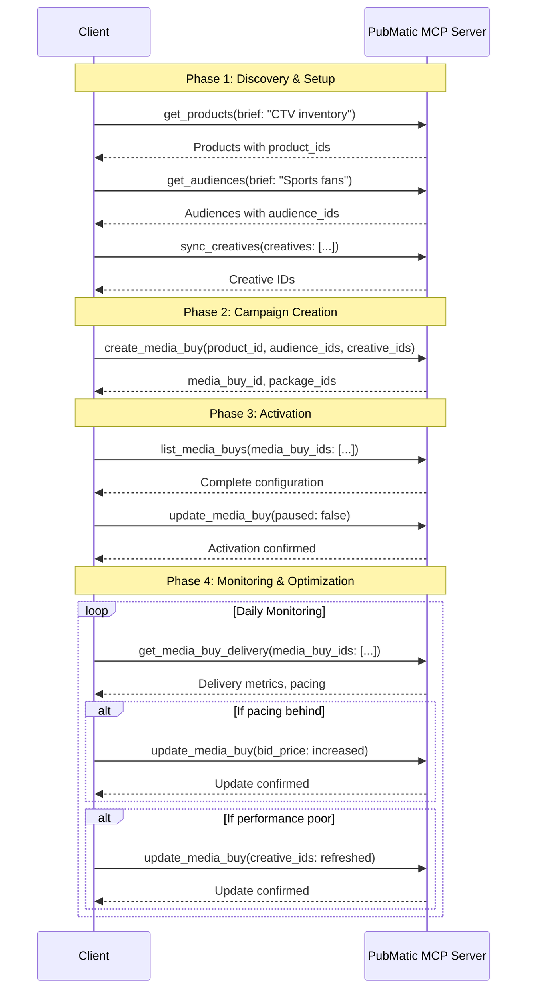

# PubMatic Activate Campaign Management Tools: Client Integration Guide

## Introduction

The PubMatic Activate Campaign Management tools provide a complete suite of AdCP-compliant capabilities for creating, managing, and monitoring programmatic media buy campaigns. These tools enable **Activate Advertiser** clients to manage the full campaign lifecycle through AI-powered interfaces with structured, machine-readable results.

This guide provides technical documentation for integrating with PubMatic's Activate Campaign Management tools via the Model Context Protocol (MCP) Server.

> **Note**: For common architecture diagrams, authentication flows, and general integration approaches, please refer to the [Activate Media Buy Management README](./README.md).

## Tools Overview

The Activate Campaign Management category includes four comprehensive tools:

### 1. create_media_buy

Create new programmatic media buy campaigns with packages, targeting, budget allocation, and creative assignments following AdCP protocol specifications.

### 2. update_media_buy

Update existing campaigns with partial update support (PATCH semantics) for budgets, targeting, creatives, pacing, and pause/resume status.

### 3. list_media_buys

Retrieve complete campaign configurations including all packages, targeting details, creative assignments, and settings.

### 4. get_media_buy_delivery

Access comprehensive delivery metrics, performance data, pacing information, and package-level breakdowns for reporting and optimization.

## Key Benefits

- **Complete Campaign Lifecycle**: Manage campaigns from creation through optimization to completion
- **AdCP Compliance**: All tools follow Ad Context Protocol specifications for industry standardization
- **Flexible Updates**: PATCH semantics allow targeted updates without resending entire configurations
- **Real-time Monitoring**: Access delivery metrics and performance data for data-driven optimization
- **Async Support**: Handle complex operations with webhook notifications and status tracking
- **Multi-package Management**: Create and manage campaigns with multiple packages in single requests

---

## Tool 1: create_media_buy

### Description

The `create_media_buy` tool creates new programmatic media buy campaigns from selected products. It supports comprehensive configuration including multiple packages, targeting overlays, creative assignments, and budget allocation.

### Key Capabilities

- **Multi-package Campaigns**: Create campaigns with multiple packages in a single request
- **Flexible Targeting**: Geographic, demographic, contextual, and audience targeting
- **Creative Management**: Inline creative upload or reference existing library creatives
- **Budget Control**: Package-level budget allocation with pacing strategies
- **Format Validation**: Ensures creative formats match product requirements
- **Async Operations**: Supports immediate completion or async workflows with approvals
- **Brand Safety**: Brand manifest validation for policy compliance

### API Endpoint

**Tool Name**: `create_media_buy`

**Method**: POST JSON-RPC 2.0 `tools/call`

### Request Parameters

#### Campaign-Level Parameters

| Parameter | Type | Required | Description |
|-----------|------|----------|-------------|
| `buyer_ref` | string | Yes | Buyer's reference identifier for this media buy. Used for tracking and reporting |
| `brand_manifest` | object | Yes | Brand information for policy compliance. Minimum: name and URL |
| `start_time` | string | Yes | Campaign start time: "asap" or ISO 8601 date-time |
| `end_time` | string | Yes | Campaign end date/time in ISO 8601 format |
| `packages` | array | Yes | Array of package configurations (see Package Configuration) |
| `po_number` | string | No | Purchase order number for tracking |
| `promoted_products` | object | No | Products being promoted (for reporting/optimization) |
| `reporting_webhook` | object | No | Webhook configuration for automated reporting delivery |
| `context` | object | No | Additional context metadata (echoed back in responses) |

#### Package Configuration

Each package in the `packages` array must include:

| Parameter | Type | Required | Description |
|-----------|------|----------|-------------|
| `buyer_ref` | string | Yes | Buyer's reference for this package. Used for tracking |
| `product_id` | string | Yes | Product ID from `get_products` discovery |
| `pricing_option_id` | string | Yes | Pricing model. Currently supports: "cpm_auction" |
| `format_ids` | array | Yes | Structured format IDs matching product requirements |
| `budget` | number | Yes | Budget allocation as numeric value (currency from pricing_option) |
| `bid_price` | number | Conditional | Required for auction-based pricing. Bid eCPM as numeric value |
| `pacing` | string | No | Pacing strategy: "even" (default) or "front_loaded" |
| `targeting_overlay` | object | No | Targeting criteria (geo, audience, frequency) |
| `creative_ids` | array | No | Reference existing creatives by ID (numeric strings) |
| `creatives` | array | No | Inline creative upload (max 20 per package) |

#### Targeting Overlay Fields

| Field | Type | Description |
|-------|------|-------------|
| `geo_country_any_of` | array | ISO country codes (e.g., ["US", "CA", "GB"]) |
| `geo_region_any_of` | array | Region codes: plain format ["CA", "NY"] or ISO 3166-2 ["US-CA", "US-NY"] |
| `geo_metro_any_of` | array | DMA codes (e.g., ["803", "501"]) |
| `geo_postal_code_any_of` | array | Postal codes with country prefix (e.g., ["US-94063", "CA-M5V 2K4"]) |
| `axe_include_segment` | string | Audience ID(s) to target (from `get_audiences`). Multiple: "76351,126422" |
| `axe_exclude_segment` | string | Audience ID(s) to exclude. Multiple: "126422,373740" |
| `frequency_cap` | object | Frequency capping: `{ suppress_minutes: 60 }` |

### Request Example

```json
{
  "jsonrpc": "2.0",
  "id": 1,
  "method": "tools/call",
  "params": {
    "name": "create_media_buy",
    "parameters": {
      "buyer_ref": "Q1-2026-Sports-CTV-Campaign",
      "brand_manifest": {
        "name": "Acme Sports Apparel",
        "url": "https://acmesports.com"
      },
      "start_time": "2026-03-01T00:00:00Z",
      "end_time": "2026-03-31T23:59:59Z",
      "packages": [
        {
          "buyer_ref": "Premium-Sports-CTV-Package",
          "product_id": "123",
          "pricing_option_id": "cpm_auction",
          "format_ids": [
            {
              "agent_url": "https://creative.pubmatic.com",
              "id": "video_standard_30s"
            }
          ],
          "budget": 50000,
          "bid_price": 15.00,
          "pacing": "even",
          "targeting_overlay": {
            "geo_country_any_of": ["US"],
            "geo_region_any_of": ["US-CA", "US-NY", "US-TX"],
            "axe_include_segment": "76351,126422",
            "frequency_cap": {
              "suppress_minutes": 1440
            }
          },
          "creative_ids": ["12345", "12346"]
        }
      ]
    }
  }
}
```

### Response Structure

```json
{
  "jsonrpc": "2.0",
  "id": 1,
  "result": {
    "content": [
      {
        "type": "text",
        "text": "Media buy created successfully!\n\nMedia Buy ID: MB-2026-001234\nCampaign: Q1-2026-Sports-CTV-Campaign\nFlight: March 1-31, 2026\nTotal Budget: $50,000 USD\n\nPackages Created:\n1. Premium-Sports-CTV-Package (ID: PKG-001)\n   - Budget: $50,000\n   - Bid: $15.00 CPM\n   - Targeting: US (CA, NY, TX), Sports Audiences\n   - Creatives: 2 assigned\n\nNext Steps:\n- Campaign is ready to start on March 1, 2026\n- Creatives will serve automatically\n- Monitor performance using media_buy_id: MB-2026-001234"
      }
    ],
    "structuredContent": {
      "status": "completed",
      "media_buy_id": "MB-2026-001234",
      "buyer_ref": "Q1-2026-Sports-CTV-Campaign",
      "packages": [
        {
          "package_id": "PKG-001",
          "buyer_ref": "Premium-Sports-CTV-Package",
          "status": "active"
        }
      ],
      "creative_deadline": "2026-02-28T23:59:59Z",
      "implementation_date": "2026-03-01T00:00:00Z"
    }
  }
}
```

### Response Fields

| Field | Type | Description |
|-------|------|-------------|
| `status` | string | Operation status: "completed", "working", "submitted", "input-required", "failed", "rejected" |
| `media_buy_id` | string | Publisher's unique identifier for the created media buy |
| `buyer_ref` | string | Buyer's reference identifier (echoed back) |
| `packages` | array | Created packages with package_id and buyer_ref |
| `creative_deadline` | string | ISO 8601 timestamp for creative upload deadline |
| `implementation_date` | string | When campaign will go live (null if pending approval) |
| `task_id` | string | Task identifier for async operations (if status is "working") |

### Status Values

| Status | Description | Action Required |
|--------|-------------|-----------------|
| `completed` | Media buy created successfully | None - campaign is ready |
| `working` | Creation in progress | Poll for completion or wait for webhook |
| `submitted` | Long-running operation submitted | Wait for webhook notification |
| `input-required` | Needs additional information/approval | Provide requested information |
| `failed` | Creation failed | Review error message and retry |
| `rejected` | Rejected by policy/validation | Review rejection reason |

### Use Cases

1. **New Campaign Creation**: Launch new campaigns with discovered products and audiences
2. **Multi-package Campaigns**: Create campaigns with different targeting per package
3. **Seasonal Campaigns**: Schedule campaigns for specific flight dates
4. **A/B Testing**: Create multiple packages with different bid strategies
5. **Audience Testing**: Target different audience segments in separate packages

### Best Practices

1. **Use Discovery First**: Always use `get_products` and `get_audiences` before creating campaigns
2. **Validate Formats**: Use `list_creative_formats` to ensure format compatibility
3. **Upload Creatives Early**: Use `sync_creatives` before campaign creation to avoid delays
4. **Meaningful References**: Use descriptive `buyer_ref` values for easier tracking
5. **Reasonable Budgets**: Ensure budgets are sufficient for estimated impressions
6. **Test Targeting**: Verify targeting combinations don't create empty reach
7. **Monitor Status**: Check `status` field and handle async operations appropriately

---

## Tool 2: update_media_buy

### Description

The `update_media_buy` tool updates existing campaigns with partial update support (PATCH semantics). Only specified fields are modified; omitted fields remain unchanged.

### Key Capabilities

- **PATCH Semantics**: Update only what changes, preserve everything else
- **Campaign-Level Updates**: Pause/resume entire campaigns, adjust flight dates
- **Package-Level Updates**: Modify budgets, bids, targeting, creatives per package
- **Bulk Updates**: Update multiple packages in a single request
- **Async Support**: Handle approval workflows and long-running updates
- **Immediate Effect**: Most updates take effect immediately (subject to approval)

### API Endpoint

**Tool Name**: `update_media_buy`

**Method**: POST JSON-RPC 2.0 `tools/call`

### Request Parameters

#### Campaign-Level Parameters

| Parameter | Type | Required | Description |
|-----------|------|----------|-------------|
| `media_buy_id` | string | Conditional | Publisher's media buy ID. Required if `buyer_ref` not provided |
| `buyer_ref` | string | Conditional | Buyer's reference. Required if `media_buy_id` not provided |
| `paused` | boolean | No | Pause (true) or resume (false) entire campaign |
| `start_time` | string | No | New start time: "asap" or ISO 8601 date-time |
| `end_time` | string | No | New end date/time in ISO 8601 format |
| `packages` | array | No | Array of package updates (see Package Update Object) |

#### Package Update Object

| Parameter | Type | Required | Description |
|-----------|------|----------|-------------|
| `package_id` | string | Conditional | Publisher's package ID. Required if `buyer_ref` not provided |
| `buyer_ref` | string | Conditional | Buyer's package reference. Required if `package_id` not provided |
| `budget` | number | No | Updated budget allocation |
| `bid_price` | number | No | Updated bid eCPM for auction packages |
| `pacing` | string | No | Updated pacing: "even" or "front_loaded" |
| `paused` | boolean | No | Pause (true) or resume (false) this package |
| `targeting_overlay` | object | No | Updated targeting (REPLACES entire targeting) |
| `creative_ids` | array | No | Updated creative assignments (REPLACES all assignments) |

### Important: Array Field Update Semantics

**CRITICAL**: Array fields (targeting, creative_ids) are REPLACED entirely, not merged:

- **To ADD items**: Pass complete list (existing + new)
  - Example: Add India to US targeting → `["US", "IN"]`
- **To REPLACE items**: Pass only new values
  - Example: Replace US with India → `["IN"]`
- **To REMOVE/CLEAR**: Pass `null` explicitly
  - Example: Remove all geo targeting → `geo_country_any_of: null`

### Request Example

```json
{
  "jsonrpc": "2.0",
  "id": 2,
  "method": "tools/call",
  "params": {
    "name": "update_media_buy",
    "parameters": {
      "media_buy_id": "MB-2026-001234",
      "packages": [
        {
          "package_id": "PKG-001",
          "budget": 75000,
          "bid_price": 18.00,
          "targeting_overlay": {
            "geo_country_any_of": ["US"],
            "geo_region_any_of": ["US-CA", "US-NY", "US-TX", "US-FL"],
            "axe_include_segment": "76351,126422,373740",
            "frequency_cap": {
              "suppress_minutes": 720
            }
          }
        }
      ]
    }
  }
}
```

### Response Structure

```json
{
  "jsonrpc": "2.0",
  "id": 2,
  "result": {
    "content": [
      {
        "type": "text",
        "text": "Media buy updated successfully!\n\nUpdates Applied:\n- Package PKG-001 (Premium-Sports-CTV-Package)\n  - Budget increased: $50,000 → $75,000\n  - Bid increased: $15.00 → $18.00 CPM\n  - Targeting expanded: Added Florida, Additional audience segment\n  - Frequency cap reduced: 24 hours → 12 hours\n\nChanges effective immediately.\nNew impression goal: ~4,167 impressions (based on $18 CPM)"
      }
    ],
    "structuredContent": {
      "status": "completed",
      "media_buy_id": "MB-2026-001234",
      "buyer_ref": "Q1-2026-Sports-CTV-Campaign",
      "implementation_date": "2026-02-19T15:30:00Z",
      "affected_packages": [
        {
          "package_id": "PKG-001",
          "buyer_ref": "Premium-Sports-CTV-Package",
          "changes": ["budget", "bid_price", "targeting_overlay"]
        }
      ]
    }
  }
}
```

### Response Fields

| Field | Type | Description |
|-------|------|-------------|
| `status` | string | Update status: "completed", "working", "input-required", "failed", "rejected" |
| `media_buy_id` | string | Publisher's media buy identifier |
| `buyer_ref` | string | Buyer's reference identifier |
| `implementation_date` | string | When changes take effect (null if pending approval) |
| `affected_packages` | array | Packages that were modified with list of changed fields |
| `task_id` | string | Task identifier for async operations |

### Use Cases

1. **Budget Optimization**: Increase/decrease budgets based on performance
2. **Bid Adjustments**: Optimize bids to improve win rate or reduce costs
3. **Targeting Refinement**: Expand or narrow targeting based on results
4. **Creative Rotation**: Update creative assignments for freshness
5. **Campaign Pausing**: Pause underperforming campaigns or packages
6. **Flight Extensions**: Extend campaign end dates
7. **Frequency Optimization**: Adjust frequency caps based on reach goals

### Best Practices

1. **Use Specific Identifiers**: Prefer `media_buy_id` and `package_id` for precision
2. **Understand Array Semantics**: Remember arrays are replaced, not merged
3. **Incremental Changes**: Make small, measured adjustments for better tracking
4. **Monitor Impact**: Check `implementation_date` to know when changes take effect
5. **Handle Approvals**: Be prepared for "input-required" status on large budget increases
6. **Preserve Existing Values**: For array fields, retrieve current values first if adding items

---

## Tool 3: list_media_buys

### Description

The `list_media_buys` tool retrieves complete campaign configurations including all packages, targeting details, creative assignments, and settings. This is a configuration-focused tool (not performance reporting).

### Key Capabilities

- **Complete Configuration Retrieval**: Get all campaign settings in AdCP format
- **Flexible Querying**: Query by media_buy_id, buyer_ref, status, or date range
- **Package Details**: Full targeting_overlay, format_ids, creative_ids for each package
- **Multi-campaign Support**: Retrieve multiple campaigns in a single request
- **Fast Response**: Typically responds in 5-10 seconds

### API Endpoint

**Tool Name**: `list_media_buys`

**Method**: POST JSON-RPC 2.0 `tools/call`

### Request Parameters

| Parameter | Type | Required | Description |
|-----------|------|----------|-------------|
| `media_buy_ids` | array | No | Array of publisher media buy IDs to retrieve |
| `buyer_refs` | array | No | Array of buyer reference IDs to retrieve |
| `status_filter` | string | No | Filter by status: "active" (default), "completed", "archived", "all" |
| `start_date` | string | No | Filter campaigns starting on/after this date (YYYY-MM-DD) |
| `end_date` | string | No | Filter campaigns ending on/before this date (YYYY-MM-DD) |
| `limit` | integer | No | Max results to return for pagination |
| `offset` | integer | No | Number of results to skip for pagination |

**Note**: If neither `media_buy_ids` nor `buyer_refs` provided, returns all media buys for the advertiser (filtered by status).

### Request Example

```json
{
  "jsonrpc": "2.0",
  "id": 3,
  "method": "tools/call",
  "params": {
    "name": "list_media_buys",
    "parameters": {
      "status_filter": "active",
      "start_date": "2026-02-01",
      "end_date": "2026-03-31"
    }
  }
}
```

### Response Structure

```json
{
  "jsonrpc": "2.0",
  "id": 3,
  "result": {
    "content": [
      {
        "type": "text",
        "text": "Found 2 active media buys:\n\n1. Q1-2026-Sports-CTV-Campaign (MB-2026-001234)\n   - Flight: March 1-31, 2026\n   - Budget: $75,000\n   - 1 package\n\n2. Winter-Sale-Video-Campaign (MB-2026-001189)\n   - Flight: February 15 - March 15, 2026\n   - Budget: $100,000\n   - 2 packages"
      }
    ],
    "structuredContent": {
      "media_buys": [
        {
          "media_buy_id": "MB-2026-001234",
          "buyer_ref": "Q1-2026-Sports-CTV-Campaign",
          "start_time": "2026-03-01T00:00:00Z",
          "end_time": "2026-03-31T23:59:59Z",
          "budget": 75000,
          "currency": "USD",
          "status": "active",
          "packages": [
            {
              "package_id": "PKG-001",
              "buyer_ref": "Premium-Sports-CTV-Package",
              "paused": false,
              "pricing_option_id": "cpm_auction",
              "budget": 75000,
              "bid_price": 18.00,
              "pacing": "even",
              "format_ids": ["video_standard_30s"],
              "creative_ids": ["12345", "12346"],
              "targeting_overlay": {
                "geo_country_any_of": ["US"],
                "geo_region_any_of": ["US-CA", "US-NY", "US-TX", "US-FL"],
                "axe_include_segment": "76351,126422,373740",
                "frequency_cap": {
                  "suppress_minutes": 720
                }
              }
            }
          ]
        }
      ],
      "total_count": 2
    }
  }
}
```

### Response Fields

#### Media Buy Object

| Field | Type | Description |
|-------|------|-------------|
| `media_buy_id` | string | Publisher's media buy identifier |
| `buyer_ref` | string | Buyer's reference identifier (campaign name) |
| `start_time` | string | Campaign start time (ISO 8601) |
| `end_time` | string | Campaign end time (ISO 8601) |
| `budget` | number | Total campaign budget |
| `currency` | string | Currency code (e.g., "USD") |
| `status` | string | Campaign status: "active", "paused", "completed", "archived" |
| `packages` | array | Array of package configurations |

#### Package Configuration

| Field | Type | Description |
|-------|------|-------------|
| `package_id` | string | Publisher package/line item identifier |
| `buyer_ref` | string | Package name/reference |
| `paused` | boolean | Package pause status |
| `pricing_option_id` | string | Pricing model (e.g., "cpm_auction") |
| `budget` | number | Package budget allocation |
| `bid_price` | number | Bid eCPM for auction-based packages |
| `pacing` | string | Pacing strategy: "even" or "front_loaded" |
| `format_ids` | array | Creative format identifiers |
| `creative_ids` | array | Assigned creative IDs (numeric strings) |
| `targeting_overlay` | object | Complete targeting configuration |

### Use Cases

1. **Campaign Auditing**: Review complete campaign configurations
2. **Configuration Export**: Export settings for documentation or analysis
3. **Bulk Management**: Retrieve multiple campaigns for comparison
4. **Update Preparation**: Get current settings before making updates
5. **Configuration Verification**: Confirm settings match expectations
6. **Historical Review**: Review archived campaigns for reference

### Best Practices

1. **Use Specific Queries**: Filter by status or date range to reduce response size
2. **Check Targeting Details**: Review `targeting_overlay` for complete targeting setup
3. **Verify Creative Assignments**: Check `creative_ids` to ensure creatives are assigned
4. **Compare Configurations**: Use for A/B test analysis across packages
5. **Export for Updates**: Retrieve current config before calling `update_media_buy`

---

## Tool 4: get_media_buy_delivery

### Description

The `get_media_buy_delivery` tool retrieves comprehensive delivery metrics and performance data for reporting, optimization, and monitoring.

### Key Capabilities

- **Comprehensive Metrics**: Impressions, spend, clicks, CTR, video completions, completion rate
- **Aggregated Totals**: Combined metrics across multiple media buys
- **Package-Level Breakdown**: Performance by package with pacing index
- **Daily Breakdown**: Day-by-day delivery for trend analysis
- **Multi-buy Reporting**: Query multiple campaigns in a single request
- **Flexible Filtering**: Filter by status and date range
- **Pacing Analysis**: Track delivery vs. expected with pacing index

### API Endpoint

**Tool Name**: `get_media_buy_delivery`

**Method**: POST JSON-RPC 2.0 `tools/call`

### Request Parameters

| Parameter | Type | Required | Description |
|-----------|------|----------|-------------|
| `media_buy_ids` | array | No | Array of publisher media buy IDs |
| `buyer_refs` | array | No | Array of buyer reference IDs |
| `status_filter` | string/array | No | Single status or array. Default: ["active"]. Options: "active", "pending", "paused", "completed", "failed", "all" |
| `start_date` | string | No | Start date for reporting period (YYYY-MM-DD) |
| `end_date` | string | No | End date for reporting period (YYYY-MM-DD) |
| `context` | object | No | Additional context metadata |

**Note**: If neither `media_buy_ids` nor `buyer_refs` provided, returns all media buys in current context (filtered by status).

### Request Example

```json
{
  "jsonrpc": "2.0",
  "id": 4,
  "method": "tools/call",
  "params": {
    "name": "get_media_buy_delivery",
    "parameters": {
      "media_buy_ids": ["MB-2026-001234"],
      "start_date": "2026-03-01",
      "end_date": "2026-03-15"
    }
  }
}
```

### Response Structure

```json
{
  "jsonrpc": "2.0",
  "id": 4,
  "result": {
    "content": [
      {
        "type": "text",
        "text": "Delivery Report: Q1-2026-Sports-CTV-Campaign\nPeriod: March 1-15, 2026\n\nOverall Performance:\n- Impressions: 2,850 (68% of goal)\n- Spend: $51,300 (68% of budget)\n- Avg eCPM: $18.00\n- Clicks: 142\n- CTR: 4.98%\n- Video Completions: 2,565 (90% VCR)\n\nPacing Status: Slightly behind (Pacing Index: 0.95)\nRecommendation: Consider increasing bid to $19-20 CPM to improve delivery pace."
      }
    ],
    "structuredContent": {
      "reporting_period": {
        "start": "2026-03-01T00:00:00Z",
        "end": "2026-03-15T23:59:59Z"
      },
      "currency": "USD",
      "aggregated_totals": {
        "impressions": 2850,
        "spend": 51300,
        "clicks": 142,
        "video_completions": 2565,
        "media_buy_count": 1
      },
      "media_buy_deliveries": [
        {
          "media_buy_id": "MB-2026-001234",
          "buyer_ref": "Q1-2026-Sports-CTV-Campaign",
          "status": "active",
          "totals": {
            "impressions": 2850,
            "spend": 51300,
            "clicks": 142,
            "ctr": 0.0498,
            "video_completions": 2565,
            "completion_rate": 0.90
          },
          "by_package": [
            {
              "package_id": "PKG-001",
              "buyer_ref": "Premium-Sports-CTV-Package",
              "impressions": 2850,
              "spend": 51300,
              "pacing_index": 0.95,
              "pricing_model": "cpm",
              "rate": 18.00,
              "currency": "USD"
            }
          ],
          "daily_breakdown": [
            {
              "date": "2026-03-01",
              "impressions": 185,
              "spend": 3330
            },
            {
              "date": "2026-03-02",
              "impressions": 192,
              "spend": 3456
            }
          ]
        }
      ]
    }
  }
}
```

### Response Fields

#### Top-Level Fields

| Field | Type | Description |
|-------|------|-------------|
| `reporting_period` | object | Start and end timestamps (ISO 8601) |
| `currency` | string | ISO 4217 currency code (e.g., "USD") |
| `aggregated_totals` | object | Combined metrics across all media buys |
| `media_buy_deliveries` | array | Delivery data for each media buy |

#### Aggregated Totals

| Field | Type | Description |
|-------|------|-------------|
| `impressions` | integer | Total impressions across all media buys |
| `spend` | number | Total spend across all media buys |
| `clicks` | integer | Total clicks (where available) |
| `video_completions` | integer | Total video completions (where available) |
| `media_buy_count` | integer | Number of media buys included |

#### Media Buy Delivery Object

| Field | Type | Description |
|-------|------|-------------|
| `media_buy_id` | string | Publisher's media buy identifier |
| `buyer_ref` | string | Buyer's reference identifier |
| `status` | string | Current status: "pending", "active", "paused", "completed", "failed" |
| `totals` | object | Aggregate metrics for this media buy |
| `by_package` | array | Package-level breakdown with pacing |
| `daily_breakdown` | array | Day-by-day delivery (date, impressions, spend) |

#### Metrics Definitions

| Metric | Description |
|--------|-------------|
| `impressions` | Number of times ads were displayed |
| `spend` | Amount spent in specified currency |
| `clicks` | Number of times users clicked on ads |
| `ctr` | Click-Through Rate (clicks ÷ impressions) |
| `video_completions` | Number of video ads watched to completion |
| `completion_rate` | Video completions ÷ video impressions |
| `pacing_index` | Actual delivery rate vs. expected (1.0 = on track, <1.0 = behind, >1.0 = ahead) |
| `rate` | Pricing rate (fixed-rate or effective rate for auction-based) |

### Use Cases

1. **Performance Monitoring**: Track daily campaign performance
2. **Pacing Analysis**: Identify under/over-delivering campaigns
3. **Budget Tracking**: Monitor spend against budget allocation
4. **ROI Analysis**: Calculate return on ad spend
5. **Package Comparison**: Compare performance across packages
6. **Trend Analysis**: Identify delivery patterns over time
7. **Optimization Decisions**: Data-driven bid and budget adjustments

### Best Practices

1. **Regular Monitoring**: Check delivery at least daily for active campaigns
2. **Use Date Ranges**: Filter by date for specific period analysis
3. **Watch Pacing Index**: Values <0.9 or >1.1 may require adjustments
4. **Compare Packages**: Use package-level breakdown for A/B analysis
5. **Track Trends**: Use daily_breakdown for pattern identification
6. **Multi-campaign Aggregation**: Query multiple campaigns for portfolio view
7. **Status Filtering**: Use status_filter to focus on specific campaign states

---

## Integration Workflow

### Complete Campaign Lifecycle



## Error Handling

### Common Errors

| Error Code | Description | Resolution |
|------------|-------------|------------|
| 401 | Unauthorized | Verify API key is valid and included in headers |
| 400 | Invalid Parameters | Check parameter types and required fields |
| 404 | Media Buy Not Found | Verify media_buy_id or buyer_ref exists |
| 409 | Conflict | Campaign may be in invalid state for operation |
| 500 | Server Error | Retry with exponential backoff |

### Error Response Example

```json
{
  "jsonrpc": "2.0",
  "id": 1,
  "error": {
    "code": -32602,
    "message": "Invalid params",
    "data": {
      "field": "packages[0].budget",
      "error": "Budget must be a positive number"
    }
  }
}
```

## Performance Considerations

- **create_media_buy**: 2-120 seconds (typically instant, may require approval)
- **update_media_buy**: 1-120 seconds (typically instant, approvals may take longer)
- **list_media_buys**: 5-10 seconds (configuration query)
- **get_media_buy_delivery**: ~60 seconds (reporting query with aggregations)
- **Reporting Delay**: Delivery data typically has 2-4 hour delay

## Next Steps

After mastering Campaign Management tools:

1. **Explore Creative Management**: Use `sync_creatives` and `list_creatives` for asset management
2. **Advanced Targeting**: Learn about extended targeting options in product documentation
3. **Optimization Strategies**: Develop data-driven optimization workflows
4. **Automation**: Build automated campaign management systems
5. **Reporting Integration**: Connect delivery data to your BI/analytics systems

## Support

For technical support or questions about Campaign Management tools:
- Contact your PubMatic representative
- Visit the developer portal
- Review the [Activate Media Buy Management README](./README.md)
