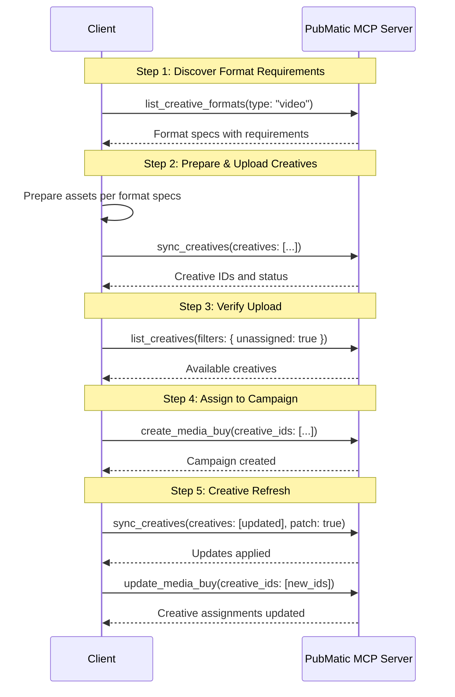
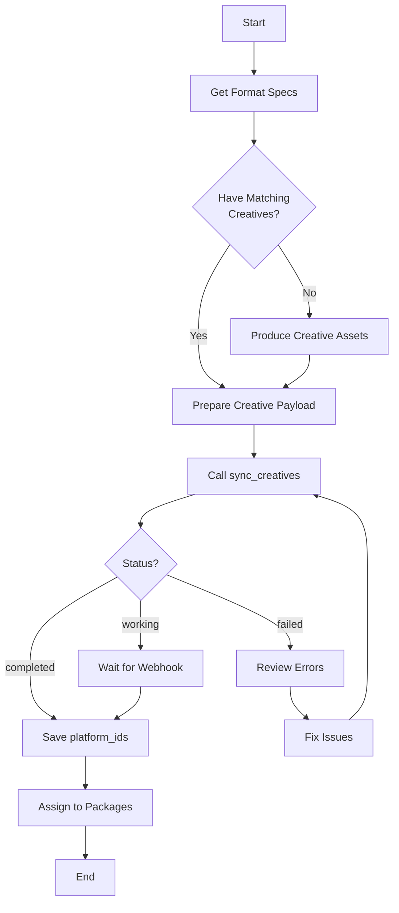

# PubMatic Activate Creative Management Tools: Client Integration Guide

## Introduction

The PubMatic Activate Creative Management tools provide comprehensive capabilities for managing creative assets throughout the campaign lifecycle. These AdCP-compliant tools enable **Activate Advertiser** clients to upload, update, search, and assign creative assets through AI-powered interfaces with centralized library management.

This guide provides technical documentation for integrating with PubMatic's Activate Creative Management tools via the Model Context Protocol (MCP) Server.

> **Note**: For common architecture diagrams, authentication flows, and general integration approaches, please refer to the [Activate Media Buy Management README](./README.md).

## Tools Overview

The Activate Creative Management category includes three essential tools:

### 1. sync_creatives

Synchronize creative assets with the centralized creative library using upsert semantics. Upload new creatives, update existing ones, and assign to packages—all in a single operation.

### 2. list_creatives

Query and search the creative library with advanced filtering, sorting, pagination, and optional data enrichment for efficient creative discovery and management.

### 3. list_creative_formats

Discover all supported creative formats with complete specifications including dimensions, file types, asset requirements, and technical details.

## Key Benefits

- **Centralized Library**: Single source of truth for all creative assets
- **Upsert Semantics**: Automatic create-or-update behavior for simplified workflows
- **Bulk Operations**: Process up to 100 creatives per request
- **Advanced Search**: Powerful filtering and sorting capabilities
- **Format Discovery**: Complete creative specifications for proper asset preparation
- **Assignment Management**: Assign creatives to packages during upload
- **Validation Options**: Strict or lenient validation modes

---

## Tool 1: sync_creatives

### Description

The `sync_creatives` tool synchronizes creative assets with the centralized creative library using upsert semantics (automatic create-or-update behavior). It supports bulk operations, multiple asset types, and package assignments.

### Key Capabilities

- **Bulk Upload**: Process up to 100 creatives in a single request
- **Upsert Semantics**: Creates new or updates existing creatives based on `creative_id`
- **Multiple Asset Types**: Hosted assets (image, video, audio), third-party tags (VAST, HTML, JavaScript), generative prompts
- **Patch Mode**: Update only specified fields while preserving others
- **Package Assignment**: Assign creatives to packages during sync
- **Validation Modes**: Strict (fail-fast) or lenient (process valid items)
- **Dry Run**: Preview changes before applying
- **Async Support**: Webhook notifications for large operations

### API Endpoint

**Tool Name**: `sync_creatives`

**Method**: POST JSON-RPC 2.0 `tools/call`

### Request Parameters

| Parameter | Type | Required | Description |
|-----------|------|----------|-------------|
| `creatives` | array | Yes | Array of creative objects (max 100) |
| `patch` | boolean | No | Partial update mode (default: false) |
| `dry_run` | boolean | No | Preview changes without applying (default: false) |
| `validation_mode` | string | No | "strict" (default) or "lenient" |
| `assignments` | object | No | Bulk creative-to-package assignments |
| `delete_missing` | boolean | No | Archive creatives not in this sync (default: false) |
| `push_notification_config` | object | No | Webhook for async notifications |

#### Creative Object Structure

| Field | Type | Required | Description |
|-------|------|----------|-------------|
| `creative_id` | string | Yes | Unique identifier (used for upsert logic) |
| `name` | string | Yes | Creative display name |
| `format_id` | object | Yes | Format identifier: `{ agent_url, id }` |
| `assets` | object | Yes | Creative assets (see Asset Types below) |
| `tags` | array | No | Tags for organization and search |

#### Asset Types

**Hosted Video Asset**:
```json
{
  "video": {
    "url": "https://cdn.example.com/video.mp4",
    "duration": 30
  }
}
```

**Hosted Image Asset**:
```json
{
  "image": {
    "url": "https://cdn.example.com/banner.jpg",
    "width": 728,
    "height": 90
  }
}
```

**Third-Party VAST Tag**:
```json
{
  "vast": {
    "url": "https://adserver.example.com/vast.xml"
  }
}
```

**Third-Party HTML Tag**:
```json
{
  "html": {
    "content": "<div>Ad content</div>",
    "width": 300,
    "height": 250
  }
}
```

**Third-Party JavaScript Tag**:
```json
{
  "javascript": {
    "url": "https://adserver.example.com/ad.js"
  }
}
```

### Request Example

```json
{
  "jsonrpc": "2.0",
  "id": 1,
  "method": "tools/call",
  "params": {
    "name": "sync_creatives",
    "parameters": {
      "creatives": [
        {
          "creative_id": "sports-video-30s-v1",
          "name": "Sports Action 30s Video",
          "format_id": {
            "agent_url": "https://creative.pubmatic.com",
            "id": "video_standard_30s"
          },
          "assets": {
            "video": {
              "url": "https://cdn.acmesports.com/sports-action-30s.mp4",
              "duration": 30
            }
          },
          "tags": ["sports", "action", "q1-2026"]
        },
        {
          "creative_id": "sports-vast-tag-v1",
          "name": "Sports VAST Tag 15s",
          "format_id": {
            "agent_url": "https://creative.pubmatic.com",
            "id": "video_standard_15s"
          },
          "assets": {
            "vast": {
              "url": "https://adserver.acme.com/vast-sports-15s.xml"
            }
          },
          "tags": ["sports", "vast", "third-party"]
        }
      ],
      "assignments": {
        "sports-video-30s-v1": ["PKG-001", "PKG-002"],
        "sports-vast-tag-v1": ["PKG-001"]
      },
      "validation_mode": "strict"
    }
  }
}
```

### Response Structure

```json
{
  "jsonrpc": "2.0",
  "id": 1,
  "result": {
    "content": [
      {
        "type": "text",
        "text": "Creative sync completed successfully!\n\nResults:\n- 2 creatives processed\n- 1 created (sports-vast-tag-v1)\n- 1 updated (sports-video-30s-v1)\n- 0 failed\n\nAssignments:\n- sports-video-30s-v1 → PKG-001, PKG-002\n- sports-vast-tag-v1 → PKG-001\n\nAll creatives are ready for campaign delivery."
      }
    ],
    "structuredContent": {
      "status": "completed",
      "context_id": "ctx-abc123",
      "dry_run": false,
      "summary": {
        "total": 2,
        "created": 1,
        "updated": 1,
        "unchanged": 0,
        "failed": 0
      },
      "creatives": [
        {
          "creative_id": "sports-video-30s-v1",
          "action": "updated",
          "platform_id": "12345",
          "changes": ["assets", "tags"],
          "status": "approved"
        },
        {
          "creative_id": "sports-vast-tag-v1",
          "action": "created",
          "platform_id": "12346",
          "status": "pending_review"
        }
      ],
      "assignment_results": {
        "successful": 3,
        "failed": 0
      }
    }
  }
}
```

### Response Fields

| Field | Type | Description |
|-------|------|-------------|
| `status` | string | Operation status: "completed", "working", "submitted" |
| `context_id` | string | Context identifier for tracking |
| `dry_run` | boolean | Whether changes were applied or just previewed |
| `summary` | object | Summary counts (total, created, updated, unchanged, failed) |
| `creatives` | array | Results for each creative with action and status |
| `assignment_results` | object | Count of successful/failed package assignments |

#### Creative Result Object

| Field | Type | Description |
|-------|------|-------------|
| `creative_id` | string | Creative identifier from request |
| `action` | string | Action taken: "created", "updated", "unchanged", "failed" |
| `platform_id` | string | Publisher-assigned creative ID (use in `creative_ids` arrays) |
| `changes` | array | List of fields that changed (for "updated" action) |
| `status` | string | Approval status: "approved", "pending_review", "rejected" |
| `errors` | array | Error details (for "failed" action) |

### Operational Modes

#### Full Upsert (default: patch=false)
Replaces entire creative with provided data. Missing fields reset to defaults.

**Use when**: Creating new creatives or doing complete replacements.

#### Patch Mode (patch=true)
Updates only specified fields, preserves existing values.

**Use when**: Making incremental updates to existing creatives.

#### Strict Validation (default: validation_mode="strict")
Entire sync fails if any creative has errors.

**Use when**: Ensuring all-or-nothing uploads for consistency.

#### Lenient Validation (validation_mode="lenient")
Processes valid creatives, reports errors for invalid ones.

**Use when**: Bulk importing where some failures are acceptable.

### Use Cases

1. **Initial Upload**: Upload all campaign creatives before campaign creation
2. **Creative Refresh**: Update existing creatives with new assets
3. **Bulk Import**: Import creatives from external systems
4. **Tag Management**: Add/update third-party ad tags
5. **Package Assignment**: Assign creatives to packages during upload
6. **A/B Testing**: Upload multiple creative variations
7. **Generative Creatives**: Submit prompts for AI-generated creatives

### Best Practices

1. **Consistent Naming**: Use meaningful `creative_id` conventions (e.g., `brand-format-variation`)
2. **Batch Efficiently**: Stay within 100 creatives per request limit
3. **Use Dry Run**: Preview large updates with `dry_run: true` before applying
4. **Tag Strategically**: Use tags for easy filtering and organization
5. **Validate Formats**: Check format specs with `list_creative_formats` before upload
6. **Handle Async**: Implement webhook handlers for large uploads
7. **Monitor Status**: Check approval status for creatives requiring review

---

## Tool 2: list_creatives

### Description

The `list_creatives` tool queries and searches the centralized creative library with advanced filtering, sorting, pagination, and optional data enrichment.

### Key Capabilities

- **Advanced Filtering**: Search by format, status, tags, dates, assignments, performance
- **Flexible Sorting**: Sort by creation date, name, status, assignments, performance
- **Pagination Support**: Handle large libraries efficiently (1-100 per page)
- **Tag-Based Discovery**: AND/OR logic for tag matching
- **Assignment Tracking**: Find assigned, unassigned, or package-specific creatives
- **Performance Data**: Optional inclusion of performance metrics
- **Field Selection**: Return only needed fields for optimization

### API Endpoint

**Tool Name**: `list_creatives`

**Method**: POST JSON-RPC 2.0 `tools/call`

### Request Parameters

| Parameter | Type | Required | Description |
|-----------|------|----------|-------------|
| `filters` | object | No | Filter criteria (see Filter Options below) |
| `sort` | object | No | Sorting parameters: `{ field, direction }` |
| `pagination` | object | No | Pagination controls: `{ limit, offset }` |
| `include_assignments` | boolean | No | Include package assignments (default: true) |
| `include_performance` | boolean | No | Include performance metrics (default: false) |
| `include_sub_assets` | boolean | No | Include sub-assets for carousel/native (default: false) |
| `fields` | array | No | Specific fields to return (omit for all) |

#### Filter Options

| Filter | Type | Description |
|--------|------|-------------|
| `format` | string | Single format filter (e.g., "video") |
| `formats` | array | Multiple formats (e.g., ["video", "display"]) |
| `status` | string | Single status (e.g., "approved") |
| `statuses` | array | Multiple statuses |
| `tags` | array | ALL must match (AND logic) |
| `tags_any` | array | ANY must match (OR logic) |
| `name_contains` | string | Case-insensitive name search |
| `creative_ids` | array | Specific creative IDs |
| `created_after` | string | ISO 8601 date-time |
| `created_before` | string | ISO 8601 date-time |
| `updated_after` | string | ISO 8601 date-time |
| `updated_before` | string | ISO 8601 date-time |
| `assigned_to_package` | string | Creatives assigned to specific package |
| `assigned_to_packages` | array | Creatives assigned to any of these packages |
| `unassigned` | boolean | Only unassigned creatives |
| `has_performance_data` | boolean | Only creatives with performance data |

#### Sort Options

| Field | Description |
|-------|-------------|
| `created_date` | When creative was uploaded (default) |
| `updated_date` | When creative was last modified |
| `name` | Creative name (alphabetical) |
| `status` | Approval status |
| `assignment_count` | Number of package assignments |
| `performance_score` | Aggregated performance metric |

Sort direction: "asc" or "desc" (default: "desc")

### Request Example

```json
{
  "jsonrpc": "2.0",
  "id": 2,
  "method": "tools/call",
  "params": {
    "name": "list_creatives",
    "parameters": {
      "filters": {
        "format": "video",
        "status": "approved",
        "tags": ["sports", "q1-2026"],
        "created_after": "2026-01-01T00:00:00Z"
      },
      "sort": {
        "field": "created_date",
        "direction": "desc"
      },
      "pagination": {
        "limit": 50,
        "offset": 0
      },
      "include_assignments": true,
      "include_performance": false
    }
  }
}
```

### Response Structure

```json
{
  "jsonrpc": "2.0",
  "id": 2,
  "result": {
    "content": [
      {
        "type": "text",
        "text": "Found 12 approved video creatives with tags [sports, q1-2026]:\n\nShowing 12 of 12 total creatives (Page 1 of 1)\n\nTop Results:\n1. Sports Action 30s Video (ID: 12345)\n   - Format: video_standard_30s\n   - Created: 2026-02-15\n   - Assigned to: 2 packages\n\n2. Sports VAST Tag 15s (ID: 12346)\n   - Format: video_standard_15s\n   - Created: 2026-02-14\n   - Assigned to: 1 package\n\n..."
      }
    ],
    "structuredContent": {
      "query_summary": {
        "total_matching": 12,
        "returned": 12,
        "filters_applied": {
          "format": "video",
          "status": "approved",
          "tags": ["sports", "q1-2026"]
        }
      },
      "pagination": {
        "limit": 50,
        "offset": 0,
        "has_more": false,
        "total_pages": 1,
        "current_page": 1
      },
      "creatives": [
        {
          "creative_id": "sports-video-30s-v1",
          "platform_id": "12345",
          "name": "Sports Action 30s Video",
          "format_id": {
            "agent_url": "https://creative.pubmatic.com",
            "id": "video_standard_30s"
          },
          "assets": {
            "video": {
              "url": "https://cdn.acmesports.com/sports-action-30s.mp4",
              "duration": 30
            }
          },
          "status": "approved",
          "tags": ["sports", "action", "q1-2026"],
          "created_date": "2026-02-15T10:30:00Z",
          "updated_date": "2026-02-15T10:30:00Z",
          "assignments": [
            {
              "package_id": "PKG-001",
              "package_name": "Premium-Sports-CTV-Package"
            },
            {
              "package_id": "PKG-002",
              "package_name": "Sports-Mobile-Video-Package"
            }
          ]
        }
      ],
      "format_summary": {
        "video": 12
      },
      "status_summary": {
        "approved": 12
      }
    }
  }
}
```

### Response Fields

#### Top-Level Fields

| Field | Type | Description |
|-------|------|-------------|
| `query_summary` | object | Total matching, returned count, filters applied |
| `pagination` | object | Pagination details with has_more indicator |
| `creatives` | array | Array of creative objects matching query |
| `format_summary` | object | Count of creatives by format |
| `status_summary` | object | Count of creatives by approval status |

#### Creative Object

| Field | Type | Description |
|-------|------|-------------|
| `creative_id` | string | Buyer's creative identifier |
| `platform_id` | string | Publisher-assigned ID (use in `creative_ids`) |
| `name` | string | Creative display name |
| `format_id` | object | Format identifier with agent_url and id |
| `assets` | object | Creative assets (video, image, vast, etc.) |
| `status` | string | Approval status: "approved", "pending_review", "rejected" |
| `tags` | array | Tags for organization |
| `created_date` | string | When creative was uploaded (ISO 8601) |
| `updated_date` | string | When creative was last modified (ISO 8601) |
| `assignments` | array | Package assignments (if include_assignments: true) |

### Use Cases

1. **Creative Inventory**: View all available creatives in library
2. **Package Planning**: Find unassigned creatives for campaign setup
3. **Performance Review**: Filter creatives with performance data for analysis
4. **Tag Management**: Search by tags for organized creative management
5. **Approval Status**: Track which creatives need approval
6. **Asset Audit**: Review all creatives by format or date range
7. **Assignment Tracking**: See where creatives are assigned

### Best Practices

1. **Use Specific Filters**: Narrow results early with format/status filters
2. **Efficient Pagination**: Start with smaller page sizes (10-20) for UI
3. **Field Selection**: Use `fields` parameter to return only needed data
4. **Tag Organization**: Maintain consistent tagging strategy
5. **Regular Cleanup**: Use `unassigned: true` filter to find unused creatives
6. **Performance Analysis**: Enable `include_performance` only when needed
7. **Assignment Verification**: Check assignments before creating campaigns

---

## Tool 3: list_creative_formats

### Description

The `list_creative_formats` tool discovers all supported creative formats with complete specifications including dimensions, file types, asset requirements, and technical constraints.

### Key Capabilities

- **Complete Specifications**: Full format definitions with all technical details
- **Format Discovery**: Browse all available formats or filter by specific criteria
- **Dimension Filtering**: Find formats by width/height constraints
- **Asset Type Filtering**: Search by required asset types (video, image, html, javascript)
- **Responsive Formats**: Identify formats that adapt to container size
- **Multi-render Support**: Formats with multiple rendering options (e.g., video + companion banner)

### API Endpoint

**Tool Name**: `list_creative_formats`

**Method**: POST JSON-RPC 2.0 `tools/call`

### Request Parameters

| Parameter | Type | Required | Description |
|-----------|------|----------|-------------|
| `format_ids` | array | No | Specific format IDs to retrieve (from `get_products`) |
| `type` | string | No | Filter by type: "audio", "video", "display" |
| `asset_types` | array | No | Filter by asset types: ["image", "video", "html", "javascript"] |
| `min_width` | integer | No | Minimum width in pixels |
| `max_width` | integer | No | Maximum width in pixels |
| `min_height` | integer | No | Minimum height in pixels |
| `max_height` | integer | No | Maximum height in pixels |
| `is_responsive` | boolean | No | Filter for responsive formats |
| `name_search` | string | No | Case-insensitive name search |

### Request Example

```json
{
  "jsonrpc": "2.0",
  "id": 3,
  "method": "tools/call",
  "params": {
    "name": "list_creative_formats",
    "parameters": {
      "type": "video",
      "asset_types": ["video"],
      "name_search": "standard"
    }
  }
}
```

### Response Structure

```json
{
  "jsonrpc": "2.0",
  "id": 3,
  "result": {
    "content": [
      {
        "type": "text",
        "text": "Found 4 standard video formats:\n\n1. Standard Video 15s (video_standard_15s)\n   - Duration: 15 seconds\n   - Dimensions: 1920x1080, 1280x720\n   - File types: MP4, WebM\n\n2. Standard Video 30s (video_standard_30s)\n   - Duration: 30 seconds\n   - Dimensions: 1920x1080, 1280x720\n   - File types: MP4, WebM\n\n..."
      }
    ],
    "structuredContent": {
      "formats": [
        {
          "format_id": {
            "agent_url": "https://creative.pubmatic.com",
            "id": "video_standard_30s"
          },
          "name": "Standard Video 30s",
          "type": "video",
          "description": "Standard 30-second video ad for CTV, desktop, and mobile",
          "requirements": {
            "duration": {
              "min": 29,
              "max": 31
            },
            "file_types": ["video/mp4", "video/webm"],
            "max_file_size": 52428800,
            "dimensions": [
              { "width": 1920, "height": 1080 },
              { "width": 1280, "height": 720 }
            ],
            "codecs": {
              "video": ["H.264", "VP8", "VP9"],
              "audio": ["AAC", "MP3"]
            },
            "bitrate": {
              "min": 2000,
              "max": 8000,
              "unit": "kbps"
            }
          },
          "assets_required": {
            "video": {
              "required": true,
              "description": "Primary video asset"
            }
          },
          "platforms_supported": ["ctv", "desktop", "mobile_web", "mobile_ios", "mobile_android"],
          "is_responsive": false
        }
      ],
      "total_count": 4
    }
  }
}
```

### Response Fields

#### Format Object

| Field | Type | Description |
|-------|------|-------------|
| `format_id` | object | Format identifier: `{ agent_url, id }` |
| `name` | string | Format display name |
| `type` | string | Format type: "audio", "video", "display" |
| `description` | string | Detailed format description |
| `requirements` | object | Technical requirements (dimensions, file types, codecs, bitrate) |
| `assets_required` | object | Required asset types and descriptions |
| `platforms_supported` | array | Supported platforms |
| `is_responsive` | boolean | Whether format adapts to container size |

#### Requirements Object

| Field | Type | Description |
|-------|------|-------------|
| `duration` | object | Min/max duration in seconds (for video/audio) |
| `file_types` | array | Accepted MIME types |
| `max_file_size` | integer | Maximum file size in bytes |
| `dimensions` | array | Accepted width/height combinations |
| `codecs` | object | Supported video/audio codecs |
| `bitrate` | object | Min/max bitrate with unit |

### Use Cases

1. **Pre-Upload Planning**: Understand format requirements before creative production
2. **Format Comparison**: Compare specs across different format options
3. **Asset Validation**: Verify creative assets meet technical requirements
4. **Production Specs**: Provide specs to creative teams for asset production
5. **Third-Party Tags**: Find formats accepting HTML/JavaScript tags
6. **Platform Coverage**: Identify formats supported across target platforms
7. **Format Selection**: Choose optimal format for campaign objectives

### Best Practices

1. **Call Before Upload**: Always check format specs before uploading creatives
2. **Use format_ids from Products**: Pass format_ids returned by `get_products`
3. **Validate Dimensions**: Ensure creative dimensions match requirements
4. **Check File Types**: Verify asset files are in supported formats
5. **Review Bitrate Limits**: Ensure video bitrates are within acceptable range
6. **Third-Party Tags**: Search with `asset_types: ["html"]` or `["javascript"]`
7. **Save Specifications**: Cache format specs to reduce redundant queries

---

## Integration Workflow

### Complete Creative Management Workflow



### Workflow: Upload and Assign Creatives



## Error Handling

### Common Errors

| Error | Description | Resolution |
|-------|-------------|------------|
| Invalid format_id | Format not supported | Use `list_creative_formats` to get valid formats |
| Asset validation failed | Asset doesn't meet requirements | Review format specs and adjust asset |
| File size exceeded | Creative file too large | Compress asset or use smaller file |
| Unsupported file type | File type not accepted | Convert to supported MIME type |
| Creative not found | Creative ID doesn't exist | Verify ID with `list_creatives` |
| Assignment failed | Package doesn't exist | Verify package_id is valid |

### Error Response Example

```json
{
  "jsonrpc": "2.0",
  "id": 1,
  "error": {
    "code": -32602,
    "message": "Validation failed",
    "data": {
      "creative_id": "sports-video-30s-v1",
      "errors": [
        {
          "field": "assets.video.duration",
          "error": "Duration 45 seconds exceeds maximum of 31 seconds for format video_standard_30s"
        }
      ]
    }
  }
}
```

## Creative Asset Requirements

### Video Assets

- **Formats**: MP4 (H.264/H.265), WebM (VP8/VP9)
- **Dimensions**: Product-specific (commonly 1920x1080, 1280x720)
- **Duration**: Format-specific (15s, 30s, 60s variants)
- **File Size**: Typically 50MB max
- **Bitrate**: 2-8 Mbps recommended
- **Audio**: AAC or MP3 codec

### Image Assets

- **Formats**: JPEG, PNG, WebP
- **Dimensions**: Format-specific (e.g., 728x90, 300x250, 1920x1080)
- **File Size**: Typically 200KB max
- **Resolution**: 72-150 DPI
- **Color**: RGB color space

### Third-Party Tags

- **VAST**: XML URL pointing to VAST 2.0, 3.0, or 4.0 compliant tag
- **HTML**: HTML5-compliant markup with inline styles
- **JavaScript**: Async-loading JavaScript URL (HTTPS required)
- **DAAST**: Digital Audio Ad Serving Template URL

## Testing

### Test Scenarios

1. **Upload New Creative**
   - Call: `sync_creatives` with new creative
   - Expected: Action "created", platform_id returned

2. **Update Existing Creative**
   - Call: `sync_creatives` with existing creative_id, new assets
   - Expected: Action "updated", changes listed

3. **Patch Mode Update**
   - Call: `sync_creatives` with patch: true, partial data
   - Expected: Only specified fields updated

4. **Bulk Upload**
   - Call: `sync_creatives` with 10 creatives
   - Expected: All processed with individual results

5. **Search by Tags**
   - Call: `list_creatives` with tags filter
   - Expected: Only creatives with matching tags

6. **Format Discovery**
   - Call: `list_creative_formats` with type: "video"
   - Expected: All video formats with complete specs

7. **Assignment Verification**
   - Call: `list_creatives` with assigned_to_package filter
   - Expected: Creatives assigned to specified package

## Performance Considerations

- **sync_creatives**: Instant to 120 seconds (bulk operations may take longer)
- **list_creatives**: ~1 second (database lookup)
- **list_creative_formats**: ~1 second (database lookup)
- **Bulk Upload**: Process up to 100 creatives per request
- **Pagination**: Use limit 50-100 for optimal performance
- **Creative Approval**: May require additional time for review

## Next Steps

After mastering Creative Management:

1. **Integrate with Campaigns**: Use creative_ids from sync in `create_media_buy`
2. **Performance Optimization**: Track creative performance with `list_creatives` (include_performance: true)
3. **Automated Workflows**: Build automated creative refresh systems
4. **Creative Testing**: Implement A/B testing frameworks
5. **Asset Management**: Develop centralized asset management systems

## Support

For technical support or questions about Creative Management tools:
- Contact your PubMatic representative
- Visit the developer portal
- Review the [Activate Media Buy Management README](./README.md)
