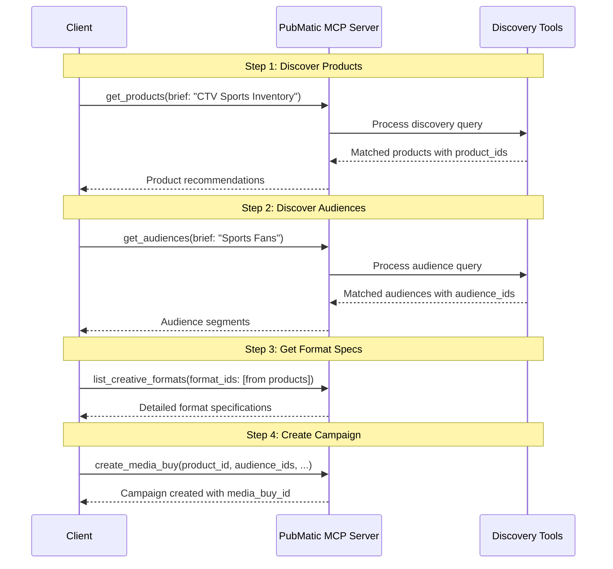

# PubMatic Activate Discovery Tools: Client Integration Guide

## Introduction

The PubMatic Activate Discovery tools enable **Activate Advertiser** clients to discover and evaluate advertising products and audience segments through AI-powered interfaces. These AdCP-compliant tools streamline the discovery process by providing natural language search capabilities with structured, machine-readable results.

This guide provides technical documentation for integrating with PubMatic's Activate Discovery tools via the Model Context Protocol (MCP) Server.

> **Note**: For common architecture diagrams, authentication flows, and general integration approaches, please refer to the [Activate Media Buy Management README](./README.md).

## Tools Overview

The Activate Discovery category includes two powerful tools:

### 1. get_products

Discover and evaluate advertising products/deal templates based on campaign requirements using natural language queries or structured filters.

### 2. get_audiences

Search and discover audience segments across third-party, contextual, and seller-defined audiences with AI-enriched descriptions.

## Key Benefits

- **Natural Language Discovery**: Use conversational queries to find relevant products and audiences
- **AI-Powered Matching**: Receive intelligent recommendations based on campaign objectives
- **Structured Results**: Get AdCP-compliant, machine-readable data for automated workflows
- **Comprehensive Details**: Access pricing, reach, targeting options, and format specifications
- **Fast Response Time**: Typically responds in 1-2 seconds for discovery queries

## Tool 1: get_products

### Description

The `get_products` tool searches and discovers advertising products (deal templates/packages) based on campaign requirements. It supports both natural language briefs and structured filter parameters.

### Key Capabilities

- **Natural language search**: Describe campaign needs conversationally
- **Structured filtering**: Apply specific filters for formats, geo, devices, audiences, brand safety
- **Product recommendations**: Receive ranked product suggestions with rationale
- **Pricing information**: Access pricing models, rates, and currency details
- **Format specifications**: Get supported creative format references
- **Availability data**: View estimated impressions and reach

### API Endpoint

**Tool Name**: `get_products`

**Method**: POST JSON-RPC 2.0 `tools/call`

### Request Parameters

| Parameter | Type | Required | Description |
|-----------|------|----------|-------------|
| `brief` | string | No | Natural language description of campaign requirements. Example: "Find premium CTV inventory for sports audience in US" |
| `brand_manifest` | object/string | No | Brand information (inline object or URL reference). Used for brand safety and contextual matching |
| `filters` | object | No | Structured filters for product discovery |
| `filters.delivery_type` | string | No | Filter by delivery type: "non_guaranteed" |
| `filters.format_types` | array | No | Filter by format types (e.g., ["video"]). Currently supports video |
| `filters.is_fixed_price` | boolean | No | Filter for fixed price vs auction products |
| `filters.min_exposures` | integer | No | Minimum impressions needed for campaign validity |
| `filters.standard_formats_only` | boolean | No | Only return products accepting IAB standard formats |

### Request Example

```json
{
  "jsonrpc": "2.0",
  "id": 1,
  "method": "tools/call",
  "params": {
    "name": "get_products",
    "parameters": {
      "brief": "I need premium CTV video inventory targeting sports enthusiasts in the United States with at least 5 million impressions available",
      "brand_manifest": {
        "name": "Acme Sports Apparel",
        "url": "https://acmesports.com"
      },
      "filters": {
        "format_types": ["video"],
        "min_exposures": 5000000
      }
    }
  }
}
```

### Response Structure

The response includes both human-readable content and structured AdCP-compliant data:

```json
{
  "jsonrpc": "2.0",
  "id": 1,
  "result": {
    "content": [
      {
        "type": "text",
        "text": "Found 3 premium CTV products matching your criteria:\n\n1. Premium Sports CTV Package - $15 CPM, 8M impressions available\n2. Live Sports Streaming Inventory - $18 CPM, 6M impressions available\n3. Sports News & Highlights Package - $12 CPM, 10M impressions available\n\nAll products support standard video formats and include brand safety targeting."
      }
    ],
    "structuredContent": {
      "products": [
        {
          "product_id": "123",
          "name": "Premium Sports CTV Package",
          "description": "Premium connected TV inventory across top sports properties",
          "formats": ["video"],
          "platforms": ["ctv", "mobile"],
          "pricing_options": [
            {
              "pricing_option_id": "cpm_auction",
              "pricing_model": "cpm",
              "is_fixed": false,
              "currency": "USD",
              "base_rate": 15.00,
              "floor_price": 12.00
            }
          ],
          "targeting_capabilities": {
            "geo": ["US"],
            "devices": ["ctv"],
            "audiences": ["sports_fans", "cord_cutters"],
            "brand_safety": ["ias", "doubleverify"]
          },
          "availability": {
            "estimated_impressions": 8000000,
            "available_start_date": "2026-02-20",
            "delivery_type": "non_guaranteed"
          },
          "format_ids": [
            {
              "agent_url": "https://creative.pubmatic.com",
              "id": "video_standard_30s"
            }
          ]
        }
      ],
      "message": "Showing 3 products matching your criteria. Products are ranked by relevance to sports targeting and CTV availability.",
      "total_count": 3,
      "filters_applied": {
        "format_types": ["video"],
        "min_exposures": 5000000
      }
    }
  }
}
```

### Response Fields

#### Top-Level Fields

| Field | Type | Description |
|-------|------|-------------|
| `content` | array | Human-readable messages for display to users |
| `structuredContent` | object | Machine-readable AdCP-compliant product data |

#### Product Object Fields

| Field | Type | Description |
|-------|------|-------------|
| `product_id` | string | Unique identifier for the product |
| `name` | string | Display name of the product |
| `description` | string | Detailed description of inventory |
| `formats` | array | Supported ad formats (e.g., "video", "display") |
| `platforms` | array | Supported platforms (e.g., "ctv", "mobile_web", "desktop") |
| `pricing_options` | array | Available pricing models and rates |
| `targeting_capabilities` | object | Available targeting options |
| `availability` | object | Inventory availability information |
| `format_ids` | array | Structured format identifiers for creative specs |

#### Pricing Option Fields

| Field | Type | Description |
|-------|------|-------------|
| `pricing_option_id` | string | Identifier for this pricing option |
| `pricing_model` | string | Pricing model (e.g., "cpm", "cpcv", "flat_rate") |
| `is_fixed` | boolean | Whether price is fixed or auction-based |
| `currency` | string | ISO 4217 currency code (e.g., "USD") |
| `base_rate` | number | Base rate for this pricing option |
| `floor_price` | number | Minimum bid price (for auction-based) |

### Use Cases

1. **Initial Campaign Planning**: Discover available inventory before campaign setup
2. **Budget Estimation**: Evaluate pricing across different product options
3. **Format Discovery**: Find products supporting specific creative formats
4. **Inventory Availability**: Check estimated impressions and delivery windows
5. **Comparative Analysis**: Compare multiple products side-by-side

### Best Practices

1. **Be Specific in Briefs**: Include format, geo, audience, and minimum reach requirements
2. **Use Structured Filters**: Combine natural language with filters for precise results
3. **Check Format IDs**: Use returned `format_ids` with `list_creative_formats` to get detailed specs
4. **Validate Availability**: Verify `estimated_impressions` meets campaign needs
5. **Review Pricing Options**: Check multiple pricing options for the same product
6. **Save product_id**: Use `product_id` when creating media buys with `create_media_buy`

---

## Tool 2: get_audiences

### Description

The `get_audiences` tool discovers available audience segments using natural language queries. It searches across third-party, contextual, and seller-defined audiences, returning detailed information including reach, pricing, and AI-enriched descriptions.

### Key Capabilities

- **Natural language search**: Describe target audiences conversationally
- **Cross-provider search**: Search across multiple audience data providers
- **AI-enriched descriptions**: Get detailed audience insights beyond basic descriptions
- **Reach estimation**: View unique user counts and total impressions
- **Pricing transparency**: Access CPM pricing for each audience segment
- **Category filtering**: Filter by audience type (third-party, contextual, seller-defined)

### API Endpoint

**Tool Name**: `get_audiences`

**Method**: POST JSON-RPC 2.0 `tools/call`

### Request Parameters

| Parameter | Type | Required | Description |
|-----------|------|----------|-------------|
| `brief` | string | No | Natural language description of target audience. Example: "Young professionals interested in sustainable fashion" |
| `filters` | object | No | Optional filters for audience discovery |
| `filters.category` | array | No | Audience categories to search within. Default: ["THIRD_PARTY_AUDIENCE", "CONTEXTUAL_AUDIENCE", "SELLER_DEFINED_AUDIENCE"] |
| `filters.min_exposures` | integer | No | Minimum reach (impressions) needed for campaign validity |
| `filters.min_score` | integer | No | Minimum relevance score threshold (0-100). Default: 0 |
| `filters.max_score` | integer | No | Maximum relevance score threshold (0-100). Default: 100 |

### Request Example

```json
{
  "jsonrpc": "2.0",
  "id": 2,
  "method": "tools/call",
  "params": {
    "name": "get_audiences",
    "parameters": {
      "brief": "Tech-savvy millennials interested in gaming and esports with strong purchasing power",
      "filters": {
        "category": ["THIRD_PARTY_AUDIENCE", "CONTEXTUAL_AUDIENCE"],
        "min_exposures": 1000000
      }
    }
  }
}
```

### Response Structure

```json
{
  "jsonrpc": "2.0",
  "id": 2,
  "result": {
    "content": [
      {
        "type": "text",
        "text": "Found 5 audience segments matching your criteria:\n\n1. Gaming Enthusiasts - Millennial (25-34) - $2.50 CPM, 3.2M users\n2. Esports Fans - High Income - $3.75 CPM, 1.8M users\n3. Tech Early Adopters - Gaming Interest - $3.20 CPM, 2.5M users\n\nAll audiences have minimum 1M impressions available and are from verified data providers."
      }
    ],
    "structuredContent": {
      "audiences": [
        {
          "audience_id": "76351",
          "name": "Gaming Enthusiasts - Millennial (25-34)",
          "description": "Millennials aged 25-34 with active gaming interest",
          "enriched_description": "This segment consists of millennials aged 25-34 who actively engage with gaming content across platforms. They frequently visit gaming websites, watch gaming streams, and participate in gaming communities. The segment shows high engagement with console, PC, and mobile gaming content, with strong purchasing intent for gaming hardware and subscriptions.",
          "price": 2.50,
          "currency": "USD",
          "unique_user_count": "3,200,000",
          "estimated_exposures": "12,800,000",
          "data_provider": "Acme Data Solutions",
          "category": "THIRD_PARTY_AUDIENCE",
          "relevance_score": 95
        },
        {
          "audience_id": "126422",
          "name": "Esports Fans - High Income",
          "description": "Esports enthusiasts with household income >$100k",
          "enriched_description": "Premium audience of esports enthusiasts with household incomes exceeding $100,000. This segment actively follows competitive gaming tournaments, purchases team merchandise, and engages with esports content creators. High brand affinity and purchasing power make this segment valuable for premium gaming and tech brands.",
          "price": 3.75,
          "currency": "USD",
          "unique_user_count": "1,800,000",
          "estimated_exposures": "7,200,000",
          "data_provider": "Premium Audience Network",
          "category": "THIRD_PARTY_AUDIENCE",
          "relevance_score": 92
        }
      ],
      "message": "Found 5 audiences matching your criteria. Audiences are ranked by relevance score based on your query.",
      "total_count": 5,
      "filters_applied": {
        "category": ["THIRD_PARTY_AUDIENCE", "CONTEXTUAL_AUDIENCE"],
        "min_exposures": 1000000
      }
    }
  }
}
```

### Response Fields

#### Audience Object Fields

| Field | Type | Description |
|-------|------|-------------|
| `audience_id` | string | Unique identifier for targeting (use in create_media_buy) |
| `name` | string | Display name of the audience segment |
| `description` | string | Original audience description from data provider |
| `enriched_description` | string | AI-generated detailed description with insights |
| `price` | number | CPM price for targeting this audience |
| `currency` | string | ISO 4217 currency code (e.g., "USD") |
| `unique_user_count` | string | Potential reach in unique users (formatted with commas) |
| `estimated_exposures` | string | Total available impressions (formatted with commas) |
| `data_provider` | string | Data provider organization name |
| `category` | string | Audience category: THIRD_PARTY_AUDIENCE, CONTEXTUAL_AUDIENCE, or SELLER_DEFINED_AUDIENCE |
| `relevance_score` | integer | Relevance score (0-100) based on query match |

### Audience Categories

| Category | Description |
|----------|-------------|
| `THIRD_PARTY_AUDIENCE` | Segments from third-party data providers (DMPs, data exchanges) |
| `CONTEXTUAL_AUDIENCE` | Segments based on content context and page-level signals |
| `SELLER_DEFINED_AUDIENCE` | Publisher-created first-party audience segments |

### Use Cases

1. **Audience Planning**: Discover relevant audiences during campaign planning phase
2. **Reach Estimation**: Evaluate potential reach before campaign creation
3. **Price Comparison**: Compare CPM pricing across similar audience segments
4. **Provider Selection**: Evaluate audiences from different data providers
5. **Campaign Optimization**: Find new audience segments to test during optimization

### Best Practices

1. **Be Descriptive in Briefs**: Include demographic, psychographic, and behavioral attributes
2. **Use Minimum Reach Filters**: Set `min_exposures` to ensure sufficient scale
3. **Review Enriched Descriptions**: Use AI-generated insights to validate audience fit
4. **Save audience_id Values**: Use these IDs in `targeting_overlay.axe_include_segment` when creating campaigns
5. **Multiple Audiences**: Combine multiple audience_ids with comma separation ("76351,126422")
6. **Test Incrementally**: Start with high relevance scores, then expand to lower scores
7. **Consider Pricing**: Balance reach and relevance with CPM pricing

### Audience Targeting in Media Buys

When creating or updating media buys, use the `audience_id` from discovery results:

```json
{
  "name": "create_media_buy",
  "parameters": {
    "packages": [{
      "targeting_overlay": {
        "axe_include_segment": "76351",  // Single audience
        // OR
        "axe_include_segment": "76351,126422,373740"  // Multiple audiences
      }
    }]
  }
}
```

---

## Integration Workflow

### Discovery-to-Campaign Workflow



## Error Handling

### Common Errors

| Error | Description | Resolution |
|-------|-------------|------------|
| Missing API Key | Authentication header not provided | Add X-API-Key header with valid API key |
| Invalid brief format | Brief parameter not a string | Ensure brief is a string type |
| Invalid filters | Filter parameters don't match schema | Review filter parameter types and values |
| No results found | No products/audiences match criteria | Broaden search criteria or remove filters |
| Rate limit exceeded | Too many requests in short period | Implement exponential backoff retry logic |

### Error Response Example

```json
{
  "jsonrpc": "2.0",
  "id": 1,
  "error": {
    "code": -32602,
    "message": "Invalid params",
    "data": {
      "details": "filters.min_exposures must be a positive integer"
    }
  }
}
```

## Testing

### Test Scenarios

1. **Basic Product Discovery**
   - Query: "Video inventory in US"
   - Expected: List of video products available in US

2. **Filtered Product Search**
   - Query: "Premium CTV" with filters: `{format_types: ["video"], min_exposures: 1000000}`
   - Expected: CTV products with minimum 1M impressions

3. **Basic Audience Discovery**
   - Query: "Sports fans"
   - Expected: List of sports-related audience segments

4. **Filtered Audience Search**
   - Query: "Tech enthusiasts" with filters: `{min_exposures: 5000000, category: ["THIRD_PARTY_AUDIENCE"]}`
   - Expected: Third-party tech audience segments with 5M+ reach

5. **No Results Scenario**
   - Query: "Extremely niche audience" with very high min_exposures
   - Expected: Empty results with helpful message

## Performance Considerations

- **Response Time**: Discovery tools typically respond in 1-2 seconds
- **Result Limits**: Results may be paginated for large result sets
- **Cache Efficiency**: Frequently requested queries may be cached for faster responses
- **Concurrent Requests**: API supports concurrent discovery requests

## Next Steps

After discovering products and audiences:

1. **Review Format Requirements**: Use `list_creative_formats` to get detailed format specifications
2. **Prepare Creatives**: Upload creatives using `sync_creatives` before campaign creation
3. **Create Campaign**: Use `create_media_buy` with discovered product_id and audience_id values
4. **Monitor Performance**: Track delivery with `get_media_buy_delivery`

## Support

For technical support or questions about Discovery tools:
- Contact your PubMatic representative
- Visit the developer portal
- Review the [Activate Media Buy Management README](./README.md)
