# PubMatic MCP Server Extension Setup Guide for ChatGPT (External)

This document explains how to install and configure the PubMatic MCP Server extension in ChatGPT for external users using OAuth authentication.

## Key Features & Prerequisites

* **ChatGPT Account** with Developer mode on.
* **External PubMatic authentication details**:
  * Resource ID
  * Resource Type (PUBLISHER, BUYER or Activate Advertiser)

**NOTE:**
* ChatGPT does not support adding custom headers.
* Resource ID and Resource Type will be configured in the MCP URL.
* **Examples:**
  * `https://mcp.pubmatic.com/mcp?resource-id=161760&resource-type=PUBLISHER`
  * `https://mcp.pubmatic.com/mcp?resource-id=27944&resource-type=ACTIVATE ADVERTISER`

## Step-by-Step Configuration

### Step 1: Enable Developer Mode
To get started, you'll need to enable Developer Mode in ChatGPT:
1. Open ChatGPT and log in to your account.
2. Go to **Settings** and select **Apps**.
3. Click the **"Create App"** button.

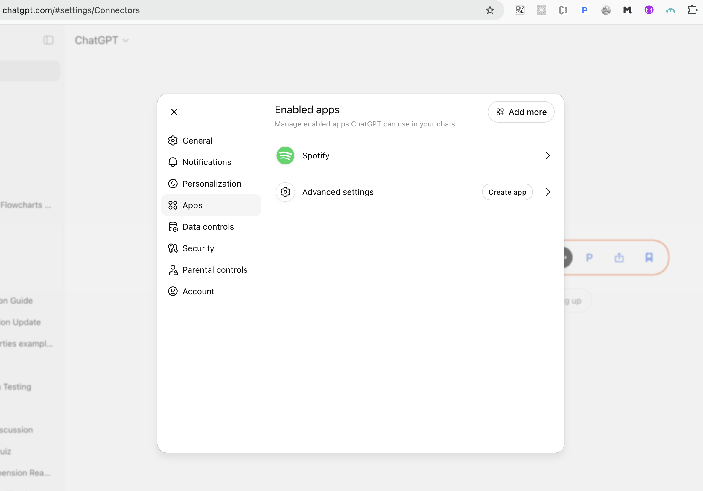

4. If you don't see the "Create App" option:
   * Navigate to **Advanced Settings**.
   * Toggle **Developer Mode** to enabled.
   * Return to the **Apps** section. 

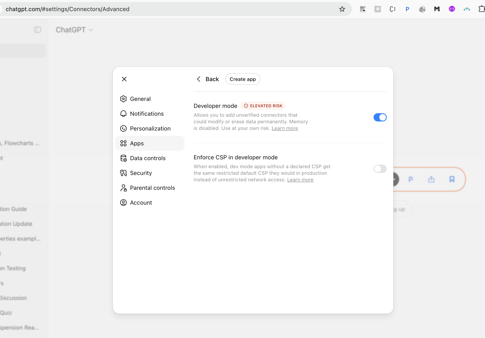

### Step 2: Create Your App
1. Click the **"Create App"** button.
2. Fill in the required information:
   * **App Name**: Enter a unique, descriptive name for your application.
   * **Description**: Enter a description for your application.
   * **MCP URL**: Provide your Model Context Protocol URL, including both the `resource-id` and `resource-type` parameters (both are required).
   * **Authentication Type**: Select **OAuth** as your authentication type.
3. Review and check the required consent checkbox to proceed.
4. Click **"Create"** to complete the setup.
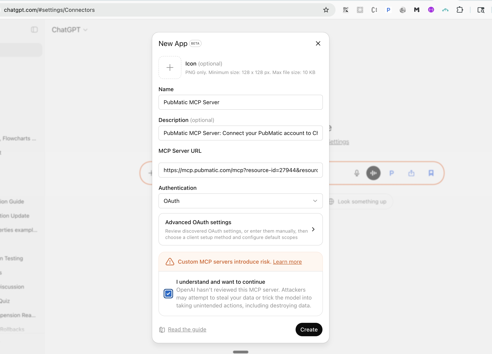

**What happens next:** After you create your app, you'll be automatically redirected to a login page. The specific login page depends on your resource type. For example:
* If your resource-type is PUBLISHER (1), you'll be redirected to `/login/publisher`.
* If your resource-type is ACTIVATE_ADVERTISER (14), you'll be redirected to `/login/activate`.

### Step 3: Authenticate Your Account
1. **Enter your credentials**: Log in with your user account credentials on the redirected login page.
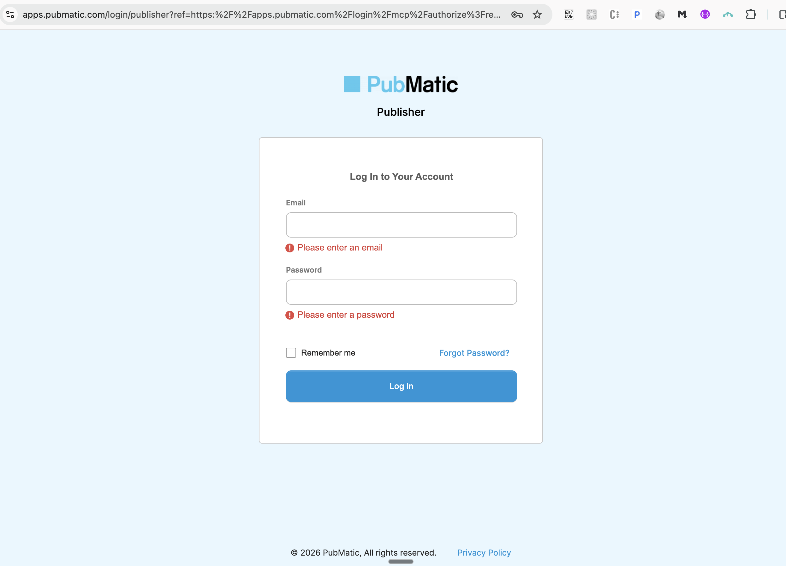
Invalid Credentials
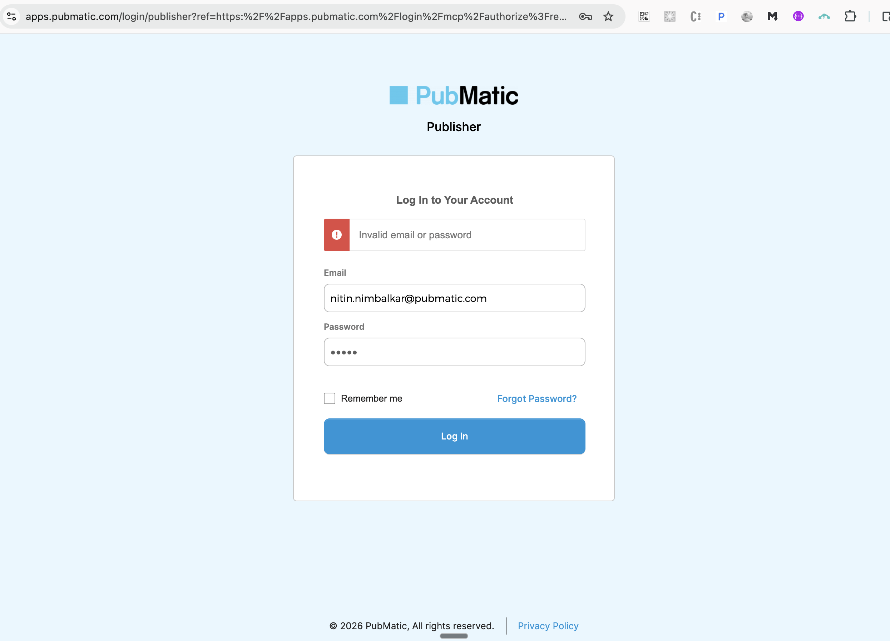

2. **Verify API access**: Ensure that your user account has API access enabled. Without this permission, authentication will fail and you won't be able to proceed.
3. **Confirm successful connection**: Entered credentials will be validated. 
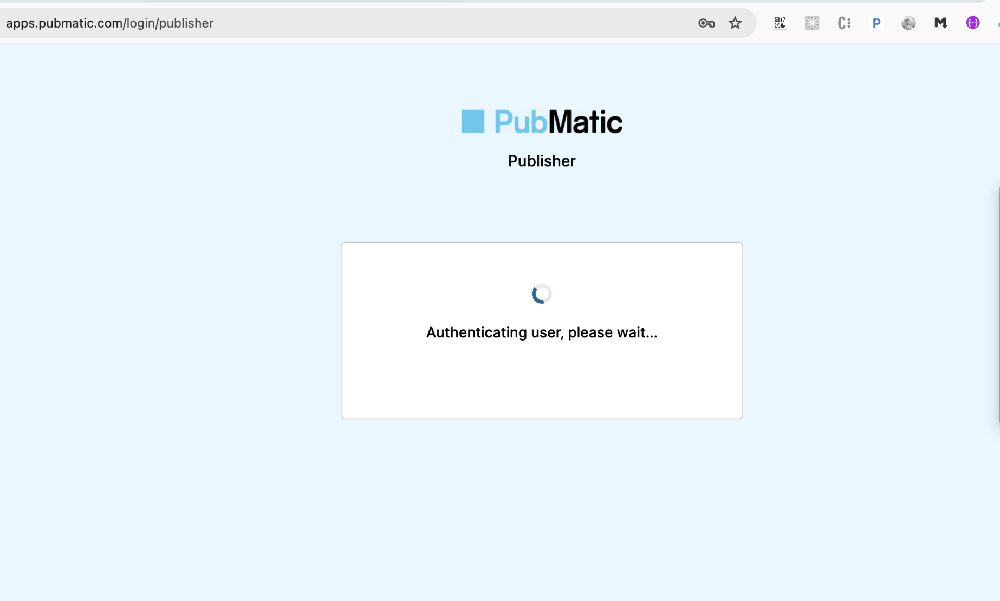
Once you've successfully logged in, you'll be automatically redirected back to your app. You should see a confirmation message stating: `"[your-app-name] is now connected"`.
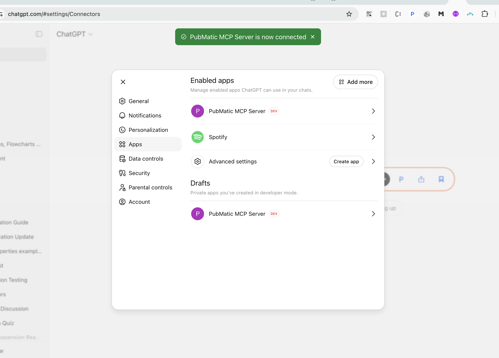
4. **Select the App Again**: Click on the app created again, You can see the details of configuration provided while creating the APP. Tools being shown loaded

Your app is now ready to use!

### Step 4: Access Your App in ChatGPT
1. Open the ChatGPT prompt input field (the message box at the bottom of the chat).
2. You can access your app in two ways:
   * **Using the menu**: Click the **"+"** button in the search bar, select **More**, then locate and click your app name.
   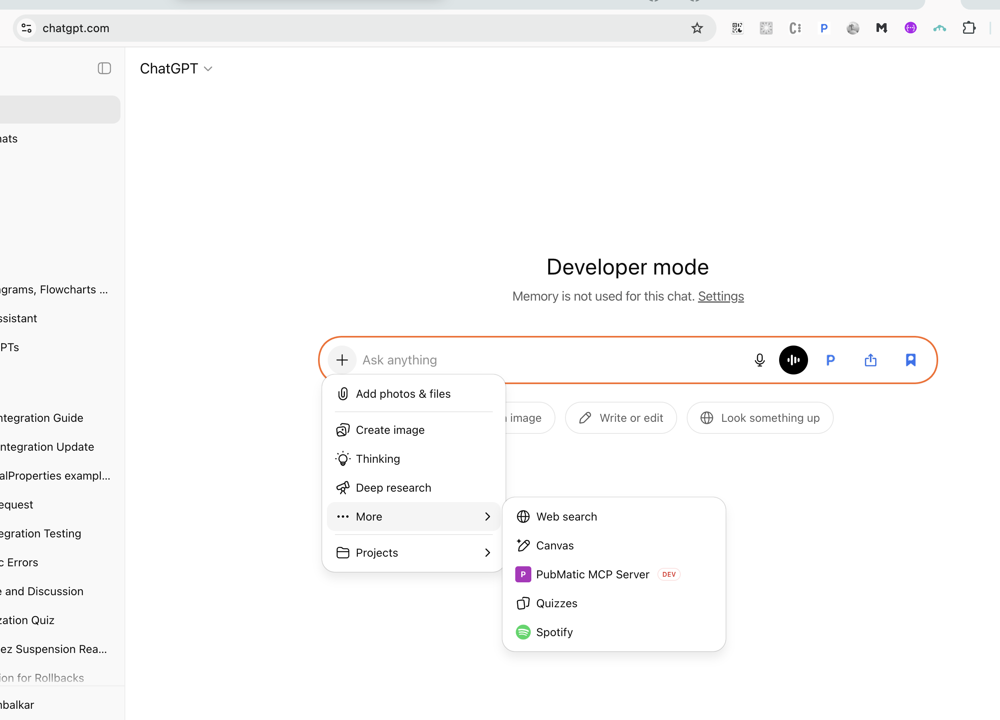
   
   * **Using a shortcut**: Type `/your-app-name` directly in the prompt field—ChatGPT will auto-suggest your app, and you can select it from the dropdown.
   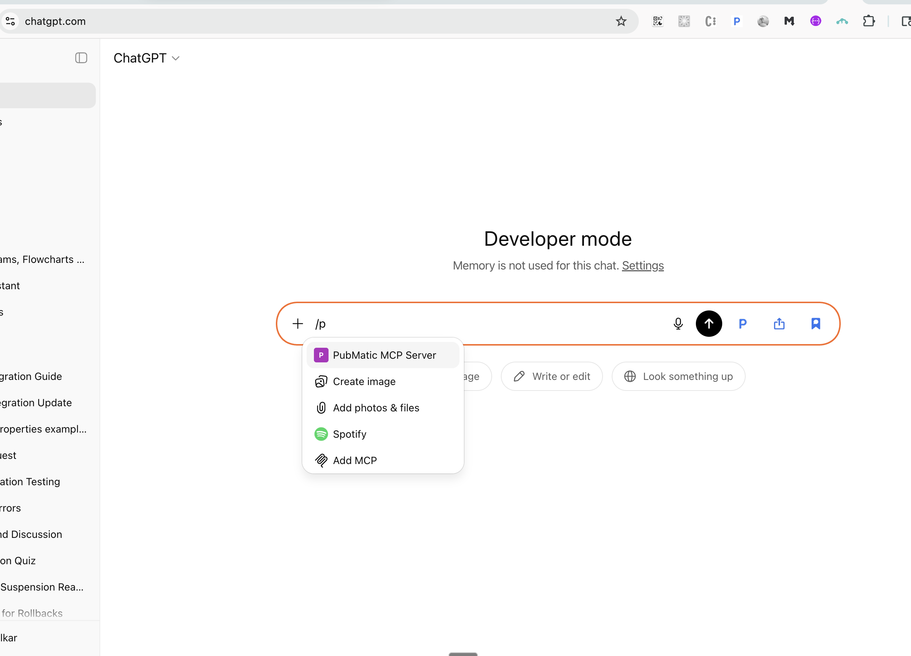
   

### Step 5: Query Your App
*(Sample Query: List all tools supported)*
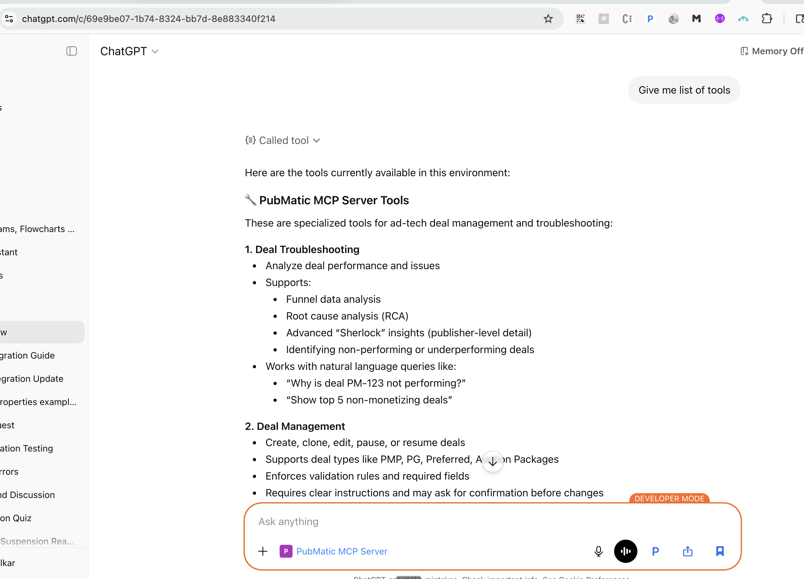

### Option to Disconnect or Delete
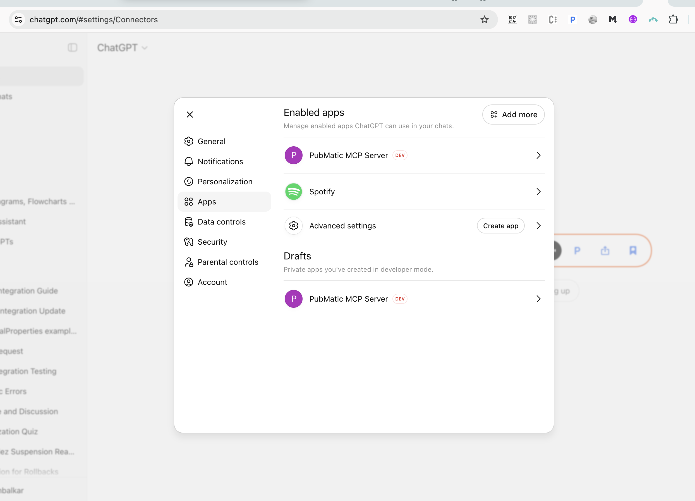
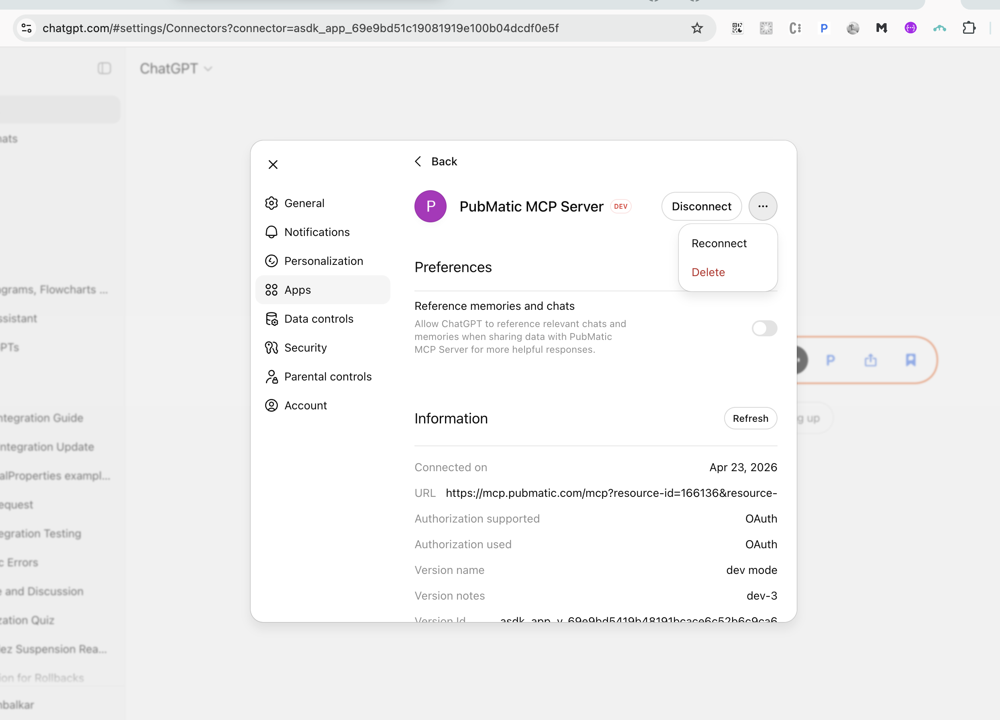

## Limitations

### Phase 1 Release Features:
* The MCP URL is integrated into your GPT app with fixed `resource-id` and `resource-type` query parameters that cannot be changed after creation.
  * Example: `https://mcp.pubmatic.com/mcp?resource-id=161760&resource-type=PUBLISHER`
* There is no option to edit or update the MCP URL once the app has been created.
* To connect to a different account, you must create and integrate a new app with the appropriate `resource-id` and `resource-type`.

### Standalone ChatGPT App Limitation:
* The standalone ChatGPT mobile app does not support adding custom apps or connecting to MCP integrations.
* App integration is only available through the web-based ChatGPT interface.

## Creating Multiple MCP Connections
When creating new GPT–MCP app connections, you must follow these steps carefully:
* **Log out of all active sessions** before creating a new connection.
* For example: If you have an active session for an Activate (Advertiser) account, you must log out first before creating a Publisher connection—even if using different browser tabs.
* Failure to log out may cause incorrect redirection or authentication failures during app creation.
* **Create separate apps for different accounts**: Each account or login requires its own dedicated GPT app integration.

## Managing Authentication Tokens
If you encounter token-related issues (such as invalid access tokens or expired refresh tokens):
1. Click the **"Reconnect"** button in your app.
2. ChatGPT will display a hint or notification prompting you to reconnect.
3. This will generate a new bearer token and restore the connection.

## License
This document is provided for users integrating with the external PubMatic MCP Server.
