# PubMatic MCP Server Extension Setup Guide for ChatGPT (External)

This document explains how to install and configure the PubMatic MCP Server extension in ChatGPT for external users using OAuth authentication.

## Key Features & Prerequisites

* **ChatGPT Account** with Developer mode on.
* **External PubMatic authentication details**:
  * Resource ID
  * Resource Type (PUBLISHER or ACTIVATE ADVERTISER)

**NOTE:**
* ChatGPT does not support adding custom headers.
* Resource ID and Resource Type will be configured in the MCP URL.
* **Examples:**
  * `https://mcp.pubmatic.com/mcp?resource-id=<resource-id>&resource-type=PUBLISHER`
  * `https://mcp.pubmatic.com/mcp?resource-id=<resource-id>&resource-type=ACTIVATE%20ADVERTISER`

## Step-by-Step Configuration

### Step 1: Enable Developer Mode

To create a personal MCP plugin, you must first enable **Developer Mode** in ChatGPT.

1. Log in to ChatGPT.
2. Navigate to **Plugins** in the sidebar.
3. Click the **"+"** button next to the search bar to create a new plugin.

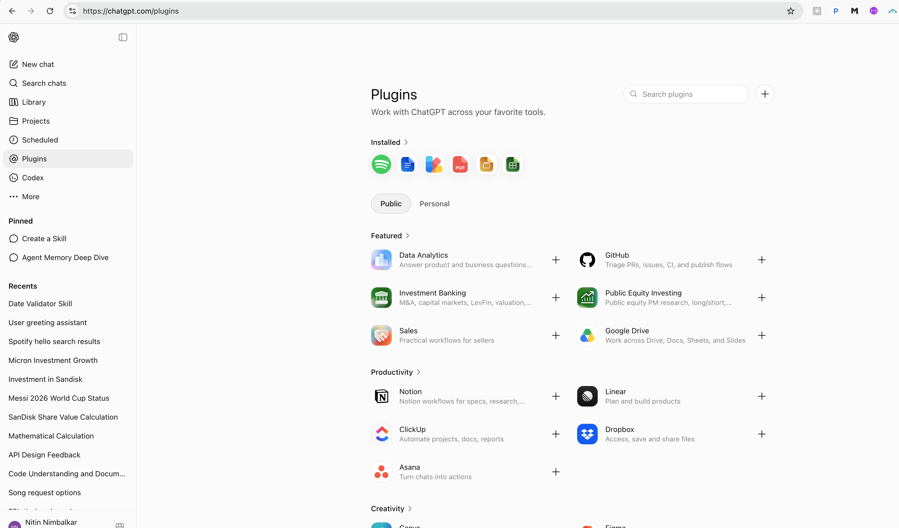

If the **"+"** button is not visible:
  - Click your profile icon in the bottom left corner.
  - Select **Settings**.
  - Go to the **Security and login** tab.
  - Find the **Developer mode** section and enable the toggle.
  - Return to the **Plugins** section. You should now see the **"+"** button.

Note: Developer Mode is required to create and install personal plugins.

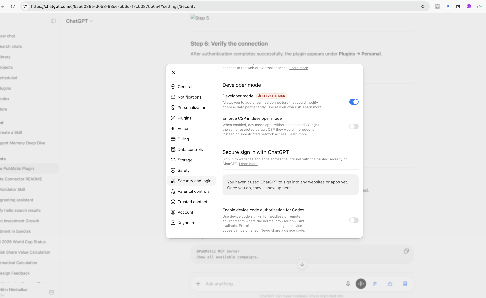

### Step 2: Create  Plugin
1. Click the **"+"** button to create new Plugin
2. Fill in the required information:
  - **Name**: Enter a unique, descriptive name for your application.
  - **Description**: Enter a description for your application.
  - **Connection (Server URL)**: Enter your Model Context Protocol URL with the `resource-id` and `resource-type` parameters (both required). Refer to the **Key Features & Prerequisites** section for URL examples.
  - **Authentication**: Select **OAuth** as your authentication type.
3. Review and check the required consent checkbox to proceed.
4. Click **"Create"** to complete the setup.
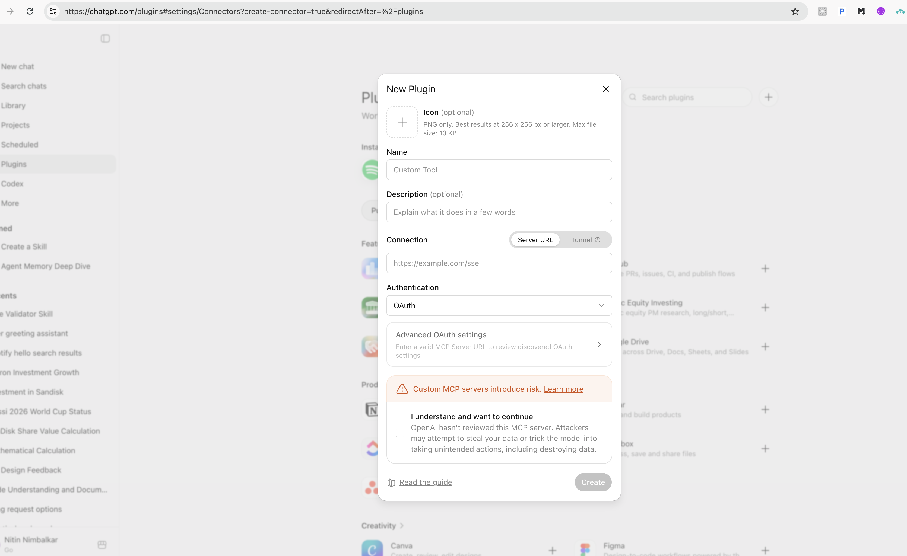

**What happens next:** After you create your Plugin, you'll be automatically redirected to a login page. The specific login page depends on your resource type. For example:
* If your resource-type is PUBLISHER (1), you'll be redirected to `/login/publisher`.
* If your resource-type is ACTIVATE ADVERTISER (14), you'll be redirected to `/login/activate`.

### Step 3: Authenticate Your Account
1. **Enter your credentials**: Log in with your user account credentials on the redirected login page.
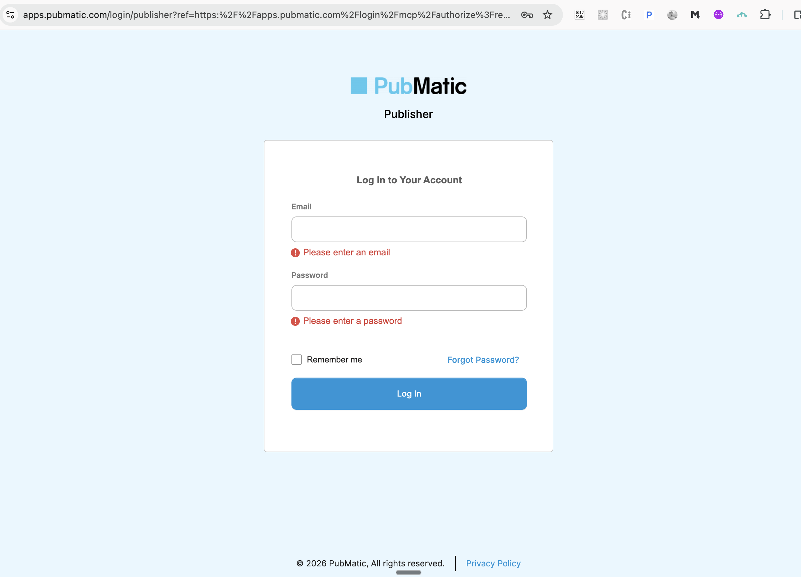
Invalid Credentials
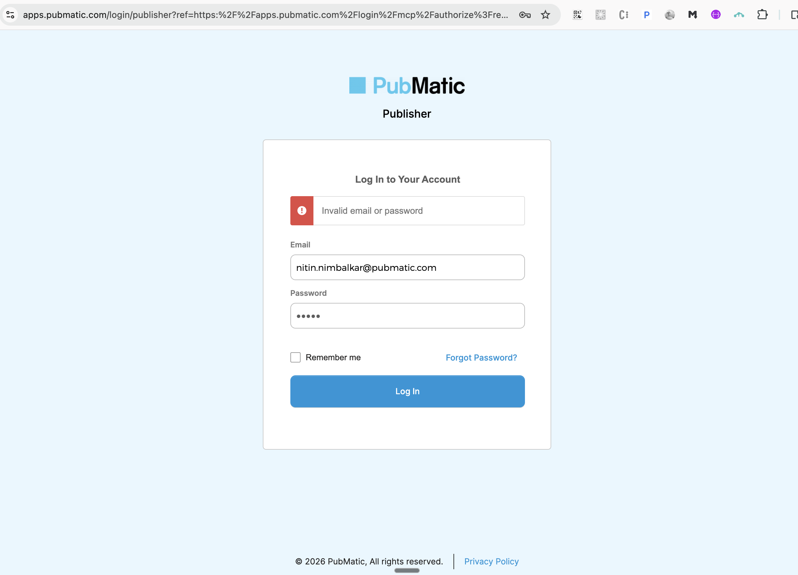

2. **Verify API access**: Ensure that your user account has API access enabled. Without this permission, authentication will fail and you won't be able to proceed.
3. **Confirm successful connection**: Entered credentials will be validated. 
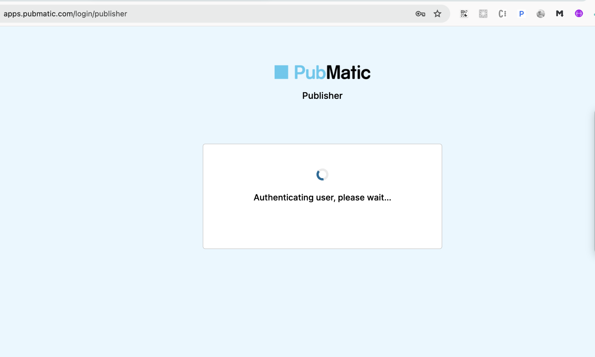
Once you've successfully logged in, you'll be automatically redirected back to your Plugin created. You should see a confirmation message stating: `"[your-app-name] is installed"`.
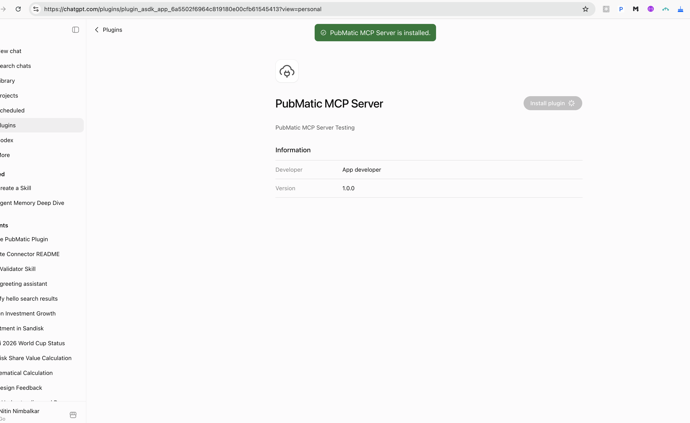
4. **Select the Plugin Again**: Click on the Plugin created again, You can see the details of configuration provided while creating the APP. Tools being shown loaded

Your app is now ready to use!

### Step 4: Access Your Plugin in ChatGPT
1. Click on **Plugins** in the sidebar.
2. Select the **Personal** tab to view your custom plugins.
3. Locate and select the plugin you created.
 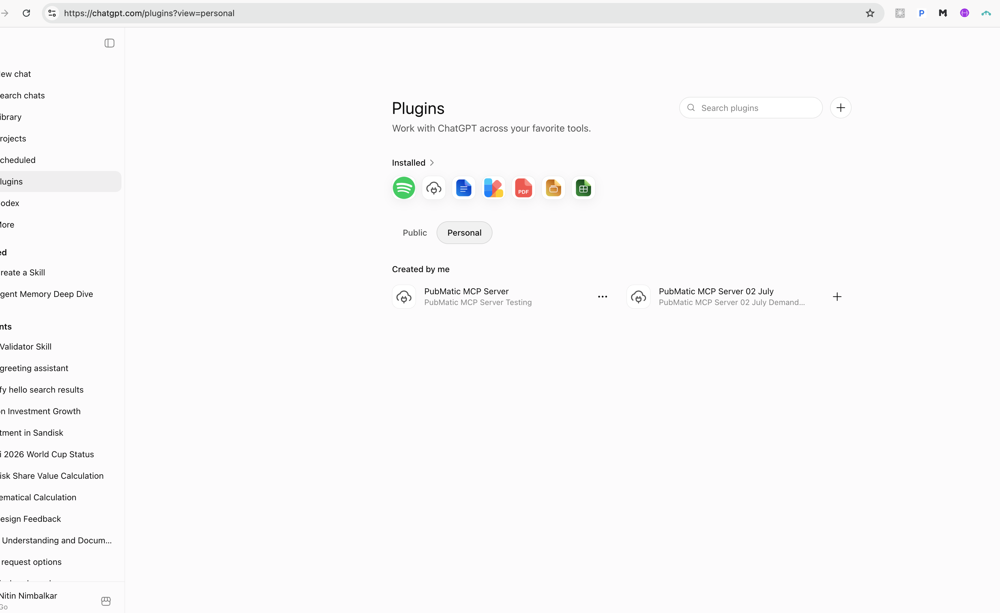
4. Click **"Try on chat"** to start using the plugin.

5. Plugin Selected will be shown on chat interface

   

### Step 5: Query Your Plugin
*(Sample Query: List all tools supported)*
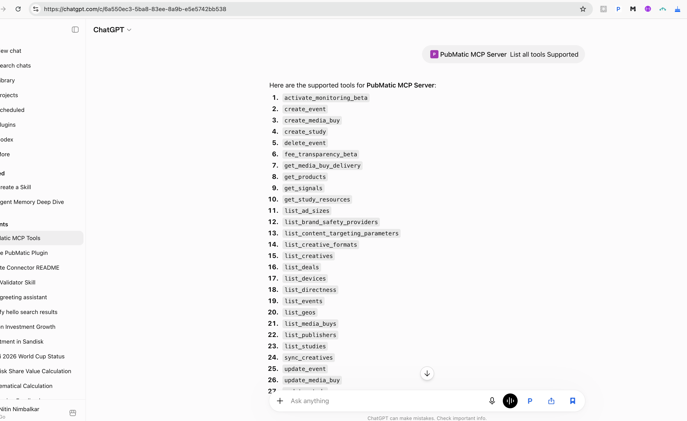

### Manage Your Plugin

To view or manage your plugin settings, follow these steps:

1. Go to the **Plugins** section.
2. Click the **"..."** (three dots) menu next to your plugin to access management options.

3. Click **Manage** to view available options for editing, reconnecting, disconnecting, or deleting your plugin.
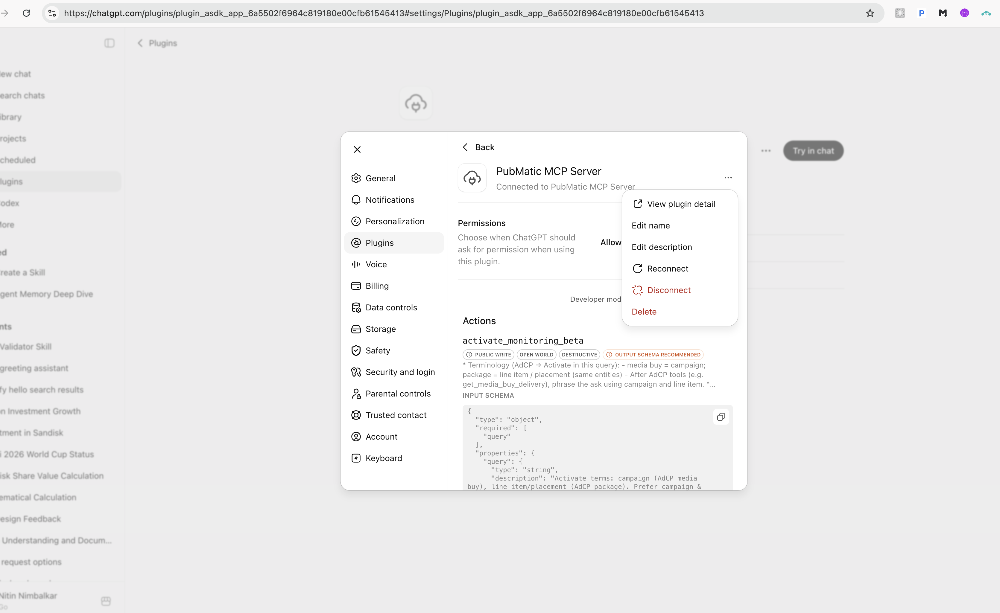

## Limitations

### Phase 1 Release Features:
* The MCP URL is integrated into your GPT app with fixed `resource-id` and `resource-type` query parameters that cannot be changed after creation.
  * Example: `https://mcp.pubmatic.com/mcp?resource-id=<resource-id>&resource-type=PUBLISHER`
* To connect to a different account, you must create and integrate a new Plugin with the appropriate `resource-id` and `resource-type`.

### Standalone ChatGPT Plugin Limitation:
* The standalone ChatGPT application does not support adding custom Plugins or connecting to MCP integrations.
* App integration is only available through the web-based ChatGPT interface.

## Creating Multiple MCP Connections
When creating new GPT–MCP app connections, you must follow these steps carefully:
* **Log out of all active sessions** before creating a new connection.
* For example: If you have an active session for an Activate (Advertiser) account, you must log out first before creating a Publisher connection—even if using different browser tabs.
* Failure to log out may cause incorrect redirection or authentication failures during Plugin creation.
* **Create separate plugins for different accounts**: Each account or login requires its own dedicated GPT plugin integration.

## Managing Authentication Tokens
If you encounter token-related issues (such as invalid access tokens or expired refresh tokens):
1. Go to **Plugins** From the chatgpt sidebar
2. Click the **Personal** button in your app.This is where custom connector residers
3. Click on + icon on custom plugin OR Click on the **Custom Plugin** which you want to reconnect. Click on **Install plugin**
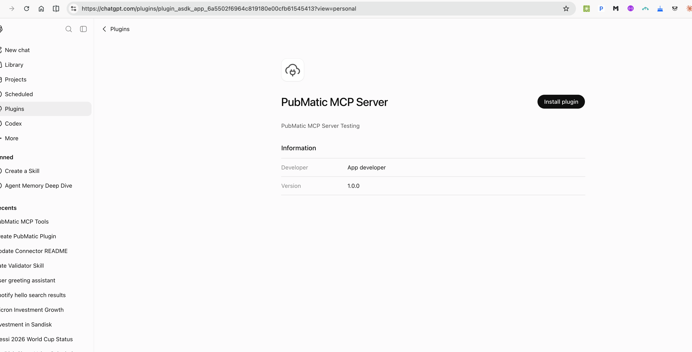
4. Modal will popup which says to connect **Sign up with <Plugin_Name>** .Click on it.
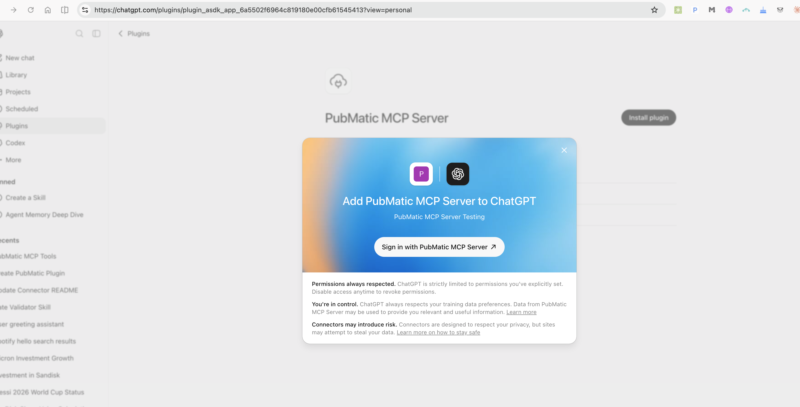

## License
This document is provided for users integrating with the external PubMatic MCP Server.
