# PubMatic MCP Server Extension Setup Guide for Claude Desktop (External)

This document explains how to install and configure the PubMatic MCP Server extension in Claude Desktop for external users.  
The `.mcpb` file enables Claude to communicate with PubMatic’s externally accessible MCP Server.

All screenshots referenced in this guide are stored in the `screenshots/` folder.

---

## Prerequisites

- Claude Desktop (latest version)
- PubMatic `.mcpb` extension file
- External PubMatic authentication details:
  - Bearer Token
  - Resource ID
  - Resource Type (`PUBLISHER`, `DSP`, or `BUYER`)

---

## Installation and Configuration Steps

### Step 1: Locate the Extension File  
Locate the downloaded `Pubmatic_MCP_Server.mcpb` file.

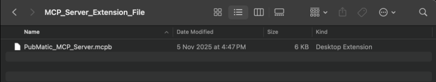

---

### Step 2: Open Claude Settings  
Launch Claude Desktop. Select **Settings** from the bottom-left menu.

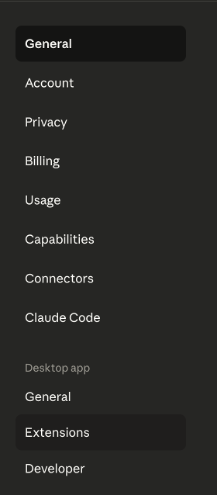

---

### Step 3: Open the Extensions Panel  
Navigate to the **Extensions** section.

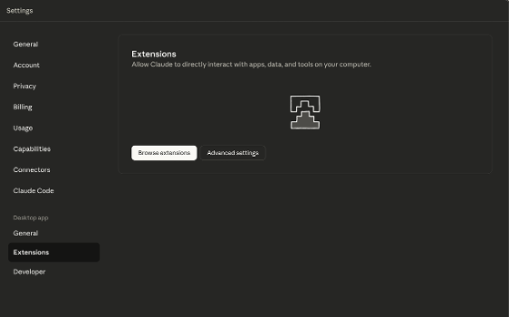

---

### Step 4: Open Advanced Settings  
Scroll to the bottom of the Extensions page and click **Advanced settings**.

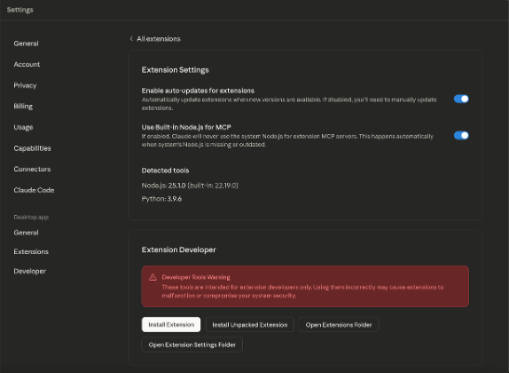

---

### Step 5: Install the Extension  
Click **Install Extension** and select the `.mcpb` file.

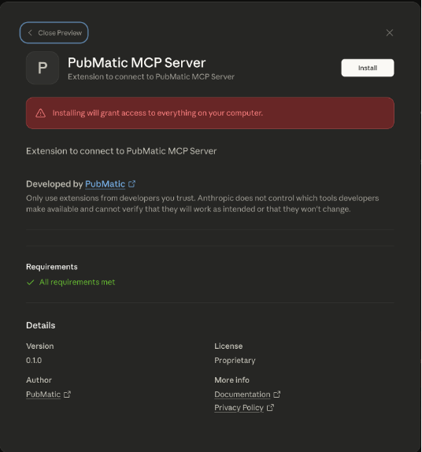

---

### Step 6: Confirm Installation  
Click **Install** in the confirmation dialog.

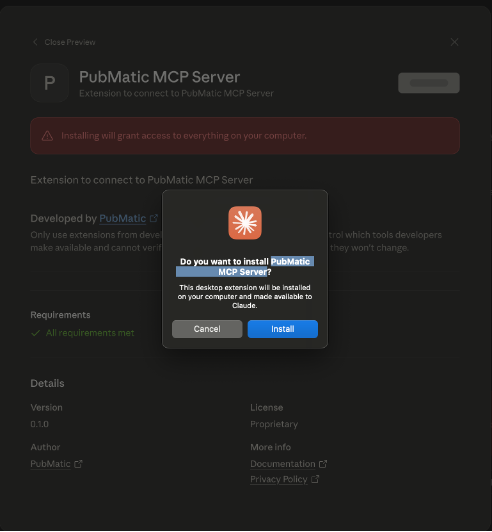

---

### Step 7: Enter Authentication Details  
Provide the following credentials:

- **Bearer Token**
- **Resource ID**
- **Resource Type**

Click **Save**.

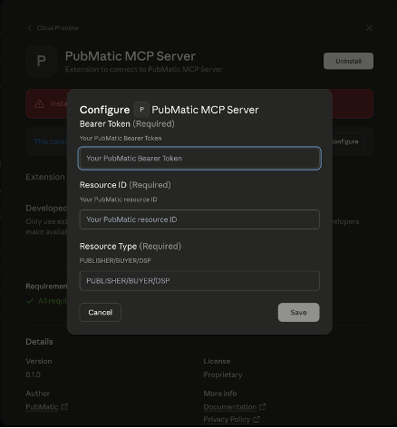

---

### Step 8: Enable the Extension  
Ensure the extension toggle is ON.

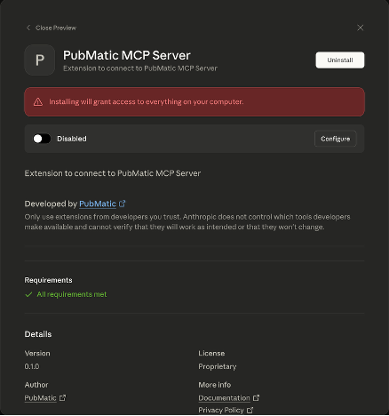
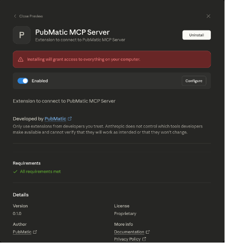

---

### Step 9: Verify Installed Extension  
Return to the Extensions list to see the installed PubMatic MCP Server.

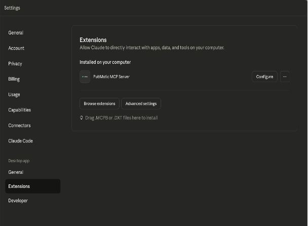

---

### Step 10: Review Configuration  
Open **Configure** to confirm the credentials and tools list.

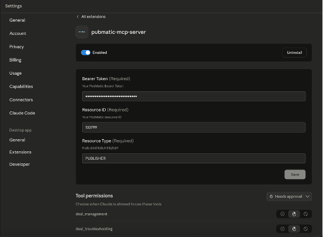

---

### Step 11: Start a New Chat  
Opening a new chat will display the available MCP Server and tools.

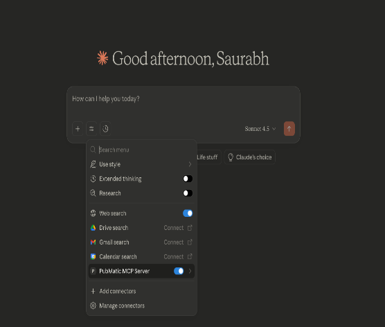

---

### Step 12: Use MCP Tools via Claude  
Enter any query and Claude will route it through the MCP Server.

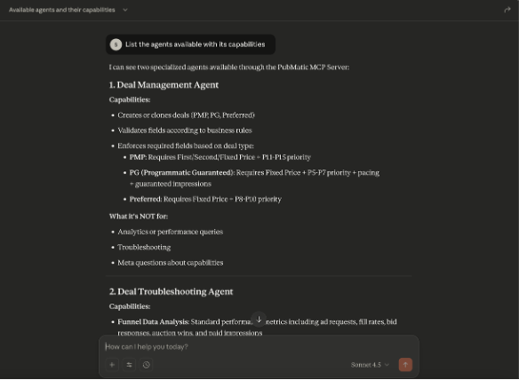

---

## Troubleshooting

- Re-enable the extension and re-enter credentials if needed.
- Ensure your Bearer Token is valid.
- Restart Claude Desktop if tools are not visible.

---

## License
This document is provided for users integrating with the external PubMatic MCP Server.
