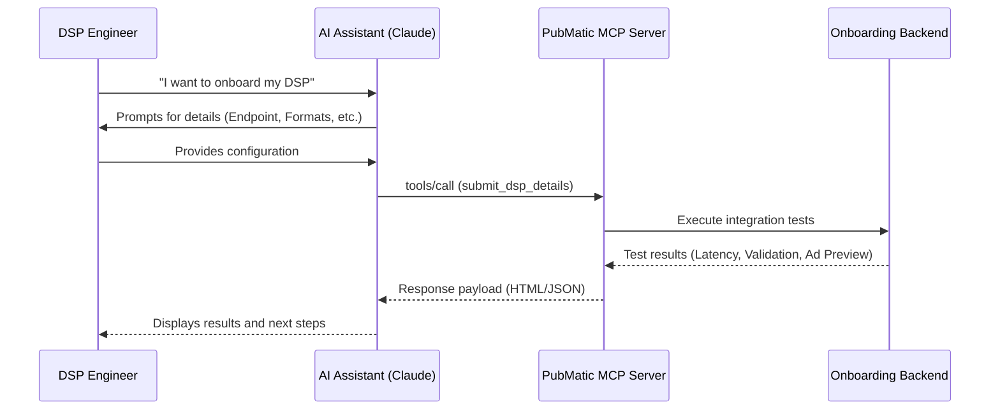

# DSP Onboarding Specifications

## Overview

The DSP Onboarding specification defines PubMatic's automated agent workflow for verifying, testing, and onboarding new Demand-Side Platforms (DSPs) through agent-to-agent protocols like MCP (Model Context Protocol). It provides a seamless, conversational experience for DSPs to submit their integration details and receive immediate, actionable feedback on their OpenRTB endpoints.

## Key Capabilities

- **Automated Intake**: Collect DSP configuration details (endpoints, platforms, ad formats, data centers) conversationally.
- **Integration Testing**: Automatically send OpenRTB bid requests to the DSP's endpoint from selected data centers.
- **Response Validation**: Validate bid responses against OpenRTB 2.5 standards and PubMatic-specific requirements.
- **Ad Rendering**: Preview and verify ad creatives (HTML/Native/VAST) directly from the DSP's bid response.
- **Structured Feedback**: Return detailed, machine-readable test results, latency metrics, and validation scores.

## Primary Audience

- DSP Integration Engineers, Solutions Engineers (SEs), and their AI assistants.

## Available Tools

### DSP Onboarding Agent

The DSP Onboarding workflow utilizes PubMatic's MCP Server to expose tools that allow AI assistants to interact with the onboarding backend.

## Benefits

Traditionally, DSP onboarding involves manual configuration, back-and-forth emails, and manual testing of OpenRTB endpoints. With agentic AI over MCP, DSPs can provide their details, run tests, and debug integration issues conversationally in real-time—significantly accelerating the time to market.

## Integration Architecture

The DSP Onboarding Agent runs on PubMatic's MCP Server with standardized Model Context Protocol semantics. Clients can be AI assistants (like Claude Desktop) using the provided `.skill` files.

### High-Level Flow

## MCP Tooling

- `submit_dsp_details`
  - Single-call tool accepting DSP configuration parameters (`dsp_company_name`, `contact_email`, `pubmatic_dsp_id`, `dsp_bid_endpoint_url`, `campaign_platforms`, `campaign_ad_formats`, `infrastructure_data_centers`, `num_requests`, `custom_samples`).
  - The agent executes live OpenRTB requests against the provided endpoint.
  - Returns a structured JSON response containing the `status` (success, blocked, error), performance metrics (`success_rate`, `successful_requests`, `total_requests`), and rich `html_results` for rendering in the assistant UI.

## Getting Started

1. **Install the Skills**: Load the provided `.skill` files (`dsp-launchpad-intake` and `dsp-live-setup`) into your Claude Desktop or compatible MCP client.
2. **Initiate Onboarding**: Start a conversation with the assistant using the `dsp-launchpad-intake` skill to provide your endpoint and testing requirements.
3. **Review Results**: The assistant will execute the tests and provide a detailed breakdown of latency, OpenRTB validation, and ad previews.
4. **Live Setup**: Once testing is successful, transition to the `dsp-live-setup` skill to finalize campaign creation.

## Future Development

This agent workflow will expand to include deeper diagnostic capabilities, automated troubleshooting suggestions based on common OpenRTB errors, and seamless handoffs to production campaign management.
