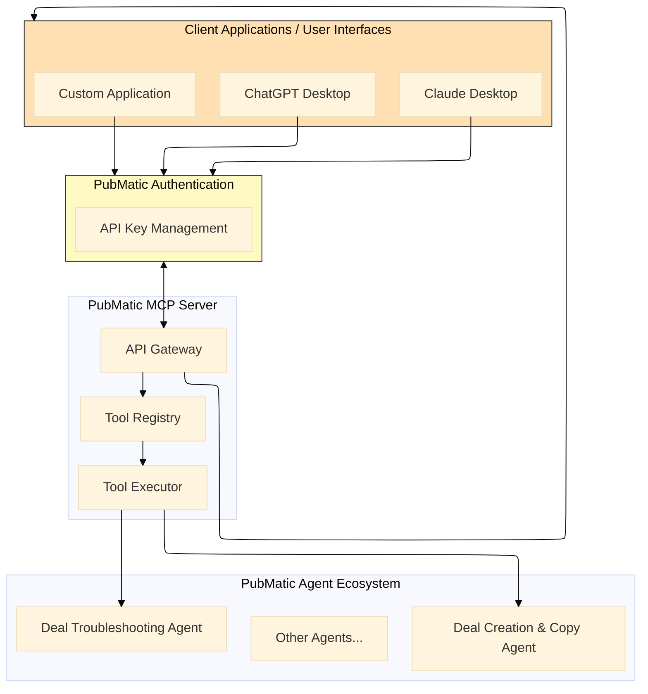
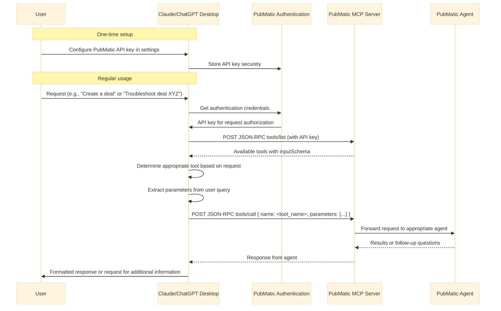
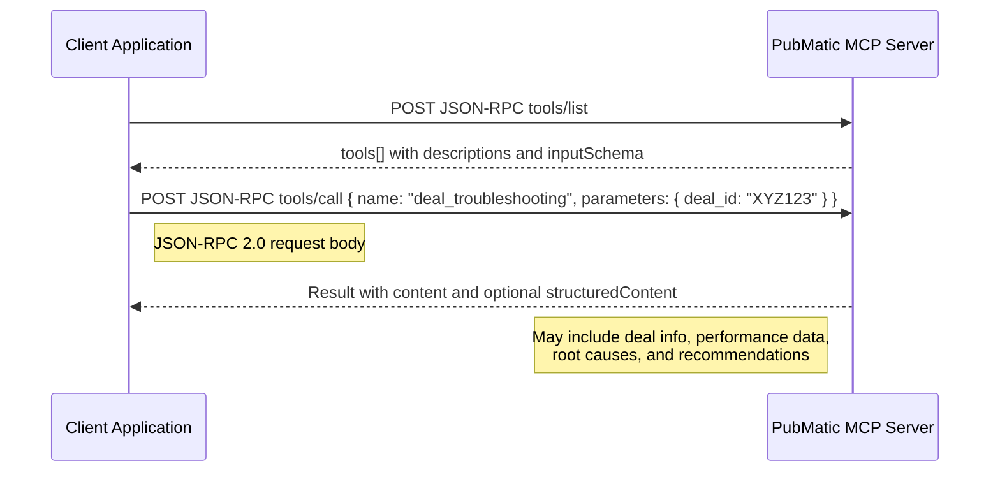

# Deal Management Specifications

## Overview

The Deal Management specification is PubMatic's first implementation of agent-to-agent communication protocols for programmatic advertising. This specification demonstrates how partners can connect through popular AI tools like ChatGPT or Claude—or through AI agents using A2A, MCP, or other protocols to streamline deal management workflows.

## Key Capabilities

- **Deal Creation & Copy**: Create and clone programmatic deals with structured parameters
- **Deal Troubleshooting**: Diagnose and resolve deal performance issues
- **Structured Responses**: Receive machine-readable data for seamless integration

## Available Tools

### Deal Creation & Copy Agent

The [Deal Creation & Copy Integration Guide](./deal_create_copy_integration_guide.md) provides comprehensive documentation for integrating with PubMatic's Deal Creation and Copy Agent, which enables programmatic creation and cloning of advertising deals through an AI-powered interface.

### Deal Troubleshooting Agent

The [Deal Troubleshooting Integration Guide](./deal_troubleshooting_integration_guide.md) provides comprehensive documentation for integrating with PubMatic's Deal Troubleshooting Agent, which helps diagnose and resolve programmatic deal performance issues.

## Benefits

Deal management, including creation and troubleshooting, is one of the most frequent touchpoints between publishers, buyers, DSPs, and SSPs, and one of the most time-consuming, complex, and frustrating processes in programmatic advertising. By streamlining this collaboration with agentic AI using protocols such as MCP or A2A, we can transform a challenging process into a smarter, faster, and seamless experience for all parties.

## Integration Architecture

The Deal Management Agents run on PubMatic's MCP Server using the standardized Model Context Protocol. This architecture enables seamless integration with client applications, including AI assistants such as Claude Desktop and ChatGPT Desktop.

### Integration Flow Diagram



### Claude/ChatGPT Desktop as MCP Client



## Integration Approaches

The specification supports multiple integration approaches:

1. **AI Assistant Integration**: Connect through popular AI tools like ChatGPT or Claude
2. **Direct API Integration**: Build custom applications that directly call the MCP Server endpoints
3. **Agent-to-Agent Communication**: Enable your AI agents to communicate directly with PubMatic's agents

### API Key configuration

Both Claude Desktop and ChatGPT Desktop support API key configuration for external services:

***For Claude Desktop***:

1. Open the Claude Desktop application settings.
2. Navigate to the "Integrations" or "API Keys" section.
3. Add a new integration for "PubMatic MCP Server".
4. Enter your PubMatic-provided API key.
5. Save the configuration.

***For ChatGPT Desktop***:

1. Open ChatGPT Desktop settings.
2. Select "Plugins" or "Integrations".
3. Add a new custom plugin for "PubMatic MCP Server".
4. Enter the MCP Server base URL and your API key.
5. Configure the authentication method as "API Key".
6. Save the configuration.

## Getting Started

- **Request API access:** Contact your PubMatic representative to request access to the MCP Server and the Deal Management Agents.
- **Explore available tools:** Use the JSON-RPC method tools/list to discover available tools and their capabilities.
- **Plan your integration:** Decide whether you need an AI assistant integration, direct API integration, or both.
- **Implement authentication:** Set up secure storage and handling of your API key.
- **Build a prototype:** Start with a simple integration to test the API and understand the response formats.
- **Test thoroughly:** Ensure your integration handles various scenarios, including errors and edge cases.
- **Deploy and monitor:** After testing, deploy your integration and monitor its performance.

## API Endpoints

### MCP Specification Compliance

The PubMatic MCP Server implements the [Model Context Protocol (MCP) specification](https://modelcontextprotocol.io/specification/2025-06-18/server/tools#structured-content), ensuring standardized interactions with AI assistants and client applications. All requests and responses follow the JSONRPC 2.0 format with structured content support.

### Authentication

All requests to the MCP Server require API key authentication:

```
X-API-Key: your-api-key
```

Contact your PubMatic representative to obtain an API key for your organization.

### Base URL

```
https://mcp.pubmatic.com/v1
```

### Common Endpoints (MCP Tools)

#### 1. Tool Discovery (JSON-RPC)

- Method: tools/list
- Transport: POST JSON-RPC 2.0 to your MCP server endpoint (e.g., /v1/tools)

Request:
```json
{
  "jsonrpc": "2.0",
  "id": 1,
  "method": "tools/list",
  "params": {}
}
```

Response:
```json
{
  "jsonrpc": "2.0",
  "id": 1,
  "result": {
    "tools": [
      {
        "name": "deal_management",
        "description": "Creates or clones deals (PMP, PG, Preferred)",
        "inputSchema": { "type": "object", "properties": { /* ... */ } }
      },
      {
        "name": "deal_troubleshooting",
        "description": "Diagnose and resolve deal performance issues",
        "inputSchema": { "type": "object", "properties": { "deal_id": { "type": "string" } }, "required": ["deal_id"] }
      }
    ]
  }
}
```

#### 2. Tool Execution (JSON-RPC)

- Method: tools/call
- Transport: POST JSON-RPC 2.0 to your MCP server endpoint (e.g., /v1/tools)

Request:
```json
{
  "jsonrpc": "2.0",
  "id": 2,
  "method": "tools/call",
  "params": {
    "name": "deal_troubleshooting",
    "parameters": { "deal_id": "XYZ123" }
  }
}
```

Response:
```json
{
  "jsonrpc": "2.0",
  "id": 2,
  "result": {
    "content": [ { "type": "text", "text": "..." } ],
    "structuredContent": { /* optional structured data per tool */ }
  }
}
```

## Tool-Specific Documentation

Review the integration guides for each tool to understand the specific API endpoints, request/response formats, and implementation approaches:



## Future Development

While we're starting with deal management, the framework we're building can extend to other critical workflows, from inventory forecasting to reporting and more. We'll continue to explore new workflows and share our learnings with the industry.