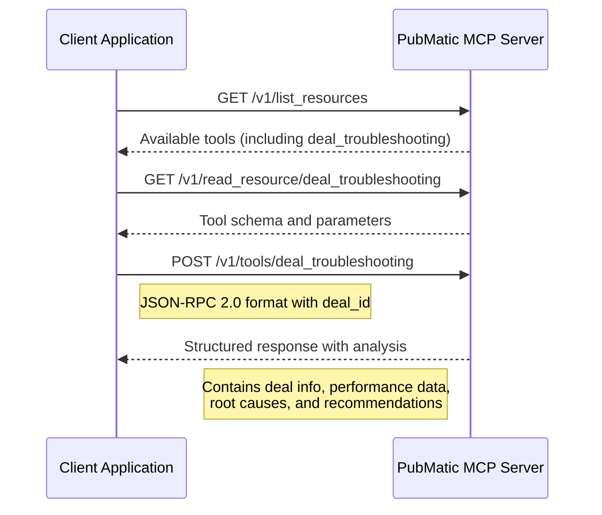

# Deal Management Specifications

## Overview

The Deal Management specification is PubMatic's first implementation of agent-to-agent communication protocols for programmatic advertising. This specification demonstrates how partners can connect through popular AI tools like ChatGPT or Claude—or through AI agents using A2A, MCP, or other protocols to streamline deal management workflows.

## Key Capabilities

- **Deal Creation**: Create programmatic deals with structured parameters
- **Deal Troubleshooting**: Diagnose and resolve deal performance issues
- **Structured Responses**: Receive machine-readable data for seamless integration

## Available Tools

### Deal Troubleshooting Agent

The [Deal Troubleshooting Integration Guide](./deal_troubleshooting_integration_guide.md) provides comprehensive documentation for integrating with PubMatic's Deal Troubleshooting Agent, which helps diagnose and resolve programmatic deal performance issues.

## Benefits

Deal management, including creation and troubleshooting, is one of the most frequent touchpoints between publishers, buyers, DSPs, and SSPs, and one of the most time-consuming, complex, and frustrating processes in programmatic advertising. By streamlining this collaboration with agentic AI using protocols such as MCP or A2A, we can transform a challenging process into a smarter, faster, and seamless experience for all parties.

## Integration Approaches

The specification supports multiple integration approaches:

1. **AI Assistant Integration**: Connect through popular AI tools like ChatGPT or Claude
2. **Direct API Integration**: Build custom applications that directly call the MCP Server endpoints
3. **Agent-to-Agent Communication**: Enable your AI agents to communicate directly with PubMatic's agents

## Getting Started

Review the integration guides for each tool to understand the API endpoints, request/response formats, and implementation approaches.

### API Flow for Deal Troubleshooting

## Future Development

While we're starting with deal management, the framework we're building can extend to other critical workflows, from inventory forecasting to reporting and more. We'll continue to explore new workflows and share our learnings with the industry.