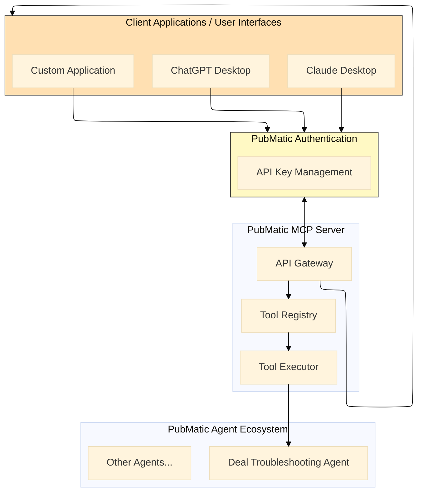
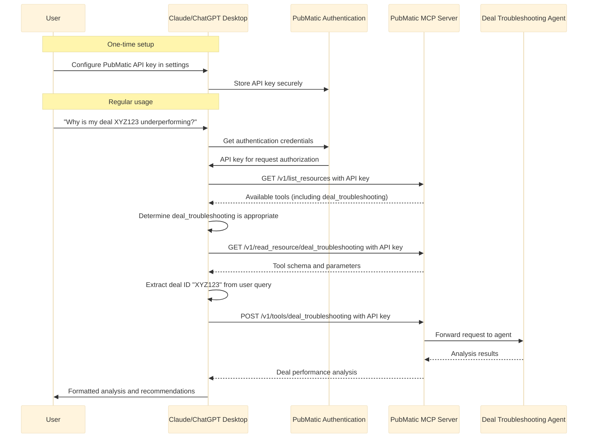

# PubMatic Deal Troubleshooting Agent: Client Integration Guide

## Introduction

The PubMatic Deal Troubleshooting Agent uses AI-powered diagnostics to identify and resolve programmatic deal performance issues. The agent applies machine learning algorithms to PubMatic's advertising data ecosystem and delivers data-driven insights and optimization recommendations for programmatic advertising workflows.

This guide provides technical documentation for DSPs (Demand-Side Platforms) and publishers who want to integrate with PubMatic's Deal Troubleshooting Agent via the Model Calling Protocol (MCP) Server.

## Agent description
The agent diagnoses and resolves deal performance issues through systematic analysis of programmatic advertising data.

## Key parameters
deal_id: ID of the deal to troubleshoot


## Key benefits
The Deal Troubleshooting Agent delivers:

- Rapid issue identification: Quickly pinpoint root causes of underperforming deals.
- Actionable recommendations: Receive data-driven optimization suggestions.
- Proactive monitoring: Automated monitoring catches issues before revenue impact.
- Performance forecasting: Predict deal performance based on historical data.
- Revenue recovery: Identify and recapture lost revenue opportunities.


## Integration Architecture

The Deal Troubleshooting Agent runs on PubMatic’s MCP Server using the standardized Model Calling Protocol. This architecture enables seamless integration with client applications, including AI assistants such as Claude Desktop and ChatGPT Desktop.


### Integration Flow Diagram



### Claude/ChatGPT Desktop as MCP Client


## Getting started
- **Request API access:** Contact your PubMatic representative to request access to the MCP Server and the Deal Troubleshooting Agent.
- **Explore available tools:** Use the /list_resources endpoint to discover available tools and their capabilities.
- **Plan your integration:** Decide whether you need an AI assistant integration, direct API integration, or both.
- **Implement authentication:** Set up secure storage and handling of your API key.
- **Build a prototype:** Start with a simple integration to test the API and understand the response formats.
- **Test thoroughly:** Ensure your integration handles various scenarios, including errors and edge cases.
- **Deploy and monitor:** After testing, deploy your integration and monitor its performance.

## Integration approaches
There are two primary approaches to integrating with the Deal Troubleshooting Agent:

### AI Assistant integration (Claude/ChatGPT Desktop)
This approach uses AI assistants like Claude Desktop or ChatGPT Desktop as the interface between users and the MCP Server. The AI assistant handles natural language understanding, tool selection, and result presentation.

**Key benefits:**

- Natural language interface for users.
- No custom UI development required.
- Contextual understanding of user queries.
- Ability to follow up with additional questions.

**API Key configuration**

Both Claude Desktop and ChatGPT Desktop support API key configuration for external services:

***For Claude Desktop***:

1. Open the Claude Desktop application settings.
2. Navigate to the "Integrations" or "API Keys" section.
3. Add a new integration for "PubMatic MCP Server".
4. Enter your PubMatic-provided API key.
5. Save the configuration.

***For ChatGPT Desktop***:

1. Open ChatGPT Desktop settings.
2. Select "Plugins" or "Integrations".
3. Add a new custom plugin for "PubMatic MCP Server".
4. Enter the MCP Server base URL and your API key.
5. Configure the authentication method as "API Key".
6. Save the configuration.

**Implementation steps**

1. Configure the AI assistant with your PubMatic MCP API key using the instructions above.
2. Set up the assistant to access the MCP Server endpoints.
3. Train or configure the assistant to recognize deal troubleshooting queries.
4. Make sure the assistant can properly format parameters for the deal_troubleshooting tool.

## Direct API integration
This approach involves building a custom application that directly calls the MCP Server endpoints to access the Deal Troubleshooting Agent.

**Key benefits:**

- Complete control over user experience.
- Integration with existing workflows and systems.
- Ability to automate troubleshooting processes.
- Custom visualization of results.

**Implementation steps**

1. Develop an API client for the MCP Server.
2. Implement tool discovery and schema retrieval.
3. Build a user interface for parameter input.
4. Create visualizations for the troubleshooting results.

## API Endpoints

### MCP Specification Compliance

The PubMatic MCP Server implements the [Model Context Protocol (MCP) specification](https://modelcontextprotocol.io/specification/2025-06-18/server/tools#structured-content), ensuring standardized interactions with AI assistants and client applications. All requests and responses follow the JSONRPC 2.0 format with structured content support.

### Authentication

All requests to the MCP Server require API key authentication:

```
X-API-Key: your-api-key
```

Contact your PubMatic representative to obtain an API key for your organization.

### Base URL

```
https://mcp.pubmatic.com/v1
```

### Endpoints for Deal Troubleshooting

#### 1. Tool Discovery

**Endpoint**: `GET /v1/list_resources`

**Description**: Retrieve a list of all available tools, including the deal troubleshooting tool.

**Response Format**:
```json
{
  "resources": [
    {
      "type": "function",
      "function": {
        "name": "deal_troubleshooting",
        "description": "Diagnose and resolve deal performance issues"
      }
    },
    // Other available tools...
  ],
  "cursor": null
}
```

#### 2. Tool Schema

**Endpoint**: `GET /v1/read_resource/deal_troubleshooting`

**Description**: Retrieve detailed schema information for the deal troubleshooting tool.

**Response Format**:
```json
{
  "name": "deal_troubleshooting",
  "title": "Deal Troubleshooting Agent",
  "description": "Diagnose and resolve deal performance issues",
  "inputSchema": {
    "type": "object",
    "properties": {
      "deal_id": {
        "type": "string",
        "description": "ID of the deal to troubleshoot"
      }
    },
    "required": ["deal_id"]
  },
  "outputSchema": {
    "type": "object",
    "properties": {
      "deal_info": {
        "type": "object",
        "properties": {
          "id": {"type": "string"},
          "name": {"type": "string"},
          "advertiser": {"type": "string"},
          "start_date": {"type": "string"},
          "end_date": {"type": "string"},
          "deal_type": {"type": "string"}
        }
      },
      "performance_summary": {
        "type": "object",
        "properties": {
          "status": {"type": "string"},
          "primary_issues": {"type": "array", "items": {"type": "string"}},
          "health_score": {"type": "number"}
        }
      },
      "root_causes": {
        "type": "array",
        "items": {
          "type": "object",
          "properties": {
            "issue": {"type": "string"},
            "impact": {"type": "string"},
            "evidence": {"type": "string"}
          }
        }
      },
      "recommendations": {
        "type": "array",
        "items": {
          "type": "object",
          "properties": {
            "action": {"type": "string"},
            "expected_impact": {"type": "string"},
            "priority": {"type": "string"}
          }
        }
      }
    }
  }
}
```

#### 3. Tool Execution

**Endpoint**: `POST /v1/tools/deal_troubleshooting`

**Description**: Execute the deal troubleshooting tool with provided parameters.

**Request Format**:
```json
{
  "jsonrpc": "2.0",
  "id": 1,
  "method": "tools/call",
  "params": {
    "name": "deal_troubleshooting",
    "parameters": {
      "deal_id": "XYZ123"
    },
    "context": {
      "conversation_id": "optional-conversation-id"
    }
  }
}
```

**Response Format**:
```json
{
  "jsonrpc": "2.0",
  "id": 1,
  "result": {
    "content": [
      {
        "type": "text",
        "text": "Deal analysis completed successfully for deal XYZ123"
      }
    ],
    "structuredContent": {
      "deal_info": {
        "id": "XYZ123",
        "name": "Premium Video Q3 Campaign",
        "advertiser": "Example Brand",
        "start_date": "2025-07-01",
        "end_date": "2025-09-30",
        "deal_type": "PMP"
      },
      "performance_summary": {
        "status": "underperforming",
        "primary_issues": [
          "Low fill rate (45% vs. target 70%)",
          "High bid rejection rate (25%)"
        ],
        "health_score": 65
      },
      "root_causes": [
        {
          "issue": "Targeting constraints too narrow",
          "impact": "high",
          "evidence": "Geographic targeting limited to 3 DMAs with low inventory availability"
        },
        {
          "issue": "Price floor too high for current market conditions",
          "impact": "medium",
          "evidence": "Current floor ($12.50) is 30% above market average for similar inventory"
        }
      ],
      "recommendations": [
        {
          "action": "Expand geographic targeting to include 5 additional high-performing DMAs",
          "expected_impact": "Potential 40% increase in fill rate",
          "priority": "high"
        },
        {
          "action": "Adjust price floor to $9.75 to align with current market conditions",
          "expected_impact": "Potential 15% increase in win rate",
          "priority": "medium"
        },
        {
          "action": "Review creative assets for compliance with publisher requirements",
          "expected_impact": "Reduce rejection rate by up to 10%",
          "priority": "medium"
        }
      ]
    }
  }
}
```

## Integration Approaches

There are two primary approaches to integrating with the Deal Troubleshooting Agent:

### 1. AI Assistant Integration (Claude/ChatGPT Desktop)

This approach leverages AI assistants like Claude Desktop or ChatGPT Desktop as the interface between users and the MCP Server. The AI assistant handles natural language understanding, tool selection, and result presentation.

**Key Benefits**:
- Natural language interface for users
- No custom UI development required
- Contextual understanding of user queries
- Ability to follow up with additional questions

**API Key Configuration**:

Both Claude Desktop and ChatGPT Desktop support API key configuration for external services:

**For Claude Desktop**:
1. Open Claude Desktop application settings
2. Navigate to the "Integrations" or "API Keys" section
3. Add a new integration for "PubMatic MCP Server"
4. Enter your PubMatic-provided API key
5. Save the configuration

**For ChatGPT Desktop**:
1. Open ChatGPT Desktop settings
2. Select "Plugins" or "Integrations"
3. Add a new custom plugin for "PubMatic MCP Server"
4. Enter the MCP Server base URL and your API key
5. Configure the authentication method as "API Key"
6. Save the configuration

**Implementation Steps**:
1. Configure the AI assistant with your PubMatic MCP API key as described above
2. Set up the assistant to access the MCP Server endpoints
3. Train or configure the assistant to recognize deal troubleshooting queries
4. Ensure the assistant can properly format parameters for the deal_troubleshooting tool

### 2. Direct API Integration

This approach involves building a custom application that directly calls the MCP Server endpoints to access the Deal Troubleshooting Agent.

**Key Benefits**:
- Complete control over user experience
- Integration with existing workflows and systems
- Ability to automate troubleshooting processes
- Custom visualization of results

**Implementation Steps**:
1. Develop an API client for the MCP Server
2. Implement tool discovery and schema retrieval
3. Build a user interface for parameter input
4. Create visualizations for the troubleshooting results
