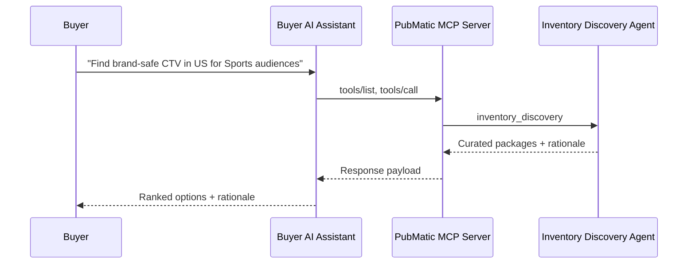

# Inventory Discovery Specifications

## Overview

The Inventory Discovery specification defines PubMatic's buyer-focused agent for discovering, evaluating, and curating supply opportunities through agent-to-agent protocols like MCP and A2A. It mirrors the structure of Deal Management to ensure a consistent developer experience across PubMatic's MCP Server.

## Key Capabilities

- **Inventory Discovery**: Search and filter publisher inventory by attributes such as formats, geos, devices, audiences, contextual signals, and brand safety.
- **Supply Curation**: Propose and assemble recommended supply packages tailored to buyer objectives.
- **Structured Responses**: Return machine-readable results (schemas) to enable automated decisioning and downstream workflows.

## Primary Audience

- Buyers (agencies, brands) and their AI assistants.

## Available Tools

### Inventory Discovery Agent

The [Inventory Discovery Integration Guide](./inventory_discovery_integration_guide.md) provides comprehensive documentation for integrating with PubMatic's Inventory Discovery Agent, including request/response formats, filters, result structures, and best practices.

## Benefits

Discovering and curating supply typically requires multiple back-and-forths across proposal docs, email threads, and spreadsheets. With agentic AI over MCP, buyers can request targeted supply options, receive structured shortlists with rationale, and iterate conversationally—accelerating planning and activation.

## Integration Architecture

The Inventory Discovery Agent runs on PubMatic's MCP Server with standardized Model Context Protocol semantics. Clients can be AI assistants (Claude/ChatGPT Desktop) or custom apps using JSON-RPC.

### High-Level Flow

## MCP Tooling (Examples)

- `inventory_discovery`
  - Single-call tool accepting a natural-language `brief` from the user describing objectives, audiences, markets, formats, constraints, budget/flight, etc.
  - Optional `filters` object can be provided to explicitly guide discovery (e.g., formats, geo, device, audience_segments, contextual, brand_safety, supply_type).
  - The agent interprets the brief and optional filters to produce curated package recommendations with rationale and forecasting data.

Note: Exact input/output schemas are defined in the integration guide and may evolve.

## Getting Started

- Request API access to PubMatic's MCP Server.
- Discover tools via `tools/list` and review `inputSchema`.
- Start with `inventory_discovery` by providing a concise campaign `brief`.
- Iterate conversationally by refining the brief (e.g., add constraints, outcomes, preferences) and re-calling the tool.

## Future Development

This agent will expand with forecasting hooks, audience enrichment, marketplace intelligence, and activation handoffs to Deal Management.
