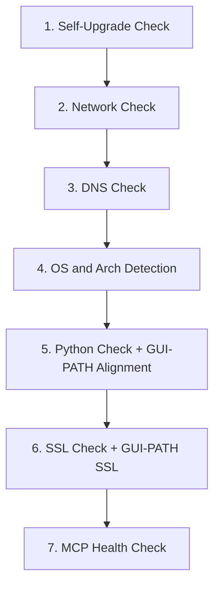

# PubMatic Troubleshooting Script - Redesign Plan

## Overview

Completely restructure `PubMatic_Troubleshooting.sh` into a modular, ordered pipeline with 7 sections: self-upgrade, network check, DNS check, OS/arch detection, Python validation with optional install (including GUI-PATH manifest alignment), SSL/certificate setup (including GUI-PATH SSL verification), and MCP health check. Cross-platform support for macOS and Linux. Windows is out of scope (separate script).

---

## Dependency Philosophy

**Baseline assumptions (only two):**
- `bash` (v3.2+ ships with macOS, v4+ on most Linux)
- `curl` (ships with macOS, present on most Linux distros)

**Everything else must be checked before use.** The script must never crash because a tool like `nslookup`, `dig`, `host`, `pip`, or `jq` is missing. Each section uses a "try the best tool, fall back to simpler ones, fall back to bash builtins" strategy.

### Dependency Matrix

| Section | Primary Tool | Fallback 1 | Fallback 2 (Bash Built-in) |
|---------|-------------|------------|---------------------------|
| 1. Self-Upgrade | `curl` (required) | -- | -- |
| 2. Network Check | `curl` (required) | -- | -- |
| 3. DNS Check | `host` | `nslookup` | `ping -c1` (confirms reachability even if we can't extract IP) |
| 4. OS/Arch | `uname` (POSIX, always present) | -- | -- |
| 5. Python Check | `python3` (that's what we're checking) | `python` (check if it's 3.x) | -- |
| 5. Python Install | `installer` (macOS) / `apt-get` (Debian) / `dnf` (RHEL) | `yum` (older RHEL) | Guide user manually |
| 6. SSL Check | `python3 -c "import ssl"` | `curl -vI https://...` (verify SSL via curl if Python SSL broken) | -- |
| 6. SSL Install | `pip` / `pip3` / `python3 -m pip` | `python3 -m ensurepip` (bootstrap pip first) | -- |
| 7. Health Check | `curl` (required) | -- | -- |

### Helper: `require_cmd` and `has_cmd`

Two utility functions used throughout:

```bash
has_cmd() { command -v "$1" &>/dev/null; }

require_cmd() {
    if ! has_cmd "$1"; then
        fail "$2" "$1 is not installed and is required."
    fi
}
```

Every section calls `has_cmd` before using any tool that isn't bash or curl.

---

## Execution Flow



---

## Script Structure

### Header / Globals

- `SCRIPT_VERSION="1.0.0"` -- embedded version for self-upgrade comparison
- Constants: `MIN_VERSION="3.8"`, `MAX_VERSION="3.13.99"`, `PYTHON_PKG_VERSION="3.12.9"`, `MCP_HOST="mcp.pubmatic.com"`, `HEALTH_CHECK_URL="https://apps.pubmatic.com/mcpserver/health"`
- Logging to `/tmp/pubmatic_troubleshooting_<timestamp>.log`
- Argument parsing: `--yes` / `-y` flag to auto-accept Python install prompt (for CI/automation)
- Remove `set -e` -- each function handles its own errors explicitly
- ANSI color helpers (`green`, `red`, `yellow`) with `NO_COLOR` environment variable support
- Status tracking variables: `CHECK_UPGRADE`, `CHECK_NETWORK`, `CHECK_DNS`, `CHECK_PLATFORM`, `CHECK_PYTHON`, `CHECK_SSL`, `CHECK_HEALTH`
- GUI Python tracking: `GUI_PYTHON` stores the `python3` binary that Claude Desktop (GUI app) will actually resolve, which may differ from the terminal's `PYTHON_CMD` on macOS
- **Dependency check at startup**: verify `curl` is available, abort early with clear message if not

---

## Section Details

### 1. Self-Upgrade (`check_upgrade`)

**Dependencies used:** `curl`, `grep`, `sed` (all POSIX standard)

- Verify `curl` is available (should be, checked at startup)
- Query `https://api.github.com/repos/PubMatic/pubmatic-mcp-server/releases/latest` using `curl`
- Parse `tag_name` using `grep`/`sed` -- no `jq` dependency:
  ```bash
  LATEST=$(curl -fsSL "$RELEASES_URL" | grep '"tag_name"' | sed 's/.*"v\?\([^"]*\)".*/\1/')
  ```
- Compare with embedded `SCRIPT_VERSION` using `sort -V` (available on macOS 10.15+ and GNU coreutils)
- If newer version exists:
  - Print current vs. latest version
  - Download the new script from the release asset URL
  - Replace self (`cp` new over old, `chmod +x`)
  - Re-exec with `exec "$0" "$@"` to continue on the new version
- If no update or GitHub unreachable: log and continue silently
- Status: `pass` (upgraded or up-to-date), `skip` (GitHub unreachable)

### 2. Network Check (`check_network`)

**Dependencies used:** `curl` only

No `ping` (may be blocked by firewall, requires ICMP). No `python3` (not validated yet). Pure curl:

- Attempt `curl -fsS --max-time 5 -o /dev/null https://www.google.com`
- If fails, try fallback: `curl -fsS --max-time 5 -o /dev/null https://1.1.1.1`
- On failure: print "No internet connectivity detected", set `CHECK_NETWORK="fail"`, exit
- On success: set `CHECK_NETWORK="pass"`, log
- **Why curl and not ping:** ping uses ICMP which is often blocked by corporate firewalls/VPNs. curl over HTTPS tests the actual protocol the script needs.

### 3. DNS Check (`check_dns`)

**Dependencies used:** Whichever DNS tool is available, with cascading fallback

The script does NOT assume any specific DNS tool is installed. It tries them in order:

```bash
resolve_dns() {
    local host="$1"
    if has_cmd host; then
        host "$host" 2>/dev/null | grep "has address"
    elif has_cmd nslookup; then
        nslookup "$host" 2>/dev/null | grep -A1 "Name:" | grep "Address"
    elif has_cmd dig; then
        dig +short "$host" 2>/dev/null
    else
        # Ultimate fallback: use curl itself to test DNS
        # curl will fail with a specific exit code (6) if DNS fails
        curl -fsS --max-time 5 -o /dev/null "https://${host}" 2>/dev/null
        if [ $? -eq 0 ]; then
            echo "(resolved via curl -- no DNS tool available to show IP)"
        elif [ $? -eq 6 ]; then
            return 1  # DNS resolution failed
        fi
    fi
}
```

- The `curl` fallback is key: even if `host`, `nslookup`, and `dig` are all missing, we can still detect DNS failure because `curl` returns exit code 6 specifically for DNS resolution failures.
- Log resolved IP addresses when available
- On failure: print DNS resolution error, suggest checking VPN/DNS settings, exit
- Status: `pass` or `fail`

### 4. OS and Arch Detection (`detect_platform`)

**Dependencies used:** `uname` only (POSIX standard, guaranteed on all Unix systems)

- `DETECTED_OS` from `uname -s` -- handle `Darwin` (macOS) and `Linux`
- `DETECTED_ARCH` from `uname -m` -- handle `x86_64`, `arm64`/`aarch64`
- Print detected platform (e.g., "Detected: macOS arm64")
- If OS is unsupported (not Darwin/Linux): print message suggesting Windows script, exit
- **Detect Linux distro** (needed for Python install in step 5):
  ```bash
  DETECTED_DISTRO="unknown"
  if [ "$DETECTED_OS" = "Linux" ]; then
      if [ -f /etc/os-release ]; then
          # POSIX file read, no extra tools needed
          . /etc/os-release
          DETECTED_DISTRO="$ID"  # "ubuntu", "debian", "fedora", "centos", "rhel", "amzn", etc.
      fi
  fi
  ```
  `/etc/os-release` is a standard file on all modern Linux distros (systemd-based). Sourcing it is pure shell -- no `grep`, `awk`, or `cat` needed.
- Status: `pass` or `fail`

### 5. Python Check and Install (`check_python`)

**Dependencies used:** `python3` or `python` (what we're checking), OS package manager (for install)

#### 5a. Version Check -- Minimal Dependency

```bash
PYTHON_CMD=""
if has_cmd python3; then
    PYTHON_CMD="python3"
elif has_cmd python; then
    # Check if "python" is actually Python 3
    PY_MAJOR=$(python --version 2>&1 | grep -oE '[0-9]+' | head -1)
    if [ "$PY_MAJOR" = "3" ]; then
        PYTHON_CMD="python"
    fi
fi
```

- Parse version using `awk` (POSIX): `$PYTHON_CMD --version 2>&1 | awk '{print $2}'`
- Validate with `sort -V` (same as current script)
- If valid: print version, set `CHECK_PYTHON="pass"`, continue

#### 5b. If Missing or Out of Range -- Show Full Plan, Then Confirm

The script builds the exact list of commands it will run (based on detected OS, arch, distro) and **prints every step to the user before asking for confirmation**. The user sees what will happen to their system before anything is touched.

**Example output on macOS arm64:**

```
  ============================================================
  ⚠️  WARNING: Python installation required
  ============================================================

  Current situation:
    - Python 3 is not installed (or version X.Y.Z is outside 3.8–3.13.x)
    - The PubMatic MCP Server requires Python 3.8 or higher (up to 3.13.x)

  The following steps will be executed on your system:

    Step 1: curl -fsSL https://www.python.org/ftp/python/3.12.9/python-3.12.9-macos11.pkg -o /tmp/python-3.12.9-macos11.pkg
            (Download Python 3.12.9 installer from python.org)

    Step 2: sudo installer -pkg /tmp/python-3.12.9-macos11.pkg -target /
            (Install Python 3.12.9 system-wide — requires admin password)

    Step 3: sudo ln -sf /Library/Frameworks/Python.framework/Versions/3.12/bin/python3.12 /usr/local/bin/python3
            (Symlink python3 so the MCP manifest can find it)

    Step 4: rm -f /tmp/python-3.12.9-macos11.pkg
            (Clean up downloaded installer)

  ============================================================
  ⚠️  This modifies your system. Proceed? [y/N] (default: No): 
```

**Example output on Ubuntu 22.04 x86_64:**

```
  ============================================================
  ⚠️  WARNING: Python installation required
  ============================================================

  Current situation:
    - Python 3 is not installed (or version X.Y.Z is outside 3.8–3.13.x)
    - The PubMatic MCP Server requires Python 3.8 or higher (up to 3.13.x)

  The following steps will be executed on your system:

    Step 1: sudo apt-get update
            (Refresh package lists)

    Step 2: sudo apt-get install -y software-properties-common
            (Install prerequisite for adding PPAs)

    Step 3: sudo add-apt-repository -y ppa:deadsnakes/ppa
            (Add deadsnakes PPA for Python 3.12)

    Step 4: sudo apt-get update
            (Refresh package lists with new PPA)

    Step 5: sudo apt-get install -y python3.12
            (Install Python 3.12)

    Step 6: sudo ln -sf /usr/bin/python3.12 /usr/local/bin/python3
            (Symlink python3 if needed)

  ============================================================
  ⚠️  This modifies your system. Proceed? [y/N] (default: No): 
```

**Behavior:**
- Default is **No** -- pressing Enter or anything other than `y`/`Y` skips the install
- If skipped: print guidance ("Please install Python 3.8+ manually and re-run this script") and exit
- If `--yes` flag was passed at script startup: auto-accept (print the plan but skip the prompt)
- The steps shown are the **exact commands** that will run -- no hidden operations

#### 5c. Install Execution

The script builds the step list dynamically based on OS/arch/distro using `has_cmd`, then executes them sequentially only after user confirmation:

**macOS (any arch):**
- `curl` to download `.pkg`, `installer` to install, `ln -sf` to symlink, `rm` to clean up

**Linux -- detect package manager dynamically:**

```bash
build_python_install_steps() {
    INSTALL_STEPS=()
    if [ "$DETECTED_OS" = "Darwin" ]; then
        INSTALL_STEPS+=(
            "curl -fsSL ${PYTHON_PKG_URL} -o /tmp/${PYTHON_PKG_FILE}|Download Python ${PYTHON_PKG_VERSION} installer"
            "sudo installer -pkg /tmp/${PYTHON_PKG_FILE} -target /|Install Python ${PYTHON_PKG_VERSION} system-wide"
            "sudo ln -sf ${INSTALLED_BIN} /usr/local/bin/python3|Symlink python3"
            "rm -f /tmp/${PYTHON_PKG_FILE}|Clean up installer"
        )
    elif [ "$DETECTED_OS" = "Linux" ]; then
        if has_cmd apt-get; then
            INSTALL_STEPS+=(
                "sudo apt-get update|Refresh package lists"
                "sudo apt-get install -y software-properties-common|Install PPA prerequisite"
                "sudo add-apt-repository -y ppa:deadsnakes/ppa|Add deadsnakes PPA"
                "sudo apt-get update|Refresh with new PPA"
                "sudo apt-get install -y python3.12|Install Python 3.12"
            )
        elif has_cmd dnf; then
            INSTALL_STEPS+=("sudo dnf install -y python3.12|Install Python 3.12")
        elif has_cmd yum; then
            INSTALL_STEPS+=("sudo yum install -y python3|Install Python 3")
        elif has_cmd apk; then
            INSTALL_STEPS+=("sudo apk add python3|Install Python 3")
        elif has_cmd pacman; then
            INSTALL_STEPS+=("sudo pacman -Sy --noconfirm python|Install Python 3")
        else
            # No supported package manager found
            return 1
        fi
    fi
}
```

Each entry is `"command|description"` -- the script splits on `|` to display the description to the user and then run the exact command.

**Key principle:** We don't assume `apt-get` or `dnf` exists. We check which package manager is present using `has_cmd` and use that one. If none found, guide user to install manually.

#### 5d. Post-Install Verification

- Re-check `python3 --version` or `python --version`
- Handle PATH/symlink differences (macOS: `/Library/Frameworks/...`, Linux: `/usr/bin/...`, `/usr/local/bin/...`)

#### 5e. GUI-PATH Manifest Alignment 

After validating the terminal's Python, the script also resolves the `python3` that Claude Desktop (a GUI app) will actually find via `resolve_gui_python()`. This addresses the GUI PATH divergence problem where the terminal and the GUI app see different `python3` binaries:

```bash
resolve_gui_python() {
    if [ "$DETECTED_OS" = "Darwin" ]; then
        GUI_PYTHON=$(PATH=/usr/bin:/bin:/usr/sbin:/sbin:/usr/local/bin command -v python3 2>/dev/null)
    else
        GUI_PYTHON=$(command -v python3 2>/dev/null)
    fi
}
```

The `verify_gui_python()` function then:

1. Checks if the GUI python3 is a **different binary** from the terminal's validated `PYTHON_CMD`
2. If different, verifies the GUI python3 version is within the supported range
3. Verifies all `mcp_bridge.py` stdlib imports work under the GUI python3 (`sys`, `json`, `ssl`, `io`, `argparse`, `urllib.request`, `urllib.error`, `typing`)
4. Prints an informational message showing which python3 Claude Desktop will use

This check runs as part of `check_python()` — not as a separate section — because it is logically an extension of Python validation. If the GUI python3 has issues, the SSL check (section 6) will also verify it separately.

### 6. SSL/Certificate Check (`check_ssl`)

**Dependencies used:** `python3` (validated in step 5), `pip` (may need bootstrapping)

#### 6a. Check First Using Python (No Extra Dependencies)

Python's `ssl` and `socket` modules are part of the standard library -- no pip packages needed for the check:

```bash
SSL_OK=$($PYTHON_CMD -c "
import ssl, socket
try:
    ctx = ssl.create_default_context()
    with ctx.wrap_socket(socket.socket(), server_hostname='${MCP_HOST}') as s:
        s.connect(('${MCP_HOST}', 443))
    print('ok')
except Exception as e:
    print('fail:' + str(e))
" 2>&1)
```

- If `ok`: set `CHECK_SSL="pass"`, skip everything else
- If `fail`: proceed to fix

#### 6b. If SSL Setup Needed -- Show Full Plan, Then Confirm

Same pattern as the Python install: the script builds the exact list of certificate-related commands it will run, **prints every step to the user**, and asks for confirmation before modifying the certificate store.

**Example output on macOS (Python 3.12):**

```
  ============================================================
  ⚠️  WARNING: SSL certificate update required
  ============================================================

  Current situation:
    - SSL handshake to mcp.pubmatic.com failed
    - Error: [SSL: CERTIFICATE_VERIFY_FAILED] certificate verify failed

  The following steps will be executed to fix SSL certificates:

    Step 1: python3 -m ensurepip --upgrade
            (Bootstrap pip if not already installed)

    Step 2: sudo python3 -m pip install --upgrade certifi --break-system-packages
            (Install/update the certifi CA bundle for Python)

    Step 3: bash "/Applications/Python 3.12/Install Certificates.command"
            (Run Apple's official certificate installer for Python 3.12)

  ============================================================
  ⚠️  This modifies your system's certificate store. Proceed? [y/N] (default: No): 
```

**Example output on Ubuntu 22.04:**

```
  ============================================================
  ⚠️  WARNING: SSL certificate update required
  ============================================================

  Current situation:
    - SSL handshake to mcp.pubmatic.com failed
    - Error: [SSL: CERTIFICATE_VERIFY_FAILED] certificate verify failed

  The following steps will be executed to fix SSL certificates:

    Step 1: sudo apt-get install -y ca-certificates
            (Install/update OS-level CA certificates)

    Step 2: sudo update-ca-certificates
            (Rebuild the system certificate store)

    Step 3: python3 -m ensurepip --upgrade
            (Bootstrap pip if not already installed)

    Step 4: python3 -m pip install --upgrade certifi
            (Install/update the certifi CA bundle for Python)

  ============================================================
  ⚠️  This modifies your system's certificate store. Proceed? [y/N] (default: No): 
```

**Behavior:**
- Default is **No** -- pressing Enter or anything other than `y`/`Y` skips the fix
- If skipped: print guidance ("SSL certificates need to be configured manually. The MCP server may not work correctly.") and continue (non-fatal, mark as `warn`)
- If `--yes` flag was passed at script startup: auto-accept (print the plan but skip the prompt)

#### 6c. Certificate Fix Execution

The script builds the step list dynamically based on OS and Python version:

```bash
build_ssl_fix_steps() {
    SSL_STEPS=()

    # Linux: OS-level CA certificates first
    if [ "$DETECTED_OS" = "Linux" ]; then
        if has_cmd apt-get; then
            SSL_STEPS+=(
                "sudo apt-get install -y ca-certificates|Install/update OS CA certificates"
                "sudo update-ca-certificates|Rebuild system certificate store"
            )
        elif has_cmd dnf; then
            SSL_STEPS+=(
                "sudo dnf install -y ca-certificates|Install/update OS CA certificates"
                "sudo update-ca-trust|Rebuild system certificate store"
            )
        elif has_cmd yum; then
            SSL_STEPS+=(
                "sudo yum install -y ca-certificates|Install/update OS CA certificates"
                "sudo update-ca-trust|Rebuild system certificate store"
            )
        fi
    fi

    # Bootstrap pip if missing (both OS)
    if ! $PYTHON_CMD -m pip --version &>/dev/null; then
        SSL_STEPS+=("$PYTHON_CMD -m ensurepip --upgrade|Bootstrap pip")
    fi

    # Install certifi (both OS)
    local pip_flags=""
    if [ "$DETECTED_OS" = "Linux" ]; then
        # Check if PEP 668 applies (Debian 12+, Ubuntu 23.04+)
        if $PYTHON_CMD -c "import sysconfig; print(sysconfig.get_path('stdlib'))" 2>/dev/null | grep -q "EXTERNALLY-MANAGED" 2>/dev/null; then
            pip_flags="--break-system-packages"
        fi
    fi
    SSL_STEPS+=("$PYTHON_CMD -m pip install --upgrade certifi ${pip_flags}|Install/update certifi CA bundle")

    # macOS: Apple's certificate installer
    if [ "$DETECTED_OS" = "Darwin" ]; then
        local cert_cmd="/Applications/Python ${PYTHON_MINOR}/Install Certificates.command"
        if [ -f "$cert_cmd" ]; then
            SSL_STEPS+=("bash \"${cert_cmd}\"|Run Apple's certificate installer for Python ${PYTHON_MINOR}")
        fi
    fi
}
```

Same `"command|description"` format as the Python install -- steps are displayed to user, then executed sequentially after confirmation.

**Key points:**
- `pip` is NOT assumed to exist -- `ensurepip` bootstraps it if missing (stdlib, no internet)
- `--break-system-packages` is only added when PEP 668 applies (newer Debian/Ubuntu), not blindly
- macOS Apple certificate installer step is only shown if the file actually exists
- Linux `update-ca-certificates` / `update-ca-trust` is only shown if the corresponding package manager is present

#### 6d. Verify with SSL Handshake

- Re-run the same `ssl.create_default_context()` + `wrap_socket` test against `mcp.pubmatic.com:443`
- Status: `pass`, `warn` (user skipped fix), or `fail` (fix attempted but still broken)

#### 6e. GUI-PATH SSL Verification

After the primary SSL check passes (or is fixed), the script also tests SSL from the GUI python3 if it is a **different binary** from `PYTHON_CMD`:

```bash
if [ -n "$GUI_PYTHON" ] && [ "$GUI_PYTHON" != "$PYTHON_CMD" ]; then
    gui_ssl=$(test_ssl_handshake "$GUI_PYTHON")
    ...
fi
```

This catches the scenario where the terminal's Python (e.g. Homebrew 3.14) has working SSL, but Claude Desktop's Python (e.g. Apple system 3.9.6) has broken or out-of-date certificates. If the GUI python3's SSL fails, `CHECK_SSL` is set to `warn` — the extension may not work correctly even though the terminal's Python is fine.

The `test_ssl_handshake()` function now accepts an optional python binary argument, defaulting to `$PYTHON_CMD`, so both the primary and GUI SSL checks use the same code path.

### 7. MCP Server Health Check (`check_health`)

**Dependencies used:** `curl` (primary), `python3` (for detailed response parsing)

#### 7a. Curl-Based Health Check (Lightweight, No Python)

```bash
HTTP_CODE=$(curl -fsS -o /tmp/pm_health_body.txt -w "%{http_code}:%{time_total}" \
    --max-time 15 \
    -H "Accept: application/json" \
    "$HEALTH_CHECK_URL" 2>/dev/null) || true
```

This gives us HTTP status code and response time using curl alone. No Python needed for basic pass/fail.

#### 7b. Parse Response Body (Python, If Available)

Only if `python3` is confirmed working (it should be by now), parse the JSON body:

```bash
STATUS=$($PYTHON_CMD -c "
import json, sys
try:
    d = json.load(open('/tmp/pm_health_body.txt'))
    print(d.get('status', 'unknown'))
except:
    print('unknown')
" 2>/dev/null || echo "unknown")
```

If Python is somehow still broken at this point, we still have the HTTP status code from curl -- the check doesn't fail just because we can't parse JSON.

- Response time threshold: 5 seconds
  - Under threshold: `pass`
  - Over threshold: `warn` (reachable but slow)
- Status: `pass`, `warn`, or `fail`

---

### GUI-PATH Manifest Alignment (Design Rationale)

> **Note:** This logic was originally tracked as a standalone manifest-alignment phase, but it has been folded into sections 5 and 6 for a cleaner 7-section architecture. The rationale is preserved here for reference.

The `manifest.json` uses `"command": "python3"`. Claude Desktop is a GUI application and resolves `python3` via a **different PATH** than the user's terminal:

| Context | PATH includes | `python3` resolves to |
|---------|--------------|----------------------|
| User terminal (with Homebrew) | `/opt/homebrew/bin`, `/usr/local/bin`, `/usr/bin` | `/opt/homebrew/bin/python3` (e.g. 3.14) |
| Claude Desktop (macOS GUI app) | `/usr/bin`, `/bin`, `/usr/sbin`, `/sbin`, `/usr/local/bin` | `/usr/bin/python3` (Apple system, e.g. 3.9.6) or `/usr/local/bin/python3` |
| Linux GUI app | System PATH | Usually `/usr/bin/python3` |

Without these checks, the script could validate Homebrew's Python 3.14 (which is what the terminal sees), while Claude Desktop actually uses Apple's system Python 3.9.6 -- and if that one has broken SSL or is missing, the extension silently fails.

**Key insight:** `mcp_bridge.py` uses **only stdlib modules** -- no third-party packages. This means `pip`, `certifi`, and other third-party tools are only needed for the troubleshooting script's own SSL certificate fix (section 6), not for the bridge itself. The bridge relies on `ssl.create_default_context()` which uses the OS-level certificate store.

---

## Final Summary Output

After all sections complete, print a summary table:

```
==========================================
 PubMatic MCP Server - Sanity Check Summary
==========================================
 [1/7] Self-Upgrade      pass
 [2/7] Network            pass
 [3/7] DNS                pass
 [4/7] Platform           pass  (macOS arm64)
 [5/7] Python             pass  (3.12.9, Claude Desktop: 3.9.6)
 [6/7] SSL Certificates   pass
 [7/7] MCP Health         pass  (0.342s)
==========================================

 Log file: /tmp/pubmatic_troubleshooting_20260312_143022.log
```

Note: The Python line includes the Claude Desktop python3 version when it differs from the terminal's Python, providing the user visibility into the GUI-PATH divergence without needing a separate section.

Any `fail` results in a non-zero exit code and a prompt to share the log file with PubMatic support.

---

## Key Design Decisions

- **Only two hard dependencies: `bash` and `curl`** -- everything else is checked with `has_cmd` before use and has fallbacks
- **`python3` is the canonical command** -- the manifest (`manifest.json`) uses `"command": "python3"`, so the script validates and installs for that exact command
- **Full transparency before any system modification** -- both Python install and SSL certificate fix show the exact commands that will run before asking for user consent
- **All prompts default to No** -- the script never modifies the system unless the user explicitly types `y`/`Y`
- **Check-before-install pattern** -- SSL section checks if things already work before even showing the prompt
- **No `jq` dependency** -- self-upgrade parses GitHub API JSON with `grep`/`sed`
- **No `pip` assumption** -- pip is bootstrapped via `ensurepip` or OS package manager if missing
- **No DNS tool assumption** -- falls back through `host` > `nslookup` > `dig` > `curl` exit code 6
- **No `ping` dependency** -- uses curl for connectivity (ICMP is often blocked by firewalls)
- **Modular functions** -- each section is a standalone function for testability and readability
- **Cross-platform** -- macOS and Linux handled via `DETECTED_OS`/`DETECTED_ARCH`/`DETECTED_DISTRO`; Windows is a separate script
- **`--break-system-packages` only when needed** -- detects PEP 668 before using the flag, not applied blindly
- **`--yes` flag for automation** -- skips all prompts for CI/unattended use, but still prints the step list for auditability
- **Manifest alignment folded into sections 5 & 6** -- rather than a standalone section, the GUI-PATH python3 verification is integrated into the Python check (section 5) and SSL check (section 6). This keeps the script at 7 clean sections while still catching the "different python3" problem where the terminal sees one Python but the GUI app uses another
- **`mcp_bridge.py` is pure stdlib** -- the bridge uses zero third-party packages (`sys`, `json`, `ssl`, `io`, `argparse`, `urllib`, `typing`), so the script does not need to install any pip packages for the bridge to work; `certifi` and pip are only needed for the troubleshooting script's own SSL fix

---

## Implementation Notes / Discovered Constraints

### Bash 3.2 Compatibility: No Namerefs (`local -n`)

**Problem:** The original design for `display_and_run_steps()` used `local -n steps_ref=$1` to pass arrays by reference (a bash nameref). macOS ships `/bin/bash` v3.2, which does **not** support namerefs -- they were introduced in bash 4.3. Running the script on macOS produced:

```
PubMatic_Troubleshooting.sh: line 112: local: -n: invalid option
```

**Resolution:** Replaced with indirect expansion, which works on bash 3.2+:

```bash
# WRONG (bash 4.3+ only):
display_and_run_steps() {
    local -n steps_ref=$1
    ...
    for entry in "${steps_ref[@]}"; do
    ...
}

# CORRECT (bash 3.2+ compatible):
display_and_run_steps() {
    local steps_var="$1[@]"
    local steps=("${!steps_var}")
    ...
    for entry in "${steps[@]}"; do
    ...
}
```

**General rule:** All bash features used in this script must be validated against bash 3.2, since that is the version shipped with macOS (Apple does not update it due to GPLv3 licensing). Features to avoid:

| Feature | Requires | Alternative |
|---------|----------|-------------|
| `local -n` (namerefs) | bash 4.3+ | Indirect expansion `${!var}` |
| Associative arrays `declare -A` | bash 4.0+ | Indexed arrays with `key|value` strings |
| `readarray` / `mapfile` | bash 4.0+ | `while read` loop |
| `${var,,}` lowercase | bash 4.0+ | `tr '[:upper:]' '[:lower:]'` or `awk '{print tolower($0)}'` |
| `|&` (pipe stderr) | bash 4.0+ | `2>&1 |` |
| `coproc` | bash 4.0+ | Named pipes or temp files |

### Homebrew PATH Precedence on macOS: Post-Install Verification Fails

**Problem:** After installing Python 3.12.9 from python.org and symlinking it to `/usr/local/bin/python3`, the post-install verification still found Python 3.14.3 (Homebrew). This is because on macOS with Homebrew, `/opt/homebrew/bin` appears **before** `/usr/local/bin` in PATH:

```
PATH=...:/opt/homebrew/bin:/opt/homebrew/sbin:/usr/local/bin:...
```

So `command -v python3` resolves to `/opt/homebrew/bin/python3` (3.14) even though `/usr/local/bin/python3` correctly points to 3.12.9.

**Resolution:** The `find_python()` function now uses a three-tier resolution strategy after install:

1. **Known installed binary path** -- After `build_python_install_steps()` runs, it stores the expected installed binary path in `INSTALLED_PYTHON_BIN` (e.g., `/Library/Frameworks/Python.framework/Versions/3.12/bin/python3.12` on macOS). `find_python()` checks this path first.
2. **Explicit `/usr/local/bin/python3` check** -- If the known path isn't set, explicitly test `/usr/local/bin/python3` and check if its version is in range, bypassing PATH ordering.
3. **Generic `command -v` fallback** -- Only if neither of the above succeeds, fall back to PATH-based resolution.

**General rule:** After installing a binary and symlinking it, always verify using the absolute path rather than relying on `command -v`, because PATH ordering is not under the script's control.
