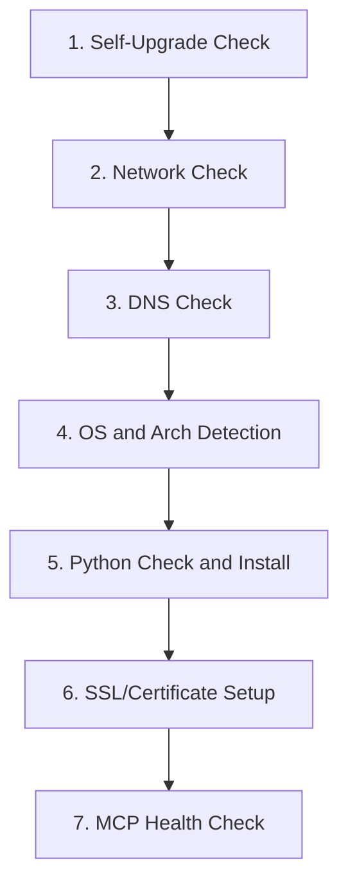

# PubMatic Troubleshooting Script - Redesign Plan

## Overview

Completely restructure `PubMatic_Troubleshooting.sh` into a modular, ordered pipeline with 7 sections: self-upgrade, network check, DNS check, OS/arch detection, Python validation with optional install, SSL/certificate setup, and MCP health check. Cross-platform support for macOS and Linux. Windows is out of scope (separate script).

---

## Dependency Philosophy

**Baseline assumptions (only two):**
- `bash` (v3.2+ ships with macOS, v4+ on most Linux)
- `curl` (ships with macOS, present on most Linux distros)

**Everything else must be checked before use.** The script must never crash because a tool like `nslookup`, `dig`, `host`, `pip`, or `jq` is missing. Each section uses a "try the best tool, fall back to simpler ones, fall back to bash builtins" strategy.

### Dependency Matrix

| Section | Primary Tool | Fallback 1 | Fallback 2 (Bash Built-in) |
|---------|-------------|------------|---------------------------|
| 1. Self-Upgrade | `curl` (required) | -- | -- |
| 2. Network Check | `curl` (required) | -- | -- |
| 3. DNS Check | `host` | `nslookup` | `ping -c1` (confirms reachability even if we can't extract IP) |
| 4. OS/Arch | `uname` (POSIX, always present) | -- | -- |
| 5. Python Check | `python3` (that's what we're checking) | `python` (check if it's 3.x) | -- |
| 5. Python Install | `installer` (macOS) / `apt-get` (Debian) / `dnf` (RHEL) | `yum` (older RHEL) | Guide user manually |
| 6. SSL Check | `python3 -c "import ssl"` | `curl -vI https://...` (verify SSL via curl if Python SSL broken) | -- |
| 6. SSL Install | `pip` / `pip3` / `python3 -m pip` | `python3 -m ensurepip` (bootstrap pip first) | -- |
| 7. Health Check | `curl` (required) | -- | -- |

### Helper: `require_cmd` and `has_cmd`

Two utility functions used throughout:

```bash
has_cmd() { command -v "$1" &>/dev/null; }

require_cmd() {
    if ! has_cmd "$1"; then
        fail "$2" "$1 is not installed and is required."
    fi
}
```

Every section calls `has_cmd` before using any tool that isn't bash or curl.

---

## Execution Flow



---

## Script Structure

### Header / Globals

- `SCRIPT_VERSION="1.0.0"` -- embedded version for self-upgrade comparison
- Constants: `MIN_VERSION="3.8"`, `MAX_VERSION="3.13.99"`, `PYTHON_PKG_VERSION="3.12.9"`, `MCP_HOST="mcp.pubmatic.com"`, `HEALTH_CHECK_URL="https://apps.pubmatic.com/mcpserver/health"`
- Logging to `/tmp/pubmatic_troubleshooting_<timestamp>.log`
- Argument parsing: `--yes` / `-y` flag to auto-accept Python install prompt (for CI/automation)
- Remove `set -e` -- each function handles its own errors explicitly
- ANSI color helpers (`green`, `red`, `yellow`) with `NO_COLOR` environment variable support
- Status tracking variables: `CHECK_UPGRADE`, `CHECK_NETWORK`, `CHECK_DNS`, `CHECK_PLATFORM`, `CHECK_PYTHON`, `CHECK_SSL`, `CHECK_HEALTH`
- **Dependency check at startup**: verify `curl` is available, abort early with clear message if not

---

## Section Details

### 1. Self-Upgrade (`check_upgrade`)

**Dependencies used:** `curl`, `grep`, `sed` (all POSIX standard)

- Verify `curl` is available (should be, checked at startup)
- Query `https://api.github.com/repos/PubMatic/pubmatic-mcp-server/releases/latest` using `curl`
- Parse `tag_name` using `grep`/`sed` -- no `jq` dependency:
  ```bash
  LATEST=$(curl -fsSL "$RELEASES_URL" | grep '"tag_name"' | sed 's/.*"v\?\([^"]*\)".*/\1/')
  ```
- Compare with embedded `SCRIPT_VERSION` using `sort -V` (available on macOS 10.15+ and GNU coreutils)
- If newer version exists:
  - Print current vs. latest version
  - Download the new script from the release asset URL
  - Replace self (`cp` new over old, `chmod +x`)
  - Re-exec with `exec "$0" "$@"` to continue on the new version
- If no update or GitHub unreachable: log and continue silently
- Status: `pass` (upgraded or up-to-date), `skip` (GitHub unreachable)

### 2. Network Check (`check_network`)

**Dependencies used:** `curl` only

No `ping` (may be blocked by firewall, requires ICMP). No `python3` (not validated yet). Pure curl:

- Attempt `curl -fsS --max-time 5 -o /dev/null https://www.google.com`
- If fails, try fallback: `curl -fsS --max-time 5 -o /dev/null https://1.1.1.1`
- On failure: print "No internet connectivity detected", set `CHECK_NETWORK="fail"`, exit
- On success: set `CHECK_NETWORK="pass"`, log
- **Why curl and not ping:** ping uses ICMP which is often blocked by corporate firewalls/VPNs. curl over HTTPS tests the actual protocol the script needs.

### 3. DNS Check (`check_dns`)

**Dependencies used:** Whichever DNS tool is available, with cascading fallback

The script does NOT assume any specific DNS tool is installed. It tries them in order:

```bash
resolve_dns() {
    local host="$1"
    if has_cmd host; then
        host "$host" 2>/dev/null | grep "has address"
    elif has_cmd nslookup; then
        nslookup "$host" 2>/dev/null | grep -A1 "Name:" | grep "Address"
    elif has_cmd dig; then
        dig +short "$host" 2>/dev/null
    else
        # Ultimate fallback: use curl itself to test DNS
        # curl will fail with a specific exit code (6) if DNS fails
        curl -fsS --max-time 5 -o /dev/null "https://${host}" 2>/dev/null
        if [ $? -eq 0 ]; then
            echo "(resolved via curl -- no DNS tool available to show IP)"
        elif [ $? -eq 6 ]; then
            return 1  # DNS resolution failed
        fi
    fi
}
```

- The `curl` fallback is key: even if `host`, `nslookup`, and `dig` are all missing, we can still detect DNS failure because `curl` returns exit code 6 specifically for DNS resolution failures.
- Log resolved IP addresses when available
- On failure: print DNS resolution error, suggest checking VPN/DNS settings, exit
- Status: `pass` or `fail`

### 4. OS and Arch Detection (`detect_platform`)

**Dependencies used:** `uname` only (POSIX standard, guaranteed on all Unix systems)

- `DETECTED_OS` from `uname -s` -- handle `Darwin` (macOS) and `Linux`
- `DETECTED_ARCH` from `uname -m` -- handle `x86_64`, `arm64`/`aarch64`
- Print detected platform (e.g., "Detected: macOS arm64")
- If OS is unsupported (not Darwin/Linux): print message suggesting Windows script, exit
- **Detect Linux distro** (needed for Python install in step 5):
  ```bash
  DETECTED_DISTRO="unknown"
  if [ "$DETECTED_OS" = "Linux" ]; then
      if [ -f /etc/os-release ]; then
          # POSIX file read, no extra tools needed
          . /etc/os-release
          DETECTED_DISTRO="$ID"  # "ubuntu", "debian", "fedora", "centos", "rhel", "amzn", etc.
      fi
  fi
  ```
  `/etc/os-release` is a standard file on all modern Linux distros (systemd-based). Sourcing it is pure shell -- no `grep`, `awk`, or `cat` needed.
- Status: `pass` or `fail`

### 5. Python Check and Install (`check_python`)

**Dependencies used:** `python3` or `python` (what we're checking), OS package manager (for install)

#### 5a. Version Check -- Minimal Dependency

```bash
PYTHON_CMD=""
if has_cmd python3; then
    PYTHON_CMD="python3"
elif has_cmd python; then
    # Check if "python" is actually Python 3
    PY_MAJOR=$(python --version 2>&1 | grep -oE '[0-9]+' | head -1)
    if [ "$PY_MAJOR" = "3" ]; then
        PYTHON_CMD="python"
    fi
fi
```

- Parse version using `awk` (POSIX): `$PYTHON_CMD --version 2>&1 | awk '{print $2}'`
- Validate with `sort -V` (same as current script)
- If valid: print version, set `CHECK_PYTHON="pass"`, continue

#### 5b. If Missing or Out of Range -- Prompt with Danger Warning

```
  WARNING: Python 3.8 or higher (up to 3.13.x) is recommended.

  This will install Python 3.12.9 on your system.
  Do you want to proceed? [y/N] (default: No)
```

- Default is **No** -- Enter or anything other than `y`/`Y` skips install and exits with guidance
- If `--yes` flag was passed, auto-accept

#### 5c. Install Based on OS, Arch, and Distro

**macOS (any arch):**
- Tool needed: `curl` (already validated), `installer` (ships with macOS)
- Download `.pkg` from `python.org`, run `sudo installer -pkg`, symlink `python3`

**Linux -- detect package manager dynamically:**

```bash
install_python_linux() {
    if has_cmd apt-get; then
        # Debian/Ubuntu
        sudo apt-get update
        sudo apt-get install -y software-properties-common
        sudo add-apt-repository -y ppa:deadsnakes/ppa
        sudo apt-get update
        sudo apt-get install -y python3.12
    elif has_cmd dnf; then
        # Fedora / RHEL 8+
        sudo dnf install -y python3.12
    elif has_cmd yum; then
        # CentOS 7 / older RHEL
        sudo yum install -y python3
    elif has_cmd apk; then
        # Alpine
        sudo apk add python3
    elif has_cmd pacman; then
        # Arch Linux
        sudo pacman -Sy --noconfirm python
    else
        echo "Could not detect a supported package manager."
        echo "Please install Python 3.8+ manually and re-run this script."
        return 1
    fi
}
```

**Key principle:** We don't assume `apt-get` or `dnf` exists. We check which package manager is present using `has_cmd` and use that one.

#### 5d. Post-Install Verification

- Re-check `python3 --version` or `python --version`
- Handle PATH/symlink differences (macOS: `/Library/Frameworks/...`, Linux: `/usr/bin/...`, `/usr/local/bin/...`)

### 6. SSL/Certificate Check (`check_ssl`)

**Dependencies used:** `python3` (validated in step 5), `pip` (may need bootstrapping)

#### 6a. Check First Using Python (No Extra Dependencies)

Python's `ssl` and `socket` modules are part of the standard library -- no pip packages needed for the check:

```bash
SSL_OK=$($PYTHON_CMD -c "
import ssl, socket
try:
    ctx = ssl.create_default_context()
    with ctx.wrap_socket(socket.socket(), server_hostname='${MCP_HOST}') as s:
        s.connect(('${MCP_HOST}', 443))
    print('ok')
except Exception as e:
    print('fail:' + str(e))
" 2>&1)
```

- If `ok`: set `CHECK_SSL="pass"`, skip everything else
- If `fail`: proceed to fix

#### 6b. If SSL Setup Needed -- Bootstrap pip if Missing

**Problem:** `pip` is not guaranteed. On Debian/Ubuntu, `python3` ships without pip by default.

```bash
ensure_pip() {
    if $PYTHON_CMD -m pip --version &>/dev/null; then
        return 0
    fi
    # Try ensurepip (Python stdlib, no internet needed)
    if $PYTHON_CMD -m ensurepip --upgrade &>/dev/null; then
        return 0
    fi
    # OS-level pip install as last resort
    if [ "$DETECTED_OS" = "Linux" ]; then
        if has_cmd apt-get; then
            sudo apt-get install -y python3-pip 2>/dev/null && return 0
        elif has_cmd dnf; then
            sudo dnf install -y python3-pip 2>/dev/null && return 0
        elif has_cmd yum; then
            sudo yum install -y python3-pip 2>/dev/null && return 0
        fi
    fi
    return 1
}
```

Then install certifi:
```bash
$PYTHON_CMD -m pip install --upgrade certifi --break-system-packages --quiet 2>/dev/null \
    || $PYTHON_CMD -m pip install --upgrade certifi --quiet 2>/dev/null
```
(`--break-system-packages` is needed on Debian 12+ / Ubuntu 23.04+ with PEP 668, but older systems reject the flag, hence the fallback)

**macOS only:** Run `/Applications/Python X.Y/Install Certificates.command` if it exists

**Linux only:** Ensure `ca-certificates` is installed:
```bash
if [ "$DETECTED_OS" = "Linux" ]; then
    if has_cmd apt-get; then
        sudo apt-get install -y ca-certificates 2>/dev/null
    elif has_cmd dnf; then
        sudo dnf install -y ca-certificates 2>/dev/null
    fi
fi
```

#### 6c. Verify with SSL Handshake (Same Python Check as 6a)

- Re-run the same `ssl.create_default_context()` + `wrap_socket` test
- Status: `pass`, `warn`, or `fail`

### 7. MCP Server Health Check (`check_health`)

**Dependencies used:** `curl` (primary), `python3` (for detailed response parsing)

#### 7a. Curl-Based Health Check (Lightweight, No Python)

```bash
HTTP_CODE=$(curl -fsS -o /tmp/pm_health_body.txt -w "%{http_code}:%{time_total}" \
    --max-time 15 \
    -H "Accept: application/json" \
    "$HEALTH_CHECK_URL" 2>/dev/null) || true
```

This gives us HTTP status code and response time using curl alone. No Python needed for basic pass/fail.

#### 7b. Parse Response Body (Python, If Available)

Only if `python3` is confirmed working (it should be by now), parse the JSON body:

```bash
STATUS=$($PYTHON_CMD -c "
import json, sys
try:
    d = json.load(open('/tmp/pm_health_body.txt'))
    print(d.get('status', 'unknown'))
except:
    print('unknown')
" 2>/dev/null || echo "unknown")
```

If Python is somehow still broken at this point, we still have the HTTP status code from curl -- the check doesn't fail just because we can't parse JSON.

- Response time threshold: 5 seconds
  - Under threshold: `pass`
  - Over threshold: `warn` (reachable but slow)
- Status: `pass`, `warn`, or `fail`

---

## Final Summary Output

After all sections complete, print a summary table:

```
==========================================
 PubMatic MCP Server - Sanity Check Summary
==========================================
 [1/7] Self-Upgrade      pass
 [2/7] Network            pass
 [3/7] DNS                pass
 [4/7] Platform           pass  (macOS arm64)
 [5/7] Python             pass  (3.12.9)
 [6/7] SSL Certificates   pass
 [7/7] MCP Health         pass  (0.342s)
==========================================

 Log file: /tmp/pubmatic_troubleshooting_20260312_143022.log
```

Any `fail` results in a non-zero exit code and a prompt to share the log file with PubMatic support.

---

## Key Design Decisions

- **Only two hard dependencies: `bash` and `curl`** -- everything else is checked with `has_cmd` before use and has fallbacks
- **`python3` is the canonical command** -- the manifest (`manifest.json`) uses `"command": "python3"`, so the script validates and installs for that exact command
- **Check-before-install pattern** -- SSL section checks if things already work before modifying anything
- **Danger prompt defaults to No** -- Python installation is destructive; user must explicitly opt in
- **No `jq` dependency** -- self-upgrade parses GitHub API JSON with `grep`/`sed`
- **No `pip` assumption** -- pip is bootstrapped via `ensurepip` or OS package manager if missing
- **No DNS tool assumption** -- falls back through `host` > `nslookup` > `dig` > `curl` exit code 6
- **No `ping` dependency** -- uses curl for connectivity (ICMP is often blocked by firewalls)
- **Modular functions** -- each section is a standalone function for testability and readability
- **Cross-platform** -- macOS and Linux handled via `DETECTED_OS`/`DETECTED_ARCH`/`DETECTED_DISTRO`; Windows is a separate script
- **`--break-system-packages` with fallback** -- handles PEP 668 on newer Debian/Ubuntu without breaking older systems
