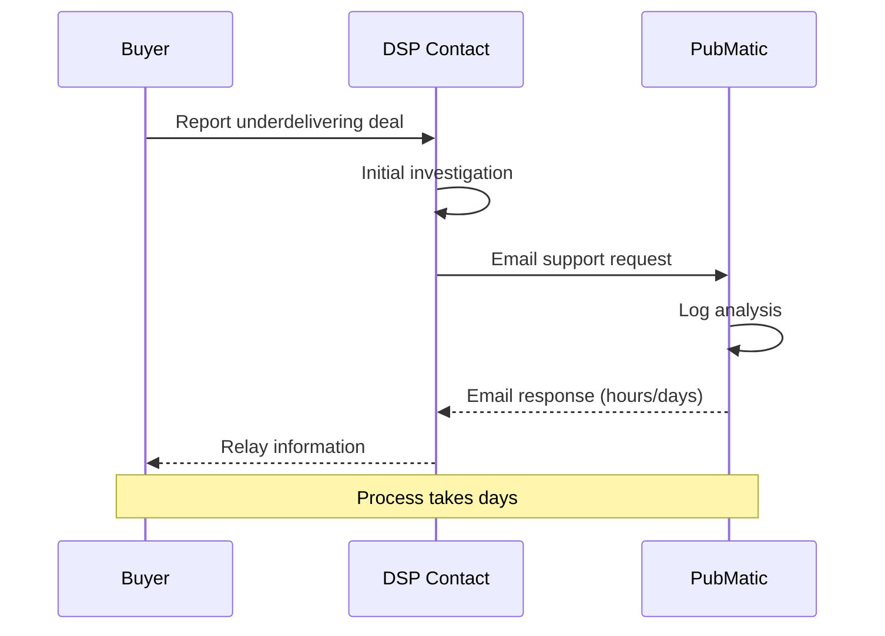
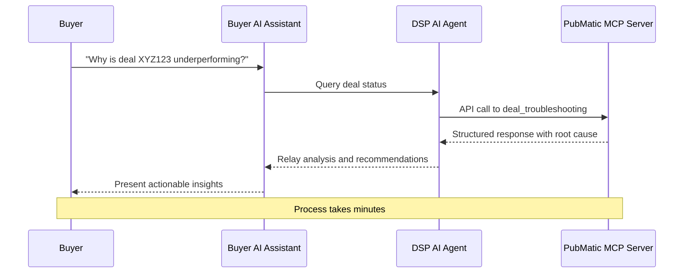

# PubMatic MCP Server Specifications

## Defining the Future of AI in Programmatic Advertising

This repository contains the official specifications for PubMatic's Model Context Protocol (MCP) server implementations, enabling agent-to-agent communication for programmatic advertising workflows.

## Overview

PubMatic is among the first in the ad tech industry to publish a public specification for deal management using AI agent-to-agent communication protocols. This pioneering initiative aims to transform how participants in the programmatic ecosystem communicate and collaborate, moving beyond static APIs and manual processes to dynamic, context-aware, and autonomous communications between AI agents.

## Vision

Programmatic supply chains work best when information flows freely and securely between partners. With agentic AI and emerging protocols like MCP (Model Context Protocol) and A2A (Agent2Agent Protocol), we can finally move beyond static, manual communication and into a world where agents collaborate directly to solve for common goals:

- Less friction
- More transparency
- Stronger outcomes for buyers and publishers alike

## Available Specifications

This repository contains specifications for the following tools:

- **[Deal Management](./Deal%20Management/)**: Tools for deal creation and troubleshooting, enabling seamless communication between publishers, buyers, and DSPs

## Benefits of Agent-to-Agent Communication

### Current Workflow
Today, when a buyer sees an underdelivering PMP deal, they reach out to their DSP contact. The DSP investigates and emails PubMatic. After multiple log checks and message exchanges, the issue may be identified days later.

### Future Workflow
With agent-to-agent communication, a buyer's AI agent can ask a DSP's AI agent why the deal isn't delivering. The DSP agent queries PubMatic's server and receives instant root cause analysis, such as pending creative approval or advertiser block, along with fix suggestions. The DSP agent relays the answer immediately, allowing buyers and publishers to take action and unblock deals in minutes instead of days.

## Getting Started

Each tool specification in this repository includes:
- Detailed API documentation
- Request and response formats
- Integration guides for different client types
- Example implementations

## Contributing

We invite publishers, DSPs, and buyers interested in shaping the future of programmatic collaboration to review our specifications and contribute to building the next generation of programmatic communication.

## License

[License information]